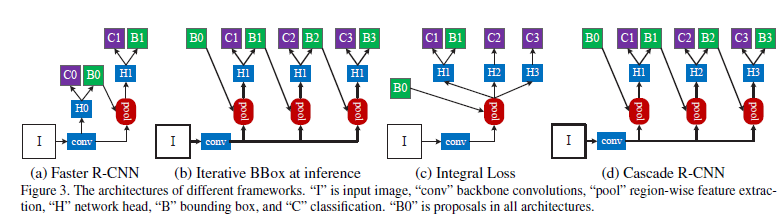
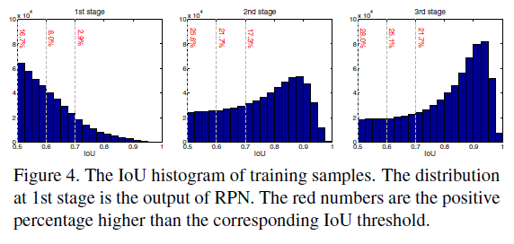
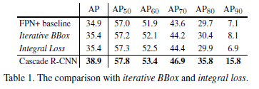
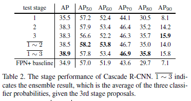
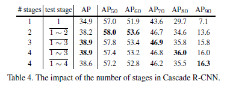
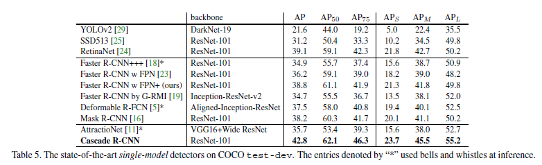
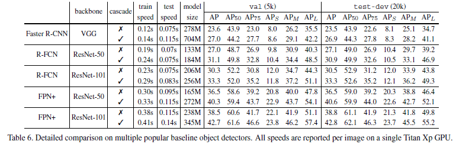

## Cascade R-CNN: Delving into High Quality Object Detection

> CVPR 2018
>
> Zhaowei Cai, Nuno Vasconcelos
>
> > 2016, A unified multi-scale deep convolutional neural network for fast object detection(MS-CNN)

### Abstract

 Object Detection 문제에서 Positive 를 판별하는 IoU threshold 값이 낮으면(e.g. 0.5), noisy detection 문제가 생긴다. 하지만, IoU를 증가하면 detection 성능이 저하되는 경향이 있다.

 이를 해결하기 위해, multi-stage object detection 구조를 가지는 Cascade R-CNN 을 제안한다.

 Cascade R-CNN은 IoU threshold 가 증가하는 순차적인 detector로 구성되며, false 에 가까운  positive 를 보다 순차적으로 선택할 수 있다.

 또한, resampling을 통해 모든 detector가 동일한 크기의 positive example set을 가지고 있어 overfitting 문제를 해결한다.

 Cascade R-CNN을 구한하면 COCO dataset에서 모든 single model object detector의 성능을 능가하고, 실험적으로 일관된 gain을 얻으면서 구조 전반에 광범위하게 적용할 수 있다.

### Cascade R-CNN

* Cascaded Bounding Box Regression
  $$
  f(x, b) = f_T\circ f_{T-1}\circ \cdots \circ f_1(x, b) \qquad (1)\\
  \begin{matrix}
  T &:& total\; number\; of\; casecade\; stages\\
  f_t &:& optimized\; each\; regressor\; in\; casecade
  \end{matrix}
$$
  
  
Iterative BBox at inference와 차이점
  
1. resampling procedure 절차로 다른 단계에 의해 처리될 distribution of hypothese를 변경한다.
  2. training과 inference 모두 사용되기 때문에 training과 inference 분포 차이가 없다.
  3. multiple specialized regressors($f_T, f_{T-1},  ..., f_1$)는 다른 단계의 resampling된 분포에 최적화되어 있다.
  
* Cascaded Detection

  

  IoU threshold를 점진적으로 늘려가며 resampling 을 통해 검출을 진행하기 때문에 high quality를 보장할 수 있다.

  - positive sample이 모든 level에서 풍부하기 때문에 overfitting을 방지할 수 있다.
  - deeper stage에서의 detection은 높은 IoU threshold 값에 최적화된다.

  inference(추론)할 때, hypotheses의 quality는 동일한 계단식 절차(cascade procedure)를 적용함으로써 순차적으로 개선되고, high quality detector는 high hypotheses에서만 작동하므로 high quality의 object detection을 가능하게 한다.

### Experimental Results

 성능 검증으로 MS COCO dataset을 활용하였으며, Cascade R-CNN은 각각 0.5, 0.6, 0.7의 IoU threshold 값을 가진 3개의 classifier를 가진다.

Table 1에서 Cascade R-CNN의 경우 다른 결과들에 비하여 큰 폭의 성능향상을 보여줬으며, 특히 AP80이상에서 큰 차이를 보인다.

 Table 2 는 classifier를 거칠수록 AP가 향상되는것을 볼 수 있었으며, 특히 1~3 stage에서 만들어낸 결과를 ensemble했을 때 가장 좋은 성능을 볼 수 있었다.

 Table 4에서는 0.75 IoU threshold 기준으로 4번째로 학습된 classifier의 비교를 보았지만, 1~3개까지의 stage를 갖는것보다 성능이 떨어짐을 확인 할 수 있었다.

### Conclusion

* high quality의 object detection의 설계를 위해 multi-stage object detection framework 인 Cascade R-CNN을 제안
* Overfitting의 방지와 inference(추론)시, quality mismatch에 대한 문제를 해결
* Cascade구조를 사용했을 때, AP80이상에서 성능이 두드러짐을 확인
* 많은 Object Detection 구조에서 적용 가능