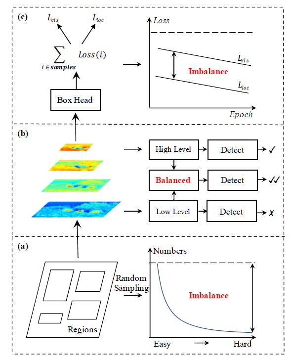
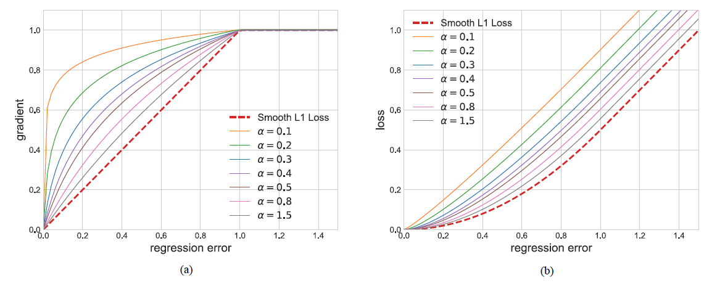

## Libra R-CNN: Towards Balanced Learning for Object Detection

> CVPR 2019
>
> Jiangmiao Pang, Kai Chen, Jianping Shi, Huajun Feng, Wanli Ouyang, Dahua Lin
>
> > Zhejiang University, The Chinese University of Hong Kong, Sense Time Research, The University of Sydney

### Abstract

object detection 문제를 다룰 때, detection training process에 대한 문제가 상대적으로 덜 주목 받고 있었다.

training process는 sample level, feature level, object level로 구성되어 있는데, 이 과정에 있어서 불균형으로 인한 성능제한 문제점이 발생한다.

Libra R-CNN 은 간단하지만, 객체검출에 대하여 균형적인 학습(balanced learning)에 대하여 효과적이다. 

Libra R-CNN은 balanced learning을 위하여 IoU-balanced sampling, balanced feature pyramid, balanced L1 loss을 통해 기존 불균형 문제점을 개선하였다.

결과적으로 FPN Faster R-CNN과 RetinaNet보다 AP성능에 대하여 MS COCO에서 2.5 points, 2.0 points 더 높게 나타났다.

### Introduction

Object detection는 region을 sampling 하고 거기서 feature를 추출하고 recognizing the categories와 refining location을 하는 공통적인 pipeline 패러다임을 가지고 있다.

 따라서, object detection의 training 성공은 다음 3가지의 측면에 의존된다.

1. whether the selected region samples are representative

 	2. whether the extracted visual features are fully utilized
 	3. whether the designed objective function is optimal

##### 하지만, 위 3가지 측면 모두 상당히 불균형하고 이는 기존 잘 설계된 모델 구조의 성능을 제한한다.

### Libra R-CNN

* Goal

  > *전체적인 균형 잡힌 설계를 사용하여 detector의 training process에서 존재하는 불균형을 완화하여 모델 아키텍쳐의 잠재력을 이용하는것이다.*

* IoU-balanced Sampling
  
   							
  
  
  
$$
  p = \frac{N}{M}\\
$$
$$
  p_k = \frac{N}{K}*\frac{1}{M_k}, \;\;k\in [0,K)\\
$$
  * $N$ : negative samples
  * $M$ : corresponding candidates
  * $p$ : probability for each sample under random sampling
  * $K$ : IoU에 따른 샘플링 간격(default=3)
  * $M_k$ : number of sampling candidates in the corresponding interval denoted by k

  > -. hard negative sample에 대해 중점적으로 고려하여 balance sampling을 진행한다.
  >
  > -. hard negative는 IoU가 0.05보다 큰 경우가 60%를 차지하지만, Random Sampling의 경우, 30%정도만 제공되고 있는것을 알 수 있다.
  >
  > -. IoU balanced sampling을 통해 hard negative sample에 대해 filtering 할 수 있다.
  >
  > -. IoU가 높은 샘플이 선택될 가능성이 높을수록 K에 민감하지 않다.

> * random sampling
>
>   -. foreground와 background 클래스 내에서 편향되지 않으며 원래 분포를 유지한채 랜덤하게 샘플링
>
> * Hard sample
>
>   -. 분류하기 어려운 샘플
>
>   -. easy negative sample : 배경과 같이 분류하기 쉬운 샘플들을 의미
>
> * K 간격으로 샘플링
>
>   -. IoU를 기준으로 K간격 내에서 샘플링. 즉, 0.5미만이 negative sample이고 간격(K)이 3일 경우, 0~0.5까지 존재하는 negative 샘플들을 3등분하여 각 영역에 존재하는 일정 개수(N)개를 추출
>
>   -. $p_k$는 k번째 간격을 기준으로 해당 간격 내의 전체 negative 개수 대비 존재하는 N개의 negative sample이 존재하는 비율

* Balanced Feature Pyramid

  > *key idea*
  >
  > *같은 깊이의 통합된 balanced semantic features를 사용하여 multi-level features를 강화하는 것.*

  

  

  * Obtaining balanced semantic features

    각 resolution에 대한 semantic feature 추출 -> 각 features를 하나의 size(ex. $C4$)로 만들어 줌(interpolation, max-pooling) -> Averaging
    $$
    C = \frac{1}{L}\sum^{l=l_{max}}_{l=l_{min}} C_l.
    $$

    ##### *Note that this procedure does not contain any parameter*

  * Refining balanced semantic features

    본 논문에서는 기본적으로 Gaussian을 활용한 non-local attention을 사용하였으며, output인 {P2, p3, p4, p5}는 FPN과 같은 pipeline을 적용하였다.

    > > FPN(Feature Pyramid Network) pipeline
    >
    > 
    >
    > 

* Balanced L1 Loss ($L_b$)
  $$
  L_{p, u, t^u, v} = L_{cls}(p, u) + \lambda[u\ge1]L_{loc}(t^u, v)
  $$
  

  * inlier는 outlier와 비교했을 때, 전체의 샘플 당 gradients 평균의 30%밖에 차지하지 않는다.(loss >= 1.0 : outlier / others : inlier)

  

  
  
  > *key idea*
  >
  > Smooth L1 Loss에서 파생되었으며, outlier가 생성하는 변곡점부분을 clipping한다.
>
  > 결정적인 regression gradients를 promoting 하는 것이다. 즉, inlier로 부터의 gradients를 promoting하여 관련 샘플과 작업의 균형을 재조정하는 것이다.

  * Localization loss defined as

$$
L_{loc} = \sum_{i\in{x, y, w, h}}L_b(t^u_i - v_i)
$$

  * corresponding formulation of gradients follows

$$
\frac{\partial L_{loc}}{\partial w}\propto \frac{\partial L_b}{\partial t^u_i} \propto \frac{\partial L_b}{\partial x}
$$

  * based on (6), promoted gradient formulation as

$$
  \frac{\partial L_b}{\partial x} = 
  \begin{cases}
  \alpha \ln(b |x| + 1) & \mbox{if |x| < 1}\\
  \gamma & \mbox{otherwise}
\end{cases}
$$

  * balanced L1 loss

$$
  L_b = 
  \begin{cases}
  \frac {\alpha}{b}(b|x|+1) \ln(b |x| + 1) - \alpha|x| & \mbox{if |x| < 1}\\
  \gamma |x| + C & \mbox{otherwise}
\end{cases}
$$

  * parameters $\gamma$, $\alpha$, and $b$

$$
\alpha \ln(b + 1) = \gamma
$$

  * default parameters : $\alpha$ = 0.5 / $\gamma$ = 1.5

  

### Experiments / Results

* 모든 experiments는 MS COCO dataset을 활용하였으며, COCO test-dev에서 2019 SOTA object detection approach 달성

  

### Conclusion

  본 논문에서는 detector의 training process에 있어서 본래의 설계된 구조의 성능에 비하여 potential이 잘 나타나지 않고 있었음을 말하고 있다.

 이에 Libra R-CNN을 제안하며, training process에 있어서 발생된 imbalanced를 해결하기위해, IoU-balanced sampling, balanced feature pyramid, balanced L1 loss 기법을 적용하였다.

 MS COCO dataset을 활용하여 간단하지만 매우 효과적인 성능을 발휘하였으며, single stage / two stage detector 모두 backbone 사용에 있어 일반화가 잘 되어 있다.

