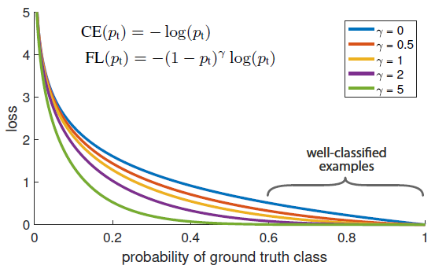

## Focal Loss for Dense Object Detection

ICCV' 17 (International Conference on Computer Vision)

>_Tsung-Yi Lin_ : Research Scientist, Google Brain, Computer Vision/Machine Learning
>
>> Microsoft coco:Common objects in context (quote : 10945 in 2014)
>>
>> Feature pyramid networks for object detection (quote : 4310 in 2017)
>
>_Priya Goyal_ : Software Engineer, Facebook AI Research, Computer Vision/Machine Learning
>
>> Accurate, Large Mini batch SGD: Training ImageNet in 1 Hour (quote : 1153 in 2017)
>
>_Ross Girshick_ : Research Scientist, Facebook AI Research, Computer Vision/Machine Learning
>
>> Fast R-CNN, Faster R-CNN, Mask R-CNN, YOLO, ...
>>
>> 
>
>_Kaiming He_ : Research Scientist, Facebook AI Research, Computer Vision/Machine Learning
>
>> ResNet, Faster R-CNN, Mask R-CNN, ...
>>
>> Learning a Deep Convolutional Network for Image Super-Resolution (quote : 5250 in 2014)
>
>_Piotr Doll´ar_ : Facebook AI Research, Computer Vision/Machine Learning
>
>> Microsoft coco:Common objects in context (quote : 10945 in 2014)
>>
>> Mask R-CNN, FPN, ...

#### Abstract

 현재 object detection는 YOLO와 같은 1-stage detector는 2-stage detector인 RCNN 보다 빠르고 간단할 수는 있지만 정확도가 낮다.

 2-stage의 경우 proposal 단계에서 region의 대부분인 background samples을 필터링(selective search, EdgeBoxes, RPN 등)하고, 분류단계에서 샘플링 작업들(foreground-background ratio를 맞추거나 sampling heuristic 방법)을 통해 foreground와 background 간의 클래스의 균형을 맞추지만, 1-stage의 경우 영상 전체에서 후보 object들이 매우 많이 나와 학습 과정에서 loss가 너무 많은 background에 집중이 되는 현상이 발생한다.

 본 논문에서는 1-stage detector가 정확도가 떨어지는 원인에 대하여 foreground와 background의 class 불균형 문제임을 발견하였으며, 잘 분류되는 example에 대한 낮은 loss weight를 부여하고, 분류하기 어려운 일부 example에 대하여 높은 loss weight를 부여하도록  standard cross entropy loss을 재구성한 Focal loss를 통해 해결한다.

 Focal Loss는 sparse set인 hard example에 대하여 training의 초점을 맞추고 많은 수를 가진 easy negative(background) example로 하여금 detector가 overwhelming되는것을 방지한다.

 이 Focal Loss를 평가하기 위해 RetinaNet을 활용하여 학습(training)을 진행하였으며, 기존의 모든 2-stage의 정확도를 능가하였고, 1-stage의 속도에 대응되는 결과를 보여주었다.

#### Focal Loss

 Focal Loss는 1-stage detector에서 foreground와 background의 클래스간 극도로 심한 불균형 상황을 해결하기 위해 디자인 되었다.
$$
CE(p, y) = 
\begin{cases}
- \log(p) & \mbox{if y=1} \\
- \log(1-p) & \mbox{otherwise}
\end{cases}
$$

$$
p_t =
\begin{cases}
p & \mbox{if y=1}\\
1-p & \mbox{otherwise}
\end{cases}
$$

* y는 GT class를 의미하며, 1 또는 -1
* t는 클래스 종류
* p는  y=1인 클래스에 대한 모델이 예측한 확률로 0~1 사이의 값
* $CE(p, y) = CE(p_t) = -\log(p_t)$
* 
  * CE loss 는 파란색 선을 나타내고, well-classified examples에 대한 loss가 그닥 작지 않다.
  * 즉, well-classified example 에 대한 loss가 커지게 되면, total loss에 영향을 끼치게 되고, 찾고자하는 객체인 hard example 보다 easy sample(ex. background)에 대해 학습이 치우치게 된다.
* Focal Loss는 CE loss에 $(1-p_t)^{\gamma}$를 추가한다.
* $FL(p_t) = -(1-p_t)^{\gamma}\log(p_t)$
* $\gamma$는 0~5사이로 조절하여 실험
* CE를 통해 만약 example을 잘못 분류했지만, $p_t$가 작은 경우 $(1-p_t)^{\gamma}$이 1에 가까워지면서 loss에는 영향이 미치지 않는다.
* $p_t$가 1에 가까워지는 경우 $(1-p_t)^{\gamma}$은 0에 가까워지고, 즉 잘분류되는 example(easy negative, background)을 down-weight 시킬 수 있다.
* $\gamma$가 0이면 FL =CE 가 되고, $\gamma$가 커질 수록 FL의 down-weight 시키는 영향력이 커진다.
* loss layer에 sigmoid를 사용할때 가장 큰 성능을 보였지만, 큰 차이는 없다.

> $$
> CE(p_t) = -\alpha_t \log(p_t)
> $$
>
> * balanced cross entropy
>   * 클래스 불균형을 해결하는 가장 일반적인 방법으로 0~1의 가중치 $\alpha$를 적용
>   * 클래스 1(y=1)에는 $\alpha$, 클래스 -1(y=-1)에는 $-\alpha$를 적용
>   * 단순히 CE를 확장한 것으로 실험에서 기본이 되는 식으로 사용

#### RetinaNet Detector

 RetinaNet은 하나로 통합된 network로 backbone network와 2개의 subnetworks로 구성된다.

* subnetwork는 convolution을 활용하여 classification과 localization을 수행한다.

1. Feature Pyramid Network Backbone
   * Backbone은 ResNet구조 위에 FRN을 구성하였으며, 피라미드 레벨은 P2~P7이 되도록 구성
     * P1 = input size, P2 = input size/2, P3 = (input size/2)/2, ...
   * 모든 파라미터 레벨의 채널은 256으로 동일하게 하였으며, ResNet이외 다양한 Network에 대한 설계는 성능에 큰 영향을 미치지 않았지만 FPN의 여부가 AP의 큰 영향을 미침.
2. Anchor
   * 종횡비는 {1:2, 1:1, 2:1}를 가지고, 각 크기는 {$2^0, 2^{1/3}, 2^{2/3}$}로 표현하여 총 9개의 anchor box로 32~813 픽셀까지 담당할 수 있게 적용
   * IoU가 0.5이상인 anchor box만 GT object box로 할당하고, 0.4이하의 anchor box는 background로 할당되며, 이외 0.4~0.5는 학습과정에서 무시
3. Classification Subnet
   * 3x3 크기의 256개 필터를 가진 convolution layer(activation=relu)를 4번 반복하여 구성
   * 마지막에 K*A(K:class num, A:anchor num(9))개의 필터를 가진 convolution layer(activation=sigmoid)를 적용
4. Box Regression Subnet
   * RCNN에서와 같이 box 파라미터(cx, cy, w, h)를 사용하여 regression 적용

#### Inference and Training

* detector confidence threshold 0.05로 먼저 필터링을 하고, top-scoring protection 1000개의 box prediction 을 사용
  * 1000개의 top-scoring protection은 각 FPN level 당 detector confidence(IoU score)를 기준으로 한다.
* 최종 detection을 위해 threshold 0.5의 NMS(non-maximum suppression)을 적용하여 중복 예측들을 통합
* Focal Loss는 classification subnet에 적용하였으며, $\gamma = 2$일 때 성능이 가장 좋음
* optimization은 SGD를 사용

#### Experiments

* foreground examples
  * 20% 정도의 hardest positive sample(0.8~1.0부분)이 전체 loss의 절반을 차지하며, $\gamma$가 커질수록 top 20%의 example에 집중되지만, 효과는 작은편
* background examples
  * $\gamma$가 2일 때, 대부분의 loss는 hard negative example(1.0부분)에서 나오며, easy negative의 효과를 줄이고 hard negative에 집중

​												

#### Conclusion

 1-stage detector가 2-stage detector 보다 정확도에 대한 성능이 나오지 못했던 이유는 클래스의 불균형이였으며, 이를 해결하기 위해 Focal Loss를 제안하였다.

 Focal Loss 는 Cross entropy에서 easy negative에 대한 loss weight를 줄여 hard example에 대해 학습이 집중되도록 구성 되어 있다.

 Focal Loss에 대한 평가를 위해 RetinaNet을 활용하였으며, 이는 1-stage detector로 정확도와 속도 측면에 SOTA를 달성하였다.

