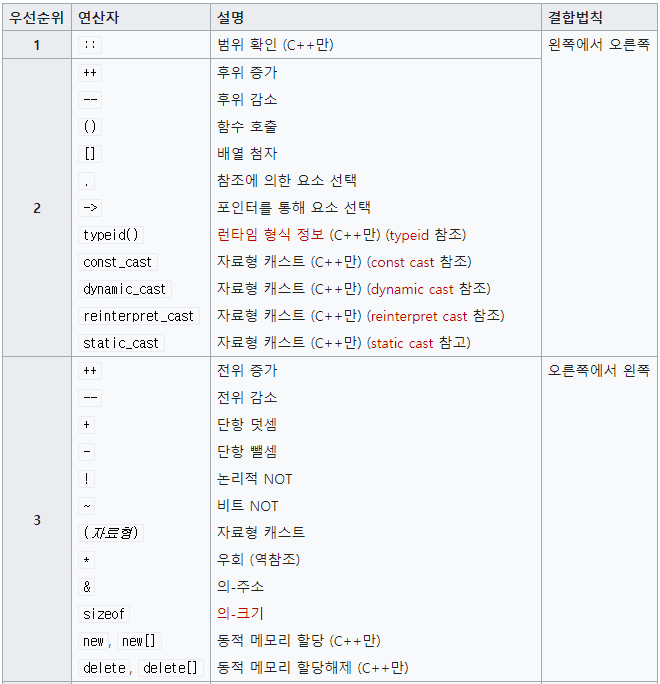
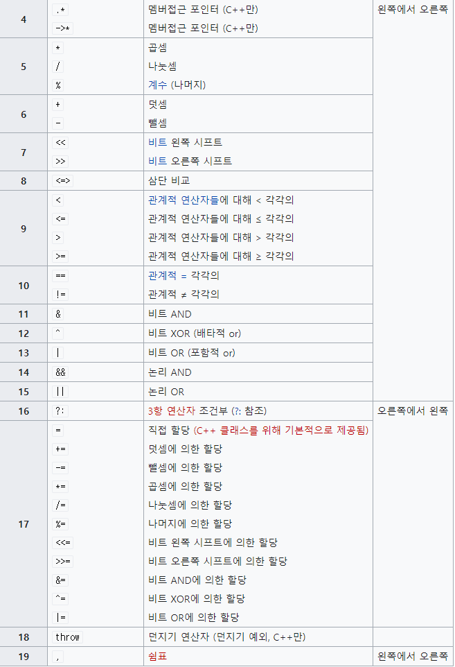
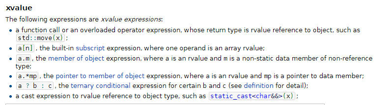
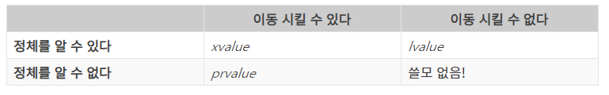

## C++ 5장 연산자와 람다

#### 연산자(Operator)

 C++의 연산자는 밑의 표와 같다 또한 연산자들은 우선순위를 가지고 있어 우선순위에 따라 연산을 수행한다.






> 그림 출처:
>
> 위키피디아
>
> [https://ko.wikipedia.org/wiki/C%EC%99%80_C%2B%2B%EC%9D%98_%EC%97%B0%EC%82%B0%EC%9E%90](https://ko.wikipedia.org/wiki/C와_C%2B%2B의_연산자)


여기서 모를수도 있다고 생각하는 연산자 몇개만 예제를 통해 설명한다.

```C++
//범위 지정 연산자

namespace A{
	void hello(){
		std::cout <<"I am A"<<endl;
       }
}
namespace B{
    void hello(){
        std::cout<< " I am B"<<endl;
    }
}    
    
int main(void){
    A::hello();
    B::hello();
    
}

>>
    I am A
    I am B
--------------------------------------------------------------------------
 포인터 맴버 선택 연산자 '->' 와 객체 맴버 선택 연산자 '.' 사용 차이

class status{
    int hp;
    int age;
    int power;
}


int main(){
    status* ptr_stat = new status();	//동적 할당
    status stat;	//객체 선언
    
    std::cout<<" 객체 선언 일때"<<stat.hp<<std::endl;
    
    std::cout<<"동적 할당 일때"<<ptr_stat->hp<<std::endl;
    // 여기서 ptr_stat은 주소 값을 가지고 있음
        
}

    
```

> 객체 생성을 하지 않고 동적할당을 하는 이유:
>
> [링크](https://multithread.tistory.com/entry/C-객체생성-두가지-방법과-의문점new를-이용한-동적할당객체)
>
> 

#### 연산자의 우선 순위와 결합방향의 참조 예

```C++
int x = 3 * 4 / f(30);
```

위와 같은 코드의 연산자의 우선 순위와 결합 방향을 알아보자.

순서는 다음과 같다.

- 코드에서 가장 우선순위가 높은 연산자는 '()' 함수 호출 연산자이다. 가장 먼저 함수 호출을해 f(30)의 값을 가져온다.
- 그 다음 우선순위로는 '*'연산자와  '/'연산자이다 두 연산자는 서로 우선 순위가 동일하므로 왼쪽에서 오른쪽 방향아로 곱셈 수행 후 나눗셈을 수행한다.
- 마지막으로 가장 우선순위가 낮은 = 연산자가 사용되어 x 변수에 값이 저장된다.


### 단항 연산자

#### ++, -- 증감 당항 연산자

- ++연산자는 변수의 앞이나 뒤에 붙여 변수에 1을 증가시키는 기능을 한다.
- -- 연산자는 변수의 앞이나 뒤에 붙여 변수에 1을 감소시키는 기능을 한다.


증감 연산자가 앞에 붙으면 **전위 증감 연산자**라고 하고 뒤에 붙으면 **후위 증감 연산자**라고 한다.

여기서 우리는 후위 증감 연산자의 연산 과정을 알아야한다. 연산과정은 밑의 순서와 같다.

- 변수를 연산자의 인수로 제공받는다.
- 변수의 데이터를 읽어 동일한 타입의 임시 저장소에 저장한다.
- 변수의 증감작업을 수행한다.
- 임시저장소의 데이터를 반환하고 작업을 마무리한다.

```C++
float x = 3.5f;

float y = x++;
printf("y=%2.2f, x= %2.2f\n",y,x);

y = --x;
printf('y= %2.2f, x= %2.2f\n',y,x);

y = ++x;
printf("y=%2.2f, x = %2.2f\n",y, x);
```

> y = 3.50, x = 4.50
>
> y= 3.50, x = 3.50
>
> y=4.50, x = 4.50


```C++
int main(){
	int val = 4;
	int i = val++ + ++val;
	std::cout<<i<<" , "<<val<<std::endl; 1)
	val = 4;
	i = ++val + val++;
	std::cout <<i<<" , " <<val<< std::endl; 2)
}
```

> 10,  6
>
> 10, 6

 위의 코드는 실수할 수 있는 코드이다.  언뜻보면 1)번 코드에서 i가 9라고 생각할 수 있다. 하지만 위의 코드의 순서는 밑과 같다.

- val++이 우선순위가 가장 높기 때문에 가장 먼저 수행된다.
- val++의 값은 4가 되고 val의 값은 5가된다.
- 그 다음으로 ++val이 수행되어 ++val의 값은 6이 된다.
- i = val++ + ++val 은6 + 4로 10이 된다.


#### Tip. 연산자의 올바른 표현

```C++
올바른 표현
for (int i = 0; i<10; ++i){

}

나쁜 표현

for (int i=0; i<10; i++){

}
```

위에서 보듯 나쁜 표현을 사용하게 되면 처리하는 과정이 올바른 표현 과정보다 훨씬 길기 때문에 효율적이지 않다. 그렇기에 올바른 표현을 쓰는 것이 효율적이게 사용할 수 있다.


### 이항 연산자

 산술 연산자는 연산을 수행하기 전 레지스터의 변수 타입으로 변수와 리터럴을 변형시키는 작업을 수행한다. 예로 char+char는 먼저 비트 전환 연산자처럼 

int+int로 변형되어 연산이 진행된 후 다시 원래 형식으로 변환한다.

 이런 작업이 수행되는 이유는 실제 연산작업을 하는 수행 주체가 메모리가 아닌 CPU 및 내 레지스터이기 때문에 레지스터가 지원하는 타입에 맞추어 자동으로 변환을 하게 된다. 만약 컴퓨터가 32 bit 머신인 경우는 int32로 변경되고 64 bit 머신인 경우에는 int 64타입으로 변경이된다.

```
#include <iostream>

int main(){
	int m=10, n = 3;
	float s = m / n;
	std::cout<<s<<std::endl;
	return 0;
	
}
```

> *>>*
>
> 3

 위 코드에서  float s = (float) m / n 처럼 타입 변환 연산자를 사용하면 변수 데이터는 실수 타입으로 변환되어 연산이 수행된다. 변환 연산자는 산술 연산자보다 우선 순위가  높기 때문에 변수가 먼저 변환되고 연산이 되어  결과는 3.3333이 나오게 된다.

위의 말은 요약하자면

- 연산자를 기준으로 변수 데이터 타입이 레지스터와 다르면 먼저 레지스터에 맞는 타입으로 변환작업이 이루어지게 된다.
- 타입 변환 작업 수행 후 연산 수행
- 연산 종료 후 변수에서 사용된 원래 타입으로 변환이 이루어진다.


### 기타 연산자

#### 삼항 조건 연산자

```C++
//삼항 조건 연산자
(condition) ? (if_true): (if_flase)

//일반 조건문
if (condition)
	if_true;
else
	if_false;
	
	
//	더 자세한 삼항 조건 연산자 표현
int z;
if(y==x)
	z = x;
else 
	z = ++y;
```

 삼항 조건 연산자는 오른쪽에서 왼쪽 방향으로 결합 연산이 이루어진다.

이말이 무슨 뜻인지는 아래의 예로 설명하겠다.


```c++
int x = 0,y = 0;
int z = y == 0 ? 1::x == 1 ? 2: y = 4;
std::cout <<"x = "<<x<<',y = '<<y<<", z = "<<z<< std::endl;
```

위의 코드에서 삼항 조건 연산자는 오른쪽에서 왼쪽 방향으로 연산이 이루어지는 것이 아니기 때문에 int z = ((y == 0 ? 1: x) == 1) ? 2: (y = 4);로 해석되는 것이 아닌 z = ((y === 0) ? 1: (x == 1 ? 2:(y = 4))); 오른쪽부터 시작해 왼쪽으로 해석한다.


```C++
//위 삼항 조건 연산자 코드를 조건문으로 바꾼것
if(y==0) = 1;
else if (x == 1) z = 2;
	else z = (y = 4);
```

오른쪽에서 왼쪽으로 해석하는 것이 조건문 코드와 의미가 같은 것을 알 수 있다.


#### sizeof 연산자

sizeof() 함수는 괄호 안의 값을 byte 단위로 크기를 알려주는 함수이다. 일반적으로 변수보다 데이터 타입에 sizeof 연산자를 사용하는 것이 바람직하다.

```c++
#include <iostream>

struct Bit { unsigned char bit: 1; };

size_t size(int * p) { 
    std::cout << "size() 함수 내 배열의 메모리 크기\t: " << sizeof(*p) << std::endl;
    return sizeof(p) / sizeof(*p);
}

int main() {
    Bit bit;
    int arr[20];

    std::cout << "main() 함수 내 Bit 구조체의 크기\t: "   << sizeof(bit) << '\n'
//            << "bit 변수의 비트 크기\t: " << sizeof bit.bit << '\n'  // 에러가 발생
              << "main() 함수 내 배열의 메모리 크기\t: "   << sizeof(arr)  << '\n';
    size_t i = size(arr);
    std::cout << "배열의 크기 : " << (sizeof(arr) / sizeof(arr[0]))
              << ", size() 함수로 반환받은 크기 : " << i << std::endl;
}													//i 는 함수
```

> main() 함수 내 Bit 구조체의 크기        : 1
> main() 함수 내 배열의 메모리 크기       : 80
> size() 함수 내 배열의 메모리 크기       : 4
> 배열의 크기 : 20 ,  size() 함수로 반환받은 크기 : 1


위의 예와 같이 배열이 존재하는 식별자 범위 밖에서 배열의 크기를 계산하면, 전혀 다른 결과를 얻게 된다.

sizeof 연산자는 데이터 타입에 대해 적용하는 것이 안전하다.


### new와 delete 연산자

new 연산자는 C언어의 malloc()함수와 동일한 기능을하는 연산자로 malloc()보다 더 쉽게 용할 수 있다.

new 연산자를 사용하는 new expression의 포맷은 다음과 같다.

```C++
new (argument list) (optional) (type) initializer(optional)
new (argument list) (optional) type initializer(optional)
```

- argument list: 기존 사용한 메모리나 new에대한 설정 옵션 등을 가리킨다.
- type: 데이터 타입 (기본 타입이나 클래스 or 구조체)를 가리킨다. 만약 타입이 긴다면 중괄호를 사용해 별도 지정도 가능하다.
- initializer: 저장소에 입력되는 초기화 값을 가리킨다 {}, () 중에 하나를 사용한다.

1. 사용법

```C++
int* ptr = new int;	// ptr 저장소는 초기화 되지 않음

float* r = new float(75.25);	//힙 메모리를 할당받고 75.25실수를 *r 저장소에 저장한다.
```


2. 데이터 타입의 배열 포인터 생성

```C++
//BUFFER_SIZE 크기의 배여로 만들어 할당
#define BUFFER_SIZE 100
// char 타입의 배열 포인터를 생성하고 초기화
char* pch = new char[BUFFER_SIZE]();

char* c = new char[0];
int* dynamic = new int[5];
```


 위와 같이 동적할당을하고 더 이상 사용하지 않을 때는 delete를 사용해주어 메모리를 해제해야한다. 메모리를 해제하지 않으면 계속 메모리를 차지해 비 효율적이다.

```C++
//포인터 메모리 해제

delete ptr;
delete r;

//배열 포인터 해제
delete[] pch;
delete[] dynamic
```


#### new 와 malloc의 차이

```c++
int main(void) {


    MyString* s2 = new MyString();	//차이점
    s2->mData = new char[len];


    MyString* s3 = (MyString*)malloc(n);	//차이점
}
```

> new malloc의 차이점https://heurinbada.tistory.com/92

- #### new

  -  할당하려는 타입의 포인터를 반환
  - 할당할 메모리 크기를 몰라도됨
  - 재할당을 할 수 없음

- #### malloc

  -  사용하기 위해서는 할당할 메모리 크기를 알아야함
  - 반환값이 void형이여서 형변환을한 후 값을 받음
  - 메모리 재할당 가능하다. (realloc)

  

 위와 같은 차이점을 제외하고 new와 malloc의 가장 중요한 차이점은 생성자 호출의 유무이다.

malloc같은 경우는 객체를 생성할 때 생성자가 호출이 되지않는다. 이는 나중에 문제를 일으킬 수 있으므로 new를 사용해 객체를 사용하는것이 좋다.


### lvalue와 rvlaue의 기본 개념

  lvalue는 아이덴티티fmf 가지고있는 왼쪽에 놓여지는 변수를 말하고 rvalue는  표현식이 종료된 이후에는 더 이상 존재하지 않는 임시적인 값을 말한다. 

다만 lvalue 변수라 해도 이동이나 데이터의 복사가 발생한다면 해당 변수는 순간적으로 lvalue가 된다.

ex)

```C++
#include <iostream>


int main()
{
    int x = 3;	//lavalue : x , Rvalue : 3
    const int y = x;	//여기서 x는 복사를하는 연산을 했기에 Rvalue가 된다.
	++a;
    a--;	//증감 단항연산자에서의 a 또한 lvalue이다.
}


------------------------------
    
int globalvar = 20;

int& foo() {	//참조 함수 &가 없으면 전역변수를 참조하는것이 아닌 그냥 값을 출력하는 함수이다.
	return globalvar;
}

int main() {
	std::cout << foo() << std::endl;
	foo() = 100;	//foo()가 전역변수를 참조하는 역활을해 foo함수는 lvalue이다.
	std::cout << foo() << std::endl;
}
```


#### rvalue	

 ravlue의 공통적 특징은 데이터의 이동이나 복사가 존재한다는 점이다. 

rvalue의 개념은 데이터를 저장하는 방식에 따라 prvalue와 xvalue로 나누어진다.

- #### prvalue

  - prvalue는 순수한 rvalue를 의미한다.
  - 아이덴티티를 가지지 않으며 데이터의 이동이나 복사만이 가능하다.
  - &를 사용해서 주소값을 받을 수 없다.
  - 단순히 정말 리터럴값 숫자라고 생각하면 쉽다.(단 문자열 리터럴 제외)
  - true,  nullptr과 같이 특수 목적으로 사용되는 키워드는 prvalue
  - 람다 함수 [](int x){ return x* x}와 같이 참조나 포인터가 아닌 일반 데이터를 반환하는 람다함수는 prvalue이다.
  - &A 와같이 주소를 반환하는 변수는 prvalue이다. 반환되는 주소 자체는 lvalue로 사용 불가능하다. 단 lvalue로 사용하려면 '*'를 붙인 간접 참조 연산자와 함께 사용해야 lvalue가 된다.

- #### xvalue

  - xvalue는 삭제 예정값을 뜻하며 lvalue와 rvalue의 중간 개념으로 C++11이후에 새롭게 정의된 개념
  - 아이덴티티를 가지면서 move될 수 있는 표현식(lvalue는 아이덴티티를 가지고 있지만 move는 불가)
  - 일정 시점이 지나면 소멸
  - 임시 저장소와 같은 개념
  - 




- #### glvalue

  - 복사를 할수 없고 아이덴티티가 존재하는 식을 나타냄
  - 본 책에서 설명으로는 glvalue는 실제 사용하는 예가 없으므로 개념적으로 이해하고 넘어가라고 한다.
  - 실제로 찾아봐도 관련 자료가 많이 없다

> value들에 대해 정리된 사이트:
>
> https://openmynotepad.tistory.com/21
>
> https://modoocode.com/294
>
> https://dydtjr1128.github.io/cpp/2019/06/10/Cpp-values.html


### 람다

 C++에서 함수는 크게 일반 함수와 무명 함수로 나누어진다. 그 중 무명함수는 람다나 함수의 객체처럼 함수의 이름 없이 사용 가능한 함수를 말한다.

일반함수와 람다 함수의 차이를 밑의 예를 통해 살펴보자.

```c++
//	람다 함수

#include <iostream>

int main(){
	// 람다 선언 후 람다를 식별하기 위해 funa라는 지역 함수를 만든다.
	auto funa = []{
	std::cout <<"hello!"
		<<std::end;
	};
	
	funa();
	
	auto funb = [](int n){
		std::cout<<"정수: "<<n<< std::endl;
	};
	
	funb( 333);
	return 0;
}

-------------------------------------------------------
//	일반 함수

void funa(){
	std::cout <<"hello"<<std::end;
	
}

void funb(int n ){
	std::cout<<"정수"<<n<< std::endl;
}

int main(){
	funa();
	
	funb(333);
	reutrn 0;

}

```


람다 함수는 사전 선언문이나 정의문 없이 실행시킬 수 있는 기능을 제공한다.

람다는 다음과 같은 포맷을 가진다.

- [캡처절] {본문}
- [캡처절] (인수) {본문}
- [캡처절] (인수)-> 반환타입 {본문}
- [캡처절] mutable(옵션) constexpr(옵션) 예외 속성 -> 반환 타입 {본문} (c++17 이후 추가된 람다 포맷)


> 
>
> #### [캡처 리스트] (인수) mutable(optional) constexpr(optional) 예외 속성 -> 반환 데이터 타입 {본문}
>
> 

- #### 캡처 리스트

  - 캡처리스트는 자신의 앞에 선언된 변수를 어떤 방식으로 사용할 것인지를 컴파일러에게 알려주는 기능을한다. 이는 일반 함수에는 없는 중요한 기능이다.
  - 캡처 리스트에서 캡처 디폴트라는 기능이 있는데 사용법은 다음과 같다.
    - [&] : 참조 캡처(by-reference capture) 전방 선언된 외부 변수를 모두 참조로 사용한다는 의미이다.
    - [=] : 값 캡처(by-value capture) 전방 선언된 외부 변수의 값을 사용한다는 의미이다.
    - [] : 아무것도 캡처하지 않음을 나타낸다.

캡처 리스트 사용 예

```c++
#include <iostream>

struct S2{
	void Func( int i);
	int a;
};

void S2::Func(int i) {
	[&]{};	// 매개 변수에 대해 캡처 디폴트로 참조를 사용
	[=]{};	// 매개 변수에 대해 캡처 디폴트로 값 캡처를 사용
	[&, i]{};	//  i 변수를 제외하고 나머지 변수는 참조 캡처를 사용
	[=,&i]{};	//	i 변수는 참조 캡처로 사용하고 나머지는 모두 캡처로 사용
	[&,&i]{};	// error 발생 참조 사용 선언이 겹쳐 error 발생
	
	[=, this]{this-> i;}; // this 포인터 사용
	
	[&, this]{	//캡처 리스트로 this를 사용
		this->a = i;
		std::cout <<"i="<<i<<std::end;
		}();	// 참조: {본문 뒤에 ()를 붙이면 바로 실행됨}
	
	[i, i]{};	// i 중복으로 반복 선언 오류
}

```


- #### 인수 리스트

  - 람다에서 사용하는 인수로 일반 함수에서 사용하는 인수와 동일한 기능을 수행
  - 직적 데이터를 입력시킬 때 사용

```c++
auto funb = [](int n) {std::cout <<"정수: "<<n<< std::endl;}
funb(333);
```


- #### mutable 키워드(옵션)

  - 람다의 캡처절에 const의 지정 선언은 없지만 원칙적으로 캡처절 내 선언된 변수들은 수정이 불가능한 const 지정자로 존재하는 것으로 인식된다.
  - 따라서 람다 함수에 mutable 이란 키워드를 본문 앞에 사용해야만 의도적으로 참조의 수정이 가능해진다.

```c++
int main()
	int m = 0;
	int n = 0;
	
	[&, n](int a ) mutable { m = (++n) +a; }{4}; //n을 제외한 모든 인수를 참조
	std::cout <<m<<' '<<n<< std::endl;
	
	int a=1,b=1,c=1;
	[a,&b,&c]() mutable {	// a를 제외한 모든 인수를 참조
		a=3,b=3,c=3;
	}();
	
	std::cout<<a<<' '<<b<<' '<<c<<'\n';
	}
```

> 5 0			//	m값은 변했지만 a값은 변하지 않음
>
> 1 3 3		//	a의 값은 참조가 아니기에 값이 변하지 않음


- #### constexpr 지정자(옵션)

  - const 와 유사한 기능을 수행
  - const 와 차이는 constexpr은 compile-time에 모든 값들이 확정됨
  - constexpr 지정자를 명시 했다면 람다 내 constexpr를 생략하더라도 컴파일러는 constexpr지정자가 있는 것으로 인식한다.
  - C++17부터 사용 가능한 옵션

```C++
auto ID = [](int n ) constexpr {return n;};
constexpr int I = ID(3);
```


- #### throw() (옵션)

  - 람다함수는 내부에서 예외를 발생 시킬 수 있다.

```c++
try {
	[]() {throw 5;}();
}	catch(int e){
	std::cout<<e<< 'n';
}
```

> 5

그러나 throw() 옵션 or noexcept 옵션은 예외가 발생하면 try-catch문과 달리 종료시킬 때 사용한다.

밑은 throw() 옵션을 사용한 예이다.

```c++
auto f = [](int x ) throw() -> bool {return x%3==0;};
auto h = []() throw() {return rand();};
std::cout <<f(2)<<' ' <<h()<<'\n';

try{
	[]() throw() {throw 5;}();
}catch(int e){
	std::cout<<e<<'n';
}
```

> 0 41 
>
> 5
>
> 예외처리 관련 자료:
>
> https://modoocode.com/230


- #### 속성(Attribute)(옵션)

  - attribute는 컴파일러에 추가 정보를 전달하는 구문이고 최적화, 경고, 추가 , 제어 등으로 사용할 수 있다.

  - 여러가지 종류가 있는데 몇개만 알아보겠다.

  - noreturn 속성

    - 함수가 결코 반환하지 않는것을 표시하는 속성
    - std::exit, std::abort 등의 함수에 붙여 경고를 억제한다.

  - deprecated 속성

    - 대상의 기능을 추천하지 않는 것을 나타내는 속성
    - API 개발 등에서 사용하고 사용되지 않는 기능을 사용할 때 사용자에게 경고를 나타낼 수 있다.

    

- #### 반환 데이터 타입

  - 람다가 반환하는 데이터 타입을 명식적으로 표기할 떄 사용된다.
  - 데이터 타입이 예측 가능하다면 굳이 사용하지 않아도 된다.

> 팁!
>
> 람다를 사용할 때 goto문이나 break문 그리고 continue등을 사용해 람다의 본문 밖으로 나갈 수 없다.


#### 람다 함수 사용 예제

```c++
#include <iostream>

int main() {
    int a = 1, b = 1, c = 1;
    auto m1 = [a, &b, &c]() mutable {	// a제외 다른 변수는 모두 참조
        a = 3; b = 3; c = 3;			
    };
    std::cout << a << ' ' << b << ' ' << c << '\n';
    
    a = 2; b = 2; c = 2;

    auto m2 = [=]() mutable {	// 참조하지않고 모든 값 가져오기
        a = 4; b = 4; c = 4;
    };

    m1();						// a = 2, b = 3, c = 3
    std::cout << a << ' ' << b << ' ' << c << '\n';

    c = [&i = a, a = a + 5]() -> int {		//c = 9의 값을 가짐
        i += 2;								// 나머지는 참조가 아니라 값이 변하지 않음
        std::cout << "&i = " << i << " a = " << a << std::endl;
        return a + 2;
    }();

    m2();				//	m2 함수 자체는 참조가 아니기에 값의 변화에 영향을 주지 않음
    std::cout << a << ' ' << b << ' ' << c << '\n';
    return 0;
}

```

> *>>*
>
> 2 3 3
>
> &i =4 a = 7
>
> 4 3 9


끝