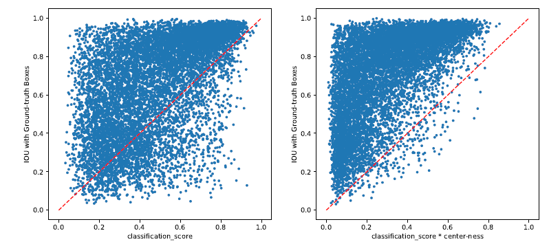

## FCOS: Fully Convolutional One-Stage Object Detection

**ICCV' 2019**

*참고 코드 : https://github.com/tianzhi0549/FCOS/*

> *Zhi Tian(Detection, estimation, and modulation theory, part 1 / 2004)*
>
> *Chunhua Shen(Refinenet / 2017)*
>
> *Hao Chen, Tong He*
>
> > *The University of Adelaide, Australia*

#### Abstract

 거의 대부분의 SOTA object detector들은 미리 정의된 anchor box의 영향을 갖는다. 

 반면, FCOS는 anchor box들이 없을 뿐만 아니라, region proposal 또한 존재하지 않는다.

 anchor box가 없어짐으로써, FCOS는 관련된 복잡한 연산들이 해결되었고, hyper-parameter와 관련된 복잡성도 해결할 수 있었다.

 Backbone으로 ResNeXt 모델을 사용한 FCOS는 single-model 및 single-scale testing을 통해서 44.7% AP를 달성하였다.

#### FCOS

* MS-COCO data set을 사용하여 총 80 개의 클래스를 활용

* 픽셀 별 예측 방식으로 object detection을 재구성하고 multi-level prediction을 사용하여 recall을 향상시키고, 중첩된 bounding box로 인한 모호성(ambiguity)를 해결

* 입력 이미지의 위치를 anchor box의 중심으로 간주하고 이 anchor box를 참조로 사용하여 target bounding box를 regression 시키는 anchor 기반의 detector와 달ㄹ리 해당 픽셀 위치에서 target bounding box를 직접 regression 한다.

  * detector는 anchor box 대신 학습 sample 위치를 직접 봄으로써 semantic segmentation을 위한 FCN과 동일하다.

* training sample은 위치(x, y)가 GT box에 위치하고 (x, y)에 대한 class label(c*)이 GT class label과 같은 경우 positive, class label이 0인 경우에는 negative sample로 간주한다.

* location에 대한 regression target 값은 실수 벡터인 t=(l, t, r, b)가 존재한다.

  * 

  * 위치가 여러 bounding box에 속하면 모호한(ambiguity) 샘플로 간주하며, regression 대상으로 면적이 최소인 bounding box만 선택하면 된다.

  * $$
    l^* = x-x^{i}_0, \;\;\;\;t^* = y-y^i_0\\
    r^* = x^i_1 - x, \;\;\;\;b^*=y^i_1 - y
    $$

* FCOS는 많은 foreground sample에 대하여 regression 학습에 활용 할 수 있으며, 이는 GT box와 함께 iou가 충분히 높은 anchor box만 positive sample로 간주하는 anchor box 기반의 detector의 성능을 넘어설 수 있는 이유가 된다.

* 

  * Backbone network의 뒤에는 4개의 conv layer가 존재하여 80개의 클래스에 대하여 예측수행과 (l,t,r,b)에 대한 location 예측을 수행한다.
  * backbone CNN 다음에 1x1 convolutional layer로 C3, C4, C5 생성
  * 기존 위치(x,y)당 9개의 anchor box를 통한 학습보다 9배는 더 적은 출력 변수를 가질 수 있다.

* $$
  L({p_{x,y}}, {t_{x, y}}) = \frac{1}{N_{pos}}\sum_{x,y}L_{cls}(p_{x,y}, c^*_{x,y}) + \frac{\lambda}{N_{pos}}\sum_{x,y} 1(c^*_{x,y}>0 )L_{reg}(t_{x,y}, t^*_{x,y})
  $$

  * $L_{cls}$ : focal loss
  * $L_{reg}$ : IoU loss (UnitBox)
  * $N_{pos}$ : positive sample 수
  * $\lambda$ : 1(본 논문에서 $L_{reg}$의 균형 가중치)
  * $1(c^*_{x,y}>0 )$ : $c^*$이 0보다 크면 1, 그렇지 않으면 0

* $p_{x,y}$ > 0.05 인 location 을 positive sample로 선택하고, (1)식을 반전하여 bounding box를 예측

#### Multi-level Prediction with FPN for FCOS

* CNN에서 최종 feature map의 큰 stride는 상대적으로 낮은 BPR(best positive recall, 최적 재현율)을 초래할 수 있다.
  * 큰 stride로 인해 최종 feature map의 위치가 인코딩 되지 않은 객체를 recall 하는것이 불가능하기 때문에 BPR이 낮을 수 있다고 생각이 되지만, multi level FPN기반의 FCOS는 경험적으로 anchor box 기반의 RetinaNet의 BPR 보다 나은 성능을 나타낸다.
  * 
* GT box의 overlap으로 다루기 힘든 ambiguity를 유발 할 수 있다.
  * Multi-level prediction을 통해 FCN 기반의 detector와 비교하여 동등하거나 더 나은 성능을 얻을 수 있다.
  * 각 level에 대한 bounding box regression의 range를 직접 제한하기 때문
  * 각 위치에 대한 $(l^*,t^*,r^*,b^*)$에 대하여 $max(l^*,t^*,r^*,b^*)>m_i$ 혹은 $max(l^*,t^*,r^*,b^*)<m_{i-1}$을 만족한다면 negative sample로 설정되므로 bounding box regression을 할 필요가 없다.
    * $m_i$는 feature level이 regression 하는 최대 거리를 의미하며, m2, m3, m4, m5, m6, m7은 0, 64, 128, 512 혹은 그 이상으로 설정
  * 2이상의 object에 할당되어 있는 경우, 최소 영역을 대상으로 하는 GT box를 선택
  * 
* 서로 다른 feature level 간의 head를 공유하여 detection 매개변수를 효율적으로 만들 뿐만 아니라, 성능을 향상 시킨다.

#### Center-ness for FCOS

* object의 중심에서 멀리 떨어진 위치에서 생성되는 많은 low-quality predicted bounding box가 생성

* 객체 위치의 "center ness"를 예측

  * center-ness는 해당 위치가 담당하는 물체 중심까지의 정규화된 거리를 의미

  * 

  * $$
    centerness^* = \sqrt{\frac{min(l^*, r^*)}{max(l^*, r^*)}\times\frac{min(t^*, b^*)}{max(t^*, b^*)}}
    $$

  * center-ness는 0~1의 범위이므로 BCE(Binary Cross Entropy)로 훈련되고 이는 위(2)식에 추가된다.

* test할때, 최종 점수(감지된 bounding box 의 순위 지정에 사용)는 예측 된 centerness을 해당 분류 score에 곱하여 계산되어 object의 중심에서 멀리 떨어진 bounding box의 점수를 낮출 수 있다.

* low-quality의 bounding box는 최종 NMS에 의하여 필터링 되어 detection의 성능을 현저하게 향상시킨다.

  * 
  * 발표 이후,  normalization과 positive sample의 중앙 부분만 사용하는 방법의 조합으로 더 나은 성능을 얻을 수 있음을 확인.

#### Results / Conclusion

* FCOS는 wide range에서의 object에 대하여 매우 작고 큰 object가 있는 경우, overlap이 심한 경우 등에서 detection이 가능하다.
* anchor와 region proposal 가 없는 1-stage detector 를 제안하였으며, RetainNet, YOLO, SSD를 포함한 anchor기반의 1-stage detector와 비교하여 나은 성능과 설계 복잡성이 덜한 네트워크를 제안하였다.
* 픽셀 당 예측을 진행하는 방식으로 1-stage detector에서 SOTA를 달성하였으며, Faster R-CNN에서 RPN으로도 사용될 수 있다.