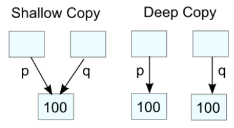

## CH07. 클래스 생성자와 소멸자

| Rule Of Three(C++11이전)                              | Rule Of Five(C++11이후)                                      | Rule Of Zero |
| ----------------------------------------------------- | ------------------------------------------------------------ | ------------ |
| 1. 복사생성자<br />2. 소멸자<br />3. 복사 대입 연산자 | 1. 복사 생성자<br />2. 소멸자<br />3. 복사 대입 연산자<br />4. 이동 연산자<br />5. 이동 대입 연산자 |              |

* Rule Of Zero

  * 클래스의 인스턴스를 만들어 사용할 때 사용자가 일반 생성자나 디폴트 생성자를 제외한 나머지 모든것을 시스템에 위임시키는 것을 의미

  * 가장 최근에 발표된 규칙

    

* Rule Of  Three

  * 복사 생성자와 소멸자를 만든다면, 동일하게 복사 대입 연산자를 추가시켜 주어야 한다.

  * ```c++
    //단지 하나의 복사 생성자만을 호출
    MyString s1("Hello World");
    MyString obj = s1;
    
    //생성된 기존변수에 대해 객체를 할당할때 복사 대입 연산자 호출
    MyString s1("Hello World"), s2;
    s2 = s1;
    ```


* Rule Of Five

  * Rule Of Three외에 이동 생성자와 이동 대입 연산자가 추가

  * ```C++
    class MyString{
        public:
        ...
        MyString(MyString&& other) noexcept;
        MyString& operator=(MyString&& other) noexcept;	//이동 대입 연산자 오버로딩
        ...
    }
    ```

  * 

* 생성자 역시 함수 오버로딩이 동일하게 적용

  * 오버로딩 : 같은 이름의 함수를 여러개 정의하고 매개변수의 유형과 개수를 다르게 하여 다양한 유형의 호출에 응답하게 한다.

  

* 복사 생성자(copy constructor)

  * 인수로 제공된 객체를 복사하여 새로운 객체를 만드는 생성자

  * 생성자 오버로딩이 적용된 또다른 기능을 수행하는 생성자

  * 원본 변형을 방지

  * 객체 생성 후, 대입 연산자를 사용하면 복사 생성자가 호출

  * ```c++
    class Simple{
        private:
        int num1;
        int num2;
        
        public:
        
        
        simple(){};// = default;
        Simple(int n1, int n2) : num1(n1), num2(n2){
            std::cout << "생성자 Simple(int n1, int n2) 호출" << std::endl;
        }
        
        //복사 생성자
        Simple(const Simple& copy): num1(copy.num1), num2(copy.num2){
            std::cout << "복사 생성자 Simple(Simple& copy) 호출" << std::endl;
        }
        
        void ShowSimpleData(){
            std::cout<<num1<<", " <<num2<< std::endl;
        }
    };
    
    int main(){
        Simple sim1(15, 30);
        
        Simple sim2 = sim1;		// Simple sim2(sim1)과 동일하게 해석
        sim2.ShowSimpleData();
        return 0;
}
    ```
    
    > 생성자 Simple(int n1, int n2) 호출
    >
    > 복사 생성자 Simple(Simple& copy) 호출
    >
    > 15, 30


* 이동 생성자

  * rvalue  참조를 인수로 사용하는 생성자

  * 기존 객체의 멤버 변수의 갑 또는 리소스(힙 메모리를 가리키는 포인터)를 그대로 이동시켜 생성

  * 기존 객체는 임시 저장소이므로 작업이 완료된 이후에 자연스럽게 소멸

  * ```C++
    class Simple{
        Simple(Simple&& move) noexcept : num1(std::move(move.num1)), num2(std::move(move.num2)){
            std::cout<<"이동 생성자 Simple(Simple&& move) 호출" << std::endl;
        }
    }
    ```


#### 생성자(Constructor)

* 주의사항

  1. 생성자의 본문 또는 초기화 리스트에서 클래스 내 가상함수(또는 virtual함수)를 호출하지 않아야한다.
  2. 생성자 내부에서는 가급적 예외(exception)를 발생시키지 않는다.
     * 발생시, noexcept 지정자를 사용하여 프로그램을 종료
  3. 기존 객체를 복사하여 생성자의 새로운 인수를 만드는 작업은 반드시 생성자의 인수리스트에서 수행
     * 지정자 클래스-이름(인수-리스트) noexcept [:초기화-리스트]{본문}
  4. 생성자는 일반 함수와 달리 메모리 주소를 알수 없기때문에 함수 포인터에 생성자의 주소를 할당하여 호출 할 수 없다.
  5. 평범한 클래스(C언어로 제작된 구조체와 호환을 목적으로 사용하는 클래스)는 기본적으로 생성자를 사용하여 객체를 생성하지 않아야한다.

* 디폴트 생성자

  * 생성자 이름만 있고 별도의 매개변수(또는 인수)가 없는 생성자

  * ```c++
    class Simple {
        ...
    	public:
        Simple() = default;
        Simple(int n1, int n2) : num1(n1), num2(n2) {
            std::cout << "생성자 Simple(int n1, int n2) 호출"<<std::endl;
        }
        ...
    }
    int main(){
        Simple sim1(15, 30), sim3 = Simple();
    }
    ```

* 암시적 변환 생성자

  * 컴파일러의 자의적 해석에 따라 객체 생성 시 하나의 생성자를 선택하는 것

  * 왼쪽 변수의 데이터에 맞추어 변환하는 작업을 수행

  * 컴파일러는 복사 생성자(또는 이동 생성자)의 호출을 줄이는 방식으로 작업을 선택하게 되어 대부분 *일반 생성자*를 사용한다.

    * ```c++
      Complex a1(1);
      ```

    * 일반 생성자 사용 외 또 다른 방법으로 *복사 생성자*를 사용

      1. 1를 인수로 Complex(int x) 생성자를 호출하여 임시 Complex 객체 생성
      2. 임시 Complex 객체를 인수로 복사 생성자를 사용하여 a1 객체를 생성
      3. 임시 Complex 객체를 삭제

  * ```c++
    #include <iostream>
    #include <cstdio>
    
    class Complex {
    public :
    	Complex(int x) : real(x), imaginary(0.0) {
    		printf("Complex(int %d) 호출\n", x);
    	}
    
    	Complex(double x, double y) : real(x), imaginary(y) {
    		printf("Complex(double %.2f, double %.2f) 호출\n", x, y);
    	}
    
    private:
    	double real;
    	double imaginary;
    };
    
    int main() {
    	Complex a1 = 1;			// 숫자를 인수로 인식하여 Complex::Complex(int)생성자 호출
    	Complex a2(2);			// 직접 Complex::Complex(int) 생성자를 호출
    	Complex a3{ 4, 5 };		// 직접 Complex::Complex(double, double) 생성자를 호출
    	Complex a4 = { 4, 5 };	// 숫자를 인수로 인식하여 Complex::Complex(double, double)생성자 호출
    	// Complex::Complex(int) 생성자를 호출
    	Complex a5 = (Complex)1;
    	Complex *a6 = new Complex(4, 5);
    	delete a6;
    }
    ```

    > Complex(int 1) 호출
    >
    > Complex(int 2) 호출
    >
    > Complex(double 4.00, double 5.00) 호출
    >
    > Complex(double 4.00, double 5.00) 호출
    >
    > Complex(int 1) 호출
    >
    > Complex(double 4.00, double 5.00) 호출

* 명시적 생성자

  * explicit 지정자를 통해서 컴파일러가 자의적인 해석을 금지하고 자신이 설정된 방식으로만 객체를 생성

  * 제약 조건이 까다롭기 때문에 조건이 까다로운 클래스에서 많이 사용

  * ```C++
    #include <iostream>
    #include <cstdio>
    
    class Complex {
    public :
    	explicit Complex(int x) : real(x), imaginary(0.0) {
    		printf("Complex(int %d) 호출\n", x);
    	}
    
    	explicit Complex(double x, double y) : real(x), imaginary(y) {
    		printf("Complex(double %.2f, double %.2f) 호출\n", x, y);
    	}
    
    private:
    	double real;
    	double imaginary;
    };
    
    int main() {
        //Complex b1 = 1;		//자의적 해석으로 인한 에러 발생
        Complex b2(2);			//Complex::Complex(int) 생성자 호출
        Complex b3{4, 5}		//Complex::Complex(double, double) 생성자 호출
        //Complex b4 = {4, 5}		//자의적 해석으로 인한 에러 발생
        Complex b5 = (Complex)1;		// 타입변환 허용
        Complex *b6 = new Complex(4, 5);
        delete b6;
    }
    ```

    > Complex(int 2) 호출
    >
    > Complex(double 4.00, double 5.00) 호출
    >
    > Complex(int 1) 호출
    >
    > Complex(double 4.00, double 5.00) 호출)

* 생성자 상속

  * 클래스의 상속에 있어 기본적으로 클래스의 멤버는 원칙적으로 하위 클래스에 그대로 물려주지만, 클래스의 멤버 가운데 생성자와 소멸자, 대입 연산자(암시적 변환을 수행하는 연산자)는 물려주지 않는다.

  * ```c++
    #include <iostream> 
    
    class Box {
    public: 
        Box(int width = 0, int length = 0, int height = 0) 
            : width(width), length(length), height(height) {};
        inline int Volume() {return width * length * height; }
    
    private:
        int width;
        int length;
        int height;
    };
    
    class WoodBox: public Box {
    public:
        // WoodBox(int w, int l, int h) : Box(w, l, h) {}
        using Box::Box;			//자신의 클래스 이름을 사용
    };
    
    int main(void){
        WoodBox *b = new WoodBox(5, 10, 3);
        std::cout << "나무 상자의 크기 = " << b->Volume() << std::endl;
        delete b;
    }
    ```

    > 나무 상자의 크기 = 150

* initializer_list 클래스 템플릿

  * 배열이나 컨테이너 클래스 타입으로 선언된 멤버 변수를 초기화 시킬때 사용

  * 다음 조건이 성립되었을 때, 자동으로 호출되어 객체가 생성

    * 다수의 데이터를 대입 연산자와 함게 시작 중괄호와 끝 중괄호('{', '}')로 제공할 때
    * iterator 객체 또는 vector 객체와 같이 리스트를 인수로 제공할 때
    * 배열을 인수로 사용할 때

  * ```c++
    #include <iostream>
    #include <initializer_list>
    
    struct MyClass {
    	MyClass(int, int);
    	MyClass(std::initializer_list<int>);
    	~MyClass();		//소멸자
    
    private:
    	int size;
    	int *mem;
    };
    
    int main() {
    	MyClass bar(10, 20);
    	MyClass foo{ 10, 20 };
    }
    
    MyClass::MyClass(int a, int b) {
    	size = 2;
    	mem = new int[2]();
    	mem[0] = a;
    	mem[1] = b;
    	std::cout << "MyClass(int ,int) :" << mem[0] << ' ' << mem[1] << std::endl;
    }
    
    MyClass::MyClass(std::initializer_list<int>a) {
    	size = a.size;
    	std::cout << "MyClass(std::initializer_list<int>) : ";
    	mem = new int[size]();
    	for (int i = 0; i < size; ++i) {
    		mem[i] = *(a.begin() + i);
    		std::cout << mem[i] << ' ';
    	}
    	std::cout<<std::endl
    }
    
    MyClass::~MyClass() {
    	std::cout << "delete[] mem" << std::endl;
    	delete[] mem;
    }
    ```


#### 소멸자

* 클래스의 인스턴스가 삭제되기 전에 수행되는 특수 목적 함수
* 다음 경우에 호출
  * 프로그램이 종료되어 객체를 삭제 시킬 때
  * 함수 내 지역 변수처럼 특정 지역 내 선언된 변수가 식별자 적용 범위를 벗어나 더 이상 사용할수 없을 때
  * new 연산자를 사용하여 생성된 클래스의 인스턴스를 삭제시키기 위해 delete 연산자를 호출 할 때
* 특징
  * 인수를 갖지 않는다.
  * 단 하나만이 존재할 수 있다.
  * 생성자 처럼 하위 클래스로 상속이 불가하다.
  * 하위 클래스의 소멸자가 호출 되면, 동시에 연관된 상위 클래스의 소멸자가 자동으로 호출 된다.
  * 객체가 소멸되기 직전에 자연스럽게 호출된다.
  * 의미없이 비어있는 소멸자는 만들지 않는것이 좋다.
    * OS는 객체를 삭제하기전에 소멸자를 작업 큐에 넣고 하나씩 수행하므로, 시스템의 성능을 좋게 하려면 가급적 비어있는 소멸자는 만들지 않는 것이 좋다.

* ```c++
  #include <iostream>
  #include <cstring>
  #include <cstdlib> 
  
  struct Account {
  	char *account; // 계좌 번호 
  	char *name;      // 이  름
  	int balance;     // 잔  액 
  	Account(const char *id, const char *name, int bal)
  		: account(new char[strlen(id) + 1]),
  		name(new char[strlen(name) + 1]),
  		balance(bal) {
  		strcpy(this->account, id);
  		strcpy(this->name, name);
  		std::cout << "Account 생성자가 호출되었습니다." << std::endl;
  	}
  
  	~Account() {
  		std::cout << "Account 소멸자가 호출되었습니다." << std::endl;
  		delete[] account;
  		delete[] name;
  	}
  
  	void Print() {
  		printf("계 좌 : %s , 소유자 : %s", account, name);
  		printf(", 잔 액 : %i\n", balance);
  	}
  
  	void Deposit(int money) {
  		balance += money;
  	}
  
  	void Withdraw(int money) {
  		balance -= money;
  	}
  };
  
  int main() {
  	Account *hong = new Account("120-345-129099", "홍길동", 60000);	//(1)
  	if (NULL == hong)
  		return -1;
  	{
  		Account kim("129-345-929100", "김홍도", 0);					//(2)
  		hong->Withdraw(2000);
  		kim.Deposit(2000);
  		hong->Print();												  // (3)
  		kim.Print();												  // (4)
  	}
  
  	delete hong;													  // (5)
  	return 0;													  	  // (6)
  }
  ```

  >Account 생성자가 호출되었습니다.		//(1)
  >Account 생성자가 호출되었습니다.		//(2)
  >계 좌 : 120-345-129099 , 소유자 : 홍길동, 잔 액 : 58000			//(3)
  >계 좌 : 129-345-929100 , 소유자 : 김홍도, 잔 액 : 2000			 //(4)
  >Account 소멸자가 호출되었습니다.												//(5)
  >Account 소멸자가 호출되었습니다.												//(6)

* 가상 소멸자

  * 다형성의 원칙에 따라 해당 객체를 상위 클래스의 인스턴스에 할당 하였다면, 해당 객체가 소멸 시 정상적으로 상위 클래스의 소멸자는 호출되는 반면, 하위 클래스의 소멸자는 호출되지 않는 문제가 발생.

    * new 연산자를 사용하여 하위 클래스의 신스턴스를 생성
    * 생성한 객체를 상위 클래스 타입의 포인터에 할당
    * 객체를 삭제하기 위해 delete 연산자를 호출한다.

    > 만일 힙 메모리 공간이 아닌 스택 내 저장소를 생성하는 일반변수를 참조하는 경우 모두 정상적으로 상위 클래스의 소멸자와 하위 클래스의 소멸자가 호출 된다.

  * 상위 클래스의 소멸자에 virtual 지정자를 선언하여 가상 소멸자를 만들어 주어야한다.

  * ```c++
    class Box{
        ...
        virtual ~Box(){
            std::cout <<"Box 소멸자 호출" <<std::endl;
        }
        ...
    };
    ```


#### 복사 생성자

* 클래스-이름 (const 클래스-이름& ) {본문}

* ```c++
  class_name (const class_name &){
      ...
  }
  //default 복사 생성자를 생성하도록 요청
  class_name (const class_name& ) = default;
  //복사 생성자를 삭제
  class_name (const class_name& ) = delete;
  ```

* 기존 객체를 복사하여 새로운 객체를 생성하는 생성자

* C++에서는 일반 변수를 선언 시 힙 메모리가 아닌 스택 메모리 내 객체를 생성하기 때문에 객체의 복사가 빈번히 발생

* 객체의 복사 문제를 해결하기 위해서 new 연산자를 사용하여 포인터를 사용하는 방법과 일반 변수를 참조하는 방법이 있다.

* Rule Of Zero의 규칙에 따라 복사 생성자를 별도 정의하지 않는것이 좋다.

* 소멸자 내부에서 delete 연산자를 호출하여 힙 메모리 내 저장소를 삭제하는 과정에서 문자열이 깨지는 것과 같은 에러 발생.

  * 다음 조건에서 발생
    * 클래스 내부에 멤버 포인터가 존재
    * 멤버 포인터는 생성자가 호출 시 메ㅐ모리를 할당받고 초기화
    * 소멸자는 생성자에 의해 할당받은 메모리를 OS에 반환하는 기능을 수행
    * 시스템에서 제공하는 디폴트 복사 생성자를 사용
  * 함수의 작업이 완료되면, 객체를 소멸하는 과정에서 소멸자가 호출되어 문자열의 저장소를 삭제
  * 프로그램이 종료되면서 원본 객체 역시 소멸되어 영역침범이라는 에러 발생

  

* ```c++
  #include <iostream>
  #include <string>
  #include <cstring>
  
  class MyString {
  public:
      MyString(const char *n);
      MyString(const MyString &my) = default; // 복사 생성자
      ~MyString();
  
      const char* GetString() const;
      int GetLength() const;
      
  private:
      char* data;
      int length;
  };
  
  MyString::MyString(const char *n){
      if (nullptr == n){
          data = nullptr;
          length = 0;
          return;
      }
      
      int mLength = strlen(n);
      if (0 == mLength) {
          data = nullptr;
          length = 0;
          return;
      }
      
      char *temp = new char[mLength + 1];
      std::strcpy(temp, n);
      data = temp;
      length = mLength;
      
      printf("MyString::MyString(const char '%s')\n", n);
  }
  
  MyString::~MyString(){
      printf("MyString::MyString('%s') 소멸자 호출\n", data);
      if (nullptr != data) {
          delete[] data;
  
          data = nullptr;
          length = 0;
      }
  }
  
  const char* MyString::GetString() const {
      return data;
  }
  
  int MyString::GetLength() const {
      return length;
  }
  
  //other 객체를 소멸하는 과정에서 소멸자가 호출
  void display(const MyString& other) {
     std::cout << other.GetString() << std::endl;
  }
  
  int main() {
      MyString s1("Hello World");
      display(s1);
      MyString obj = s1;		// 복사 생성자에 의해 얕은 복사 수행
      return 0;
  }
  ```
  >MyString::MyString(const char 'Hello World')
  >Hello World
  >MyString::MyString('Hello World') 소멸자 호출
  >MyString::MyString('硼硼硼硼硼硼硼硼@{`?') 소멸자 호출

* 얕은 복사 -> 깊은 복사

* (char *) 타입의 문자열 -> std::string 타입의 문자열 

* 문자열 포인터 -> std::shared_ptr 객체를 사용하여 관리

#### 얕은 복사와 깊은 복사

* 얕은 복사

  * 단지 메모리 주소만을 복사하여 변수의 데이터로 만드는 방법

    

* 깊은 복사

  * 변수가 관리하는 리소스 자체를 복사하여 새롭게 멤버 변수에 입력
  * 새롭게 메모리를 할당하고 문자열이나 객체를 복사

* 

* 복사 대입 연산자

  * 위 코드에서 깊은 복사로 바꾸어 줌에도 불구하고 s2=s1; display(s2); 를 해준다면 다시 문자열이 깨지는 에러 발생

    * 복사 대입 연산자 오버로딩 작업 없이 디폴트로 연산 작업을 수행하다보니 또 다시 얕은 복사가 발생되기 때문

  * 위 코드의 모든 문제점을 해결하기 위해서는 복사 대입 연산자 오버로딩을 만들어줘야 한다.

  * operator 키워드와 =대입연산자, 참조인수를 사용하여 선언

  * class_name& class_name::operator=(const class_name)

  * ```c++
    #include <iostream>
    #include <string>
    #include <cstring>
    
    class MyString {
    public:
    	MyString(const char *n);
    	MyString(const MyString &my);
    	~MyString();
    
    	MyString& operator= (const MyString& other);
    	void SetString(const char* n);
    	const char* GetString() const;
    	int GetLength() const;
    
    private:
    	void Release();
    	char* data;
    	int length;
    };
    
    void display(MyString other) {
    	std::cout << other.GetString() << std::endl;
    }
    
    int main() {
    	MyString s1("Hello World"), s2 = "복사 생성자";
    	display(s1); 
    	s2 = s1;
    	display(s2);
    	return 0;
    }
    
    // 일반 생성자이다.
    MyString::MyString(const char *n) : data(nullptr), length(0) {
    	SetString(n);
    	printf("MyString::MyString(const char '%s')\n", n);
    }
    
    // 복사 생성자이다.
    MyString::MyString(const MyString &my) : data(nullptr), length(0) {
    	SetString(my.GetString());
    	printf("MyString::MyString(const MyString '%s')\n", my.GetString());
    }
    
    MyString::~MyString() {
    	printf("MyString::MyString('%s') 소멸자 호출\n", data);
    	Release();
    }
    
    MyString& MyString::operator= (const MyString & other) {
    	if (this != &other) { // 자기 자신을 대입하는 것은 무의미한 작업이다.
    		Release();
    		SetString(other.GetString());
    	}
    	printf("MyString& MyString::operator = Mystring('%s')\n", this->data);
    	return *this;
    }
    
    void MyString::SetString(const char* n) {
    	if (nullptr == n) return;
    
    	int mLength = strlen(n);
    	if (0 == mLength) return;
    
    	data = new char[mLength + 1];
    	std::strcpy(data, n);
    	length = mLength;
    }
    
    const char* MyString::GetString() const {
    	return data;
    }
    
    void MyString::Release() {
    	if (data != nullptr) {
    		delete[] data;
    		data = nullptr;
    		length = 0;
    	}
    }
    
    int MyString::GetLength() const {
    	return length;
    }
    
    ```

    > MyString::MyString(const char 'Hello World')
    > MyString::MyString(const char '복사 생성자')
    > MyString::MyString(const MyString 'Hello World')
    > Hello World
    > MyString::MyString('Hello World') 소멸자 호출
    > MyString& MyString::operator = Mystring('Hello World')
    > MyString::MyString(const MyString 'Hello World')
    > Hello World
    > MyString::MyString('Hello World') 소멸자 호출
    > MyString::MyString('Hello World') 소멸자 호출
    > MyString::MyString('Hello World') 소멸자 호출


#### 이동 생성자와 이동 대입 연산자

* 이동 생성자는 rvalue 참조를 사용하는 생성자이다.

  * rvalue 참조 : 상수나 임의 저장소를 참조하는 개념

    ```c++
    void function(){
        int&& value = 10;
    }
    ```

    * 저장소를 만들어 10을 입력
    * 저장소에 대해 ravlue 참조를 생성
    * 함수 반환 시 임시 저장소와 함게 ravlue 참조를 소멸

* 이동 생성자와 이동 대입 연산자는 인수로 사용한 객체와 새롭게 생성한 객체의 멤버간의 데이터 교환이 이루어진다.

  * ```c++
    //other 객체는 작업이 완료된 이후에 소멸
    MyString::MyString(MyString&& other) noexcept : data(nullptr), length(0) {
        std::swap(this->data, other.data);
        std::swap(this->length, other.length);
    }
    ////////////////////////////////////////////////////////////////
    //이동 생성자의 정의문
    //인수로 사용하는 객체는 무명 객체처럼 임시 저장소를 사용하는 객체이다.
    ...
    MyString::MyString(MyString&& other) noexcept : data(other.data), length(other.length){
        printf("MyString(MyString&& '%s')\n", data);
        other.data = nullptr;		//인수로 사용한 객체 소멸 시 리소스(char *)를 삭제하지 못하도록 처리
        other.length = 0;
    }
    ...
    ```

  * ```c++
    #include <iostream>
    #include <string>
    #include <cstring>
    #include <vector>
    #include <algorithm>
    
    class MyString {
    public:
    	MyString(const char *n = nullptr);
    	MyString(const MyString &other);
    	MyString(MyString&& other) noexcept;
    	~MyString();
    
    	MyString& operator= (const MyString& other);
    	MyString& operator= (MyString&& other) noexcept;
    	void SetString(const char* n);
    	const char* GetString() const;
    	int GetLength() const;
    
    private:
    	char* data;
    	int length;
    };
    
    MyString::MyString(const char *n) : data(nullptr), length(0) {
    	SetString(n);
    	printf("MyString::MyString(const char '%s')\n", n);
    }
    
    MyString::MyString(const MyString &other) : data(nullptr), length(0) {
    	SetString(other.GetString());
    	printf("MyString::MyString(const MyString& '%s')\n", data);
    }
    
    MyString::MyString(MyString&& other) noexcept
    	: data(other.data), length(other.length) {
    	printf("MyString::MyString(MyString&& '%s')\n", data);
    	//printf(">>>\n");
    	other.data = nullptr;
    	other.length = 0;
    }
    
    MyString::~MyString() {
    	printf("MyString::MyString('%s') 소멸자 호출\n", data);
    	if (data != nullptr) {
    		delete[] data;
    	}
    }
    
    MyString& MyString::operator= (const MyString& other) {
    	if (this != &other) {
    		delete[] data;
    		SetString(other.GetString());
    	}
    	printf("MyString& MyString::operator = (Mystring& '%s')\n", this->data);
    	return *this;
    }
    
    MyString& MyString::operator= (MyString&& other) noexcept {
    	if (this != &other) {
    		if (nullptr != data) delete[] data;
    
    		data = other.data;
    		length = other.length;
    		other.data = nullptr;
    	}
    	printf("MyString& MyString::operator = (Mystring&& '%s')\n", this->data);
    	return *this;
    }
    
    void MyString::SetString(const char* n) {
    	if (n == nullptr) return;
    
    	int mLength = strlen(n);
    	if (mLength == 0) return;
    
    	data = new char[mLength + 1];
    	std::strcpy(data, n);
    	length = mLength;
    }
    
    const char* MyString::GetString() const {
    	return data;
    }
    
    int MyString::GetLength() const {
    	return length;
    }
    
    void display(MyString other) {
    	std::cout << other.GetString() << std::endl;
    }
    
    int main() {
    	MyString s1("Hello World"), s2 = "복사 생성자";
    	display(s1);
    	s2 = s1;
    
    	std::vector<MyString> vec;
    	vec.push_back(s1);
    	vec.push_back(MyString("이동 생성자"));
    	vec.push_back(MyString("이동 대입 연산자"));
    	s2 = std::move(vec[2]);
    	return 0;
    }
    ```

    >MyString::MyString(const char 'Hello World')
    >MyString::MyString(const char '복사 생성자')
    >MyString::MyString(const MyString& 'Hello World')
    >Hello World
    >MyString::MyString('Hello World') 소멸자 호출
    >MyString& MyString::operator = (Mystring& 'Hello World')
    >MyString::MyString(const MyString& 'Hello World')
    >MyString::MyString(const char '이동 생성자')
    >MyString::MyString(MyString&& 'Hello World')
    >**MyString::MyString('(null)') 소멸자 호출**
    >MyString::MyString(MyString&& '이동 생성자')
    >**MyString::MyString('(null)') 소멸자 호출**
    >MyString::MyString(const char '이동 대입 연산자')
    >MyString::MyString(MyString&& 'Hello World')
    >MyString::MyString(MyString&& '이동 생성자')
    >**MyString::MyString('(null)') 소멸자 호출**
    >**MyString::MyString('(null)') 소멸자 호출**
    >MyString::MyString(MyString&& '이동 대입 연산자')
    >**MyString::MyString('(null)') 소멸자 호출**
    >MyString& MyString::operator = (Mystring&& '이동 대입 연산자')
    >MyString::MyString('Hello World') 소멸자 호출
    >MyString::MyString('이동 생성자') 소멸자 호출
    >**MyString::MyString('(null)') 소멸자 호출**
    >MyString::MyString('이동 대입 연산자') 소멸자 호출
    >MyString::MyString('Hello World') 소멸자 호출

* 이동 대입 연산자 오버로딩은 보통 swap()함수를 사용하여 멤버 변수의 데이터를 서로 교체

  * ```c++
    MyString& MyString::operator= (MySting&& other) noexcept {
        if(this != &other){
            std::swap(this->data, other.data);
            std::swap(this->length, other.length);
        }
        ...
    }
    ```

  * this 객체 내 멤버들은 모두 other라고 하는 객체으 ㅣ멤버로 이동하게 된다.

  * other객체는 임시 객체이므로 연산자의 작업이 완료되면 자동적으로 소멸한다.


#### 복사/이동 생략의 원칙

* 복사 생성자와 이동 생성자의 호출을 생략할 수 있는 경우

  * 암시적 변환 생성자 처럼 객체 생성 시 오로지 하나의 객체만이 생성된다.

    * Complex x=1;	혹은 	Complex x = Complex(Complex(Complex(1)));
    * 이는 Complex x(1); 과 동일한 문장

  * 함수 내 지역변수를 생성하여 반환한다면, 복사 생성자의 호출을 생략된다.

    * NRVO(Named Return Value Optimization)

    * ```c++
      MyString create(const char *ptr = nullptr){
          MyString obj(ptr);		// 지역 변수를 생성
          return obj;				// 복사 생성자를 호출하지 않는다.
      }
      MyString x = create("Hello World");					// 일반 생성자 하나만 호출
      MyString *p = new MyString(create("Hello World"));	// 일반 생성자 하나만 호출
      ```

    * 원칙적으로는 함수 범위내 생성된 객체가 범위를 벗어난다면, 삭제되므로 복사 생성자를 호출하여 객체를 복사시켜 전달되어야 하지만, 그 과정이 생략된다.

  * 함수가 다음과 같이 객체를 생성하여 반환하는 경우에 이동 생성자의 호출이 생략된다.

    * RVO(Return Value Optimization)

    * ```C++
      MyString create(const *ptr = nullptr){
          return MyString{ptr};		//무명 변수를 생성
      }
      MyString x = create();
      ```

  * 함수 내부에서 객체를 생성하여 throw를 사용하여 예외를 던졌을 때, 복사 생성자의 호출이 생략된다.

    * ```C++
      void foo(const char *ptr=nullptr){
          throw MyString(ptr);
      }
      int main(){
          try {
              foo("throw MyString");
          }catch(MyString& c){}
      }
      ```

* ```c++
  #include <iostream>  
  #include <string>
  #include <algorithm>
  
  int count = 0;
  
  class MyString {
  	std::string data;
  
  public:
  	MyString(const char *ptr = nullptr) : data(ptr) {
  		std::cout << "Constructor : " << ptr << std::endl;
  	}
  	MyString(const MyString  &obj) : data(obj.data) {
  		std::cout << "copy constructor : " << data.c_str() << std::endl;
  		++count;
  	}
  	MyString(MyString&& obj) {
  		std::swap(this->data, obj.data);
  		std::cout << "Move constructor : " << data.c_str() << std::endl;
  		++count;
  	}
  	~MyString() {
  		std::cout << "Destructor  : " << data.c_str() << std::endl;
  	}
  
  	MyString& operator= (const MyString & other) {
  		if (this != &other) {
  			data = other.data;
  		}
  		printf("MyString& MyString::operator = (Mystring& '%s')\n", this->data);
  		++count;
  		return *this;
  	}
  
  	MyString& operator= (MyString&& other) noexcept {
  		if (this != &other) {
  			std::swap(this->data, other.data);
  		}
  		printf("MyString& MyString::operator = (Mystring&& '%s')\n", this->data);
  		++count;
  		return *this;
  	}
  };
  
  MyString fun123(const char *ptr = nullptr) {
  	MyString obj(ptr);
  	return obj;
  }
  
  MyString xyz123(const char *ptr = nullptr) {
  	return MyString{ ptr };
  }
  
  void foo(const char *ptr = nullptr) {
  	throw MyString(ptr);
  }
  
  int main() {
  	MyString abc = { "abc" };
  
  	MyString obj1(fun123("fun123()"));
  	MyString obj2(xyz123("xyz123()"));
  
  	MyString xyz = "Return Value Optimization(RVO)";
  	
  	try {
  		foo("throw MyString");
  	}
  	catch (MyString& c) {
  	}
  	
  	std::cout << "호출 횟수 : " << count << std::endl;
  	return 0;
  }
  ```

  > Constructor : abc
  >
  > Constructor : fun123()
  >
  > Constructor : xyz123()
  >
  > Constructor : Return Value Optimization(RVO)
  >
  > Constructor : throw MyString
  >
  > Destructor  : throw MyString
  >
  > 호출 횟수 : 0
  >
  > Destructor  : throw MyString
  >
  > Destructor  : xyz123()
  >
  > Destructor  : fun123()
  >
  > Destructor  : abc

