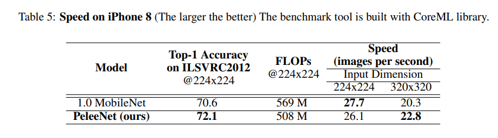

# Pelee: A Real-Time Object Detection System on Mobile Devices

>  Pelee: A Real-Time Object Detection System on Mobile Devices[NeurIPS- 2018]
>
> 저자:
>
> Robert Jun Wang
>
> - AI Research Scientist at FLIR Systems

 본 논문에서 말하길 현재 Mobile 환경에서 사용되는 MboileNet, ShuffleNet 등 과 같은 Network들은 Depthwise separable convolution을 사용해 framework에서 구현하기 어렵고 효율적이지 않는다는 주장을 한다. 

 이러한 점을 개선하기 위해 저자는 전통적인 Convolution 연산만을 사용해도 충분하다고 주장하며,  논문의 이름과 같이 Mobile Device에서 사용될 수 있는 새로운 Network를 제안한다.

본 논문에서 흥미로웠던 점(나는 흥미로웠음)은 기존 논문에서는 고성능 PC환경에서 실험이 진행되었던 반면에 논문에서는 iphone8, NVIDIA TX2 환경에서 실험이 진행된다. 또한 앞 부분에서는 PeleeNet이라는 Network에 대해 설명한 후 후반부에서는 PeleeNet을 활용한 Object detection 모델인 Pelee를 동시에 한 논문으로 설명하고 있다. 

이제부터 Pelee 구조에 대해 알아보자.

 본 논문에서 PeleeNet은 기존에 있던 DenseNet을 개량해 만든 모델이다. 즉 DenseNet에서 영감을 받아 만들어진 모델이라고 할 수도있는셈이다.

이렇게 만들어진 PeleeNet은 original DenseNet보다 정확도가 5.05% 더 높고 MobileNet보다는 6.53% 더 높다고한다. 게다가 MobileNet의 model size의 66% 수준이라고 하는데 어떻게 그것을 가능하게 했을지 밑에서 알아보자.

## PeleeNet

### Two-Way Dense Layer

  논문에서 위 'Two-Way Dense Layer' 구조는 GoogLeNet에서 영감을 받았다고 저자는 말한다. 아마 구조를 보아하니 Inception module에서 영감을 받지 않았나 생각이 든다.

 위의 Figure.1 에서 왼쪽은 원래의 Dense layer를 보여준다. 본 논문에서 사용된 방식은 오른쪽과 같은 2-way dense layer 방식인데 기존에 original 버전을 inception module과 같이 수정한 모습을 볼 수 있다. 또한 여기서 저자는 Large object들의 pattern을 학습시키기 위해 오른쪽에 있는 layer를 추가했다고 하며 Figure. 1을 보면 Filter concatenate를 할때 kernel의 개수를 맞춰주어 기존과 비슷한 연산량을 가지도록 하게 한 것을 볼 수 있다.

### Stem Block

 논문에서는 Stem Block은 Inception-v4에서 영감을 받았다고 한다.

위의 그림에서 오른쪽이 Inception-V4의 stem layer이다. 맨 밑을 보면 제일 처음 단계인 Input data를 받아 연산을 하는 것을 알 수 있다.

 위의 Figure. 2 의 stem layer는 첫번째 Dense layer에 들어가기 전에 사용되는 block으로 연산 비용을 효율적이게 사용하기 위해 설계되었다고 한다.

stem block을 보면 input data의 width와 height가 4배 줄어든 것을 볼 수 있다. 이는 전체 구조가 cost-efficient하게 되며 feature expression ability가  많은 연산을 추가적으로 하지 않아도 향상된다고 말한다. (ex 첫번째 Conv layer 채널 늘리기 등)

### Dynamic Number of Channels in Bottleneck Layer

위의 그림은 DenseNet의 bottleneck 구조를 설명한다. 

 DenseNet에서는 앞의 Convolution layer의 출력을 계속 concatenate하는 구조이기 때문에 channel 개수가 많아지면 계속해서 concatenate되기 때문에 channel의 개수가 많아질 수 있다. 그래서 이것을 방지하기 위해 Growth Rate(K)라는 구조를 사용하여 channel의 개수를 유지해준다.

> ex)
>
> 보통 DenseNet이나 PeleeNet에서 사용하는  growth rate K의 값은 32이다.
>
> 만약 K = 4
>
> 입력: 6
>
> 4번의 Convolution 과정을 거치면
>
> 채널수: (6 + 4 + 4 + 4 + 4 = 22)

 본 논문에서도 기존 DenseNet에서 사용된 구조를 많이 활용한다.  하지만 DenseNet에서 사용되는 bottleneck구조를 그대로 사용하면 한가지 문제가 생긴다.

 문제는 바로 초기 1x1 Conv를 할 때 초기 input channel의 수를  4*K 의 수만큼 만드는 것 이다. 이러면 input channel보다 큰 값이 되기 때문에 bottleneck을 사용하는 의도와 맞지 않게된다. 그래서 본 논문에서는 상황에 따라 채널의 수를 block에 따라 유동적으로 바꾸는 방법을 사용하여 bottleneck에서 채널이 늘어나는 것을 방지 했다. 그리하여 위방법을 사용함으로써 정확도는 조금 줄었지만 연산량을 28.5% 줄였다고 한다.

### Transition Layer without Compression

 Transition layer는 DenseNet에서 사용되었으며 feature map의 가로, 세로, 사이즈를 줄여주고 feature map을 줄여주는 layer이다. 여기에는 feature map을 줄여주는 compression이라는 기능이 있었는데 논문에서는 Transition layer에서의 compression은 feature expression을 저하시킨다고 하며 compression 없이 channel을 같게 해주었다고 한다.

### Composite Function

 본 논문에서는 모델의 speed를 향상 시키기 위해 DenseNet에서 사용되던 pre-activation 대신에 post-activation( Conv -  batch norm- ReLU)를 사용했다.

(DenseNet에서 사용된 pre-activation: batch norm - ReLU - Conv 순서이다.)  이렇게 하면 Inference 단계에서 Batch Normaliztion이 Convolution 연산과 합쳐질 수 있어 연산 속도가 빨라지며 정확성 감소를 막기 위해 1x1 Conv을 사용해 feature expression을 높혔다고 한다.

> 다른 이유
>
> 본 논문에서는 framework로 Tensor RT를 사용했는데
>
> 여기서 지원하는 버티컬 퓨전 레이어를 사용하면 Network의 가속을 도와준다. 
>
> 하지만 이 때 당시에는 pre-activation이 버티컬 퓨전 레이어 지원을 받을 수 없고 전통적인 post-activation으로 사용해야 지원이 가능하기 때문에 본 논문에서는 pre-activation을 post-activation으로 사용했다고 한다.
>
> 딥러닝 커뮤니티 김영준님이 질문에 답변해주신 대답

### Model Arcitecture

#### Ablation Study

위의 Table. 2는 original DensNet-41과 Pelee 성능을 비교하기 위해 기능을 하나씩 넣으면서 실험을 진행했다.

PeleeNet이 다른 모델에 비해 size가 매우 작으며 대체적으로 정확도가 높은 편이 것을 알 수 있다.

 여기서 가장눈여겨 볼 것은 Speed인데 실험 환경은 NVIDIA TX2에서 실험 되었다. PeleeNet이 다른 모델에 비해 초당 이미지 처리 횟수가 가장 많은 것을 알 수 있다.

> FP16 / FP32란?
>
> https://ai-study.tistory.com/37

# Pelee : A Real-Time Object Detection System

 논문 후반부에서는 앞에서 설계된 PeleeNet를 활용한 Pelee object detector에 대해서 말한다.

본 논문에서는 SSD와 PeleeNet을 결합한 모델을 만드는데 논무에서는 Pelee라고 부른다. 

 Pelee는 SSD를 변형한 모델이며 Yolo v2보다 조금 더 좋은 성능을 보이는데 특징은 다음과 같다.

- ##### Feature Map Selection

  - Pelee에서는 5개의 서로 다른 feature map을 사용하는데 사이즈를 사용한다.
  - feature maps: [19x19, 10x10, 5x5, 3x3, 1x1]
  - 원래 SSD에서는 38 x 38 feature map도 사용하지만 본 논문에서는 computational cost를 고려해 사용하지 않았다.

  

- ##### Residual Prediction Block

  - prediction 영역 전에 ResBlock 사용
  - prediction을 하기 전 해당 feature map의 expression을 좋게 하기 위한 과정

- ##### Small Convolutional Kernel for Prediction

  - ResBlock에서 1x1을 사용하여 연산량을 줄임
  - 1x1은 3x3 Conv 연산과 유사한 성능을 내고 computational cost가 21.5% 줄어드는 효과를 냄
  - 

그전에 SSD에 대해서 간단하게 알아보자

  SSD의 구조는 다음과 같다. 위 모델에서 38x38 feature map을 없애고  Resblock을 적용하면 Pelee 모델이 된다.

 

  SSD는 서로 다른 feature map의 크기를 활용하여 작은 물체도 효과적이게 잘 찾을 수 있다는 점이 있다.

또한 밑의 그림과 같은 식을 사용하여 default box의 크기 및 feature map에서의 좌표를 구한다.

SSD를 기준으로 계산해보면 다음과 같다. 

- m = 6, s_min = 0.2, s_max = 0.9로 계산하면 결과는 s_k = [0.2, 0.34, 0.48, 0.62, 0.76, 0.9]

- 여기서 default box의 크기를 구하기 위해 w_k, h_k를  s_k 번째 값의 3번째 값을 사용

-  맨 마지막 식을 사용해 feature map의 index를 구함
- 
- 최종 결과

> 출처:
>
> https://yeomko.tistory.com/20

### Model performance

### Conclusion

- 기존 MobileNet 등에서 연산량을 줄이기 위해 사용했던 Depthwise Separable Convolution을 사용하지 않고 전통적인 Convolution만을 사용하여 기존 Mobile Network보다 더 좋은 성능을 냄
-  좋은 성능과 speed(23.6 FPS on iPhone 8 and 125 FPS on NVIDIA TX2)를 달성
- 기존 Yolo v2 모델보다 13.8% 더 좋은 성능을 보임

> https://www.youtube.com/watch?v=hPktc0QiKtw