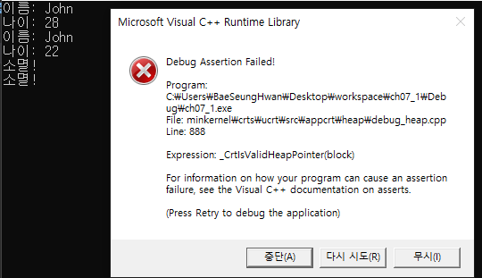
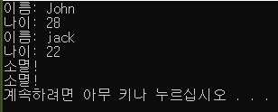
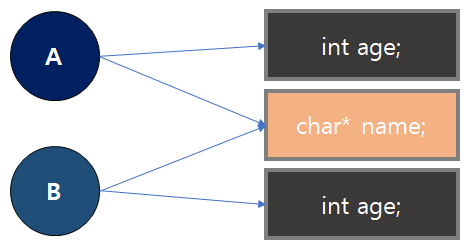
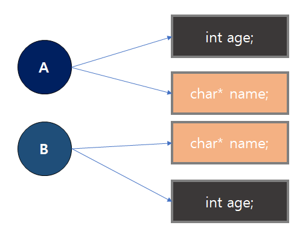

## CH07. 클래스 생성자와 소멸자

* using

  * 범위 지정 연산없이 참조를 가능케 한다.

  * ```c++
    #include <iostream> 
    
    namespace A_COM { 
        void function(void) { 
            std::cout<<"A.COM에서 정의한 함수"<<std::endl; 
        } 
    } 
    
    using A_COM::function; 
    
    int main(void) { 
        function(); 
    
        return 0; 
    } 
    ```

    * 다음 main문에 있는 function()은 using 키워드를 통해서 "A_COM이라는 이름공간 안에 선언된 function이라는 이름을 참조한다" 라는 의미

  * ```C++
    #include <iostream> 
    
    using std::cout; 
    using std::cin; 
    using std::endl; 
    
    int main(void) { 
        cout<<"Hello World!!"<<endl; 
        cout<<"Hello "<<"World!!"<<endl; 
        cout<<'a'<<"string"<<endl; 
    
        return 0; 
    }
    ```

    * cout, cin, endl을 std 이름공간 안에서 찾아 선언

  * ```c++
    #include <iostream> 
    
    namespace A_COM { 
        void function(void) { 
            std::cout<<"A.COM에서 정의한 함수"<<std::endl; 
        } 
    } 
    
    using namespace A_COM; 
    
    int main(void) { 
        function(); 
        return 0; 
    }
    ```

    * using namespace A_COM; 을 통해서 A_COM 안에 있는 변수나 함수에 상관없이 이름공간에 대한 선언없이 참조

  * ```c++
    #include <iostream>
    
    int val=100; 
    
    int main(void) { 
        int val=100; 
        ::val+=1; 		//val로 했을 경우 지역변수에 적용되므로 ::을 붙여줘야된다.
        std::cout<<::val<<std::endl;
        return 0; 
    }
    ```

  * 전역변수를 시, 지역변수와 이름이 같을경우, ::을 붙여 지역변수와 전역변수 간의 차이를 둠

  * 지역변수와 전역변수의 이름이 같을경우, ::에 상관없이 사용


#### 복사  생성자

* 클래스-이름 (const 클래스-이름& ) {본문}

* ```c++
  class_name (const class_name &){
      ...
  }
  //default 복사 생성자를 생성하도록 요청
  class_name (const class_name& ) = default;
  //복사 생성자를 삭제
  class_name (const class_name& ) = delete;
  ```

* 기존 객체를 복사하여 새로운 객체를 생성하는 생성자

* C++에서는 일반 변수를 선언 시 힙 메모리가 아닌 스택 메모리 내 객체를 생성하기 때문에 객체의 복사가 빈번히 발생

* 객체의 복사 문제를 해결하기 위해서 new 연산자를 사용하여 포인터를 사용하는 방법과 일반 변수를 참조하는 방법이 있다.

* Rule Of Zero의 규칙에 따라 복사 생성자를 별도 정의하지 않는것이 좋다.

* 소멸자 내부에서 delete 연산자를 호출하여 힙 메모리 내 저장소를 삭제하는 과정에서 문자열이 깨지는 것과 같은 에러 발생.

  * 다음 조건에서 발생
    * 클래스 내부에 멤버 포인터가 존재
    * 멤버 포인터는 생성자가 호출 시 메ㅐ모리를 할당받고 초기화
    * 소멸자는 생성자에 의해 할당받은 메모리를 OS에 반환하는 기능을 수행
    * 시스템에서 제공하는 디폴트 복사 생성자를 사용
  * 함수의 작업이 완료되면, 객체를 소멸하는 과정에서 소멸자가 호출되어 문자열의 저장소를 삭제
  * 프로그램이 종료되면서 원본 객체 역시 소멸되어 영역침범이라는 에러 발생

  

* ```c++
  #include <iostream>
  #include <string>
  #include <cstring>
  
  class MyString {
  public:
      MyString(const char *n);
      MyString(const MyString &my) = default; // 복사 생성자
      ~MyString();
  
      const char* GetString() const;
      int GetLength() const;
      
  private:
      char* data;
      int length;
  };
  
  MyString::MyString(const char *n){
      if (nullptr == n){
          data = nullptr;
          length = 0;
          return;
      }
      
      int mLength = strlen(n);
      if (0 == mLength) {
          data = nullptr;
          length = 0;
          return;
      }
      // new 연산자를 통해 메모리를 할당
      // std::nothrow 넣어줌으로써 메모리 할당 실패시 NULL을 리턴
      char *temp = new (std::nothrow) char[mLength + 1];
      if (nullptr != temp) {
          std::strcopy(temp, n);
          data = temp;
          length = mLength;
          printf("MyString::MyString(const char '%s')\n", n);
      }
  }
  
  MyString::~MyString(){
      printf("MyString::MyString('%s') 소멸자 호출\n", data);
      if (nullptr != data) {
          delete[] data;
  
          data = nullptr;
          length = 0;
      }
  }
  
  const char* MyString::GetString() const {
      return data;
  }
  
  int MyString::GetLength() const {
      return length;
  }
  
  //other 객체를 소멸하는 과정에서 소멸자가 호출
  void display(const MyString& other) {
     std::cout << other.GetString() << std::endl;
  }
  
  int main() {
      MyString s1("Hello World");
      display(s1);
      MyString obj = s1;		// 복사 생성자에 의해 얕은 복사 수행
      return 0;
  }
  ```
  >MyString::MyString(const char 'Hello World')
  >Hello World
  >
  >MyString::MyString('Hello World') 소멸자 호출
  >MyString::MyString('硼硼硼硼硼硼硼硼@{`?') 소멸자 호출
* 얕은 복사 -> 깊은 복사

* (char *) 타입의 문자열 -> std::string 타입의 문자열 

* 문자열 포인터 -> std::shared_ptr 객체를 사용하여 관리


#### 얕은 복사와 깊은 복사

* 얕은 복사

  * 단지 메모리 주소만을 복사하여 변수의 데이터로 만드는 방법

  * ```C++
    #include <iostream>
    
    using namespace std;
    
    class Person
    {
    public:
    	int age;
    	char* name;
    
    public:
    	Person(int _age, const char* _name)
    	{
    		age = _age;
    		name = new char[strlen(_name) + 1];
    		strcpy(name, _name);
    	}
    
    	Person(const Person& s)
    	{
    		age = s.age;
    		name = s.name;
    	}
    
    	~Person()
    	{
    		cout << "소멸!" << endl;
    		delete name;
    	}
    
    	void printPerson()
    	{
    		cout << "이름: " << name << endl;
    		cout << "나이: " << age << endl;
    	}
    };
    
    void main()
    {
    	Person A(22, "jack");
    	Person B = A;
    
    	A.age = 28;
    	strcpy(A.name, "John");
    
    	A.printPerson();
    	B.printPerson();
    
    }
    ```

    > 
    >
    > * name은 주소값을 참조하기 때문에 복사를 하더라도 같은 주소를 참조
    >
    > * name을 바꿨을때 A,B객체 모두 변경
    > * 소멸자가 호출될 때 name은 같은 메모리를 참조하므로 한번 delete 된 메모리를 다시 delete하기 때문에 오류 발생

* 깊은 복사

  * 변수가 관리하는 리소스 자체를 복사하여 새롭게 멤버 변수에 입력

  * 새롭게 메모리를 할당하고 문자열이나 객체를 복사

  * ```c++
    #include <iostream>
    
    using namespace std;
    
    class Person
    {
    public:
    	int age;
    	char* name;
    
    public:
    	Person(int _age, const char* _name)
    	{
    		age = _age;
    		name = new char[strlen(_name) + 1];
    		strcpy(name, _name);
    	}
    
    	Person(const Person& s)
    	{
    		age = s.age;
    		name = new char[strlen(s.name) + 1];
    		strcpy(name, s.name);
    	}
    	//Person(const Person& s)
    	//{
    	//	age = s.age;
    	//	name = s.name;
    	//}
    
    	~Person()
    	{
    		delete name;
    		cout << "소멸!" << endl;
    	}
    
    	void printPerson()
    	{
    		cout << "이름: " << name << endl;
    		cout << "나이: " << age << endl;
    	}
    };
    
    void main()
    {
    	Person A(22, "jack");
    	Person B = A;
    
    	A.age = 28;
    	strcpy(A.name, "John");
    
    	A.printPerson();
    	B.printPerson();
    
    }
    ```

    > 
    >
    > * 복사 생성자에서 새로운 메모리를 항당하기 때문에 원본과 복사본의 참조 공간이 다름

*  


* 복사 대입 연산자

  * 복사 대입 연산자 오버로딩 작업 없이 디폴트로 연산 작업을 수행하여 얕은 복사의 재발생으로 인한 에러발생을 방지하기 위해 생성 

    * 위 코드에서 깊은 복사로 바꾸어 줌에도 불구하고 s2=s1; display(s2); 를 해준다면 다시 문자열이 깨지는 에러 발생

  * operator 키워드와 =대입연산자, 참조인수를 사용하여 선언

  * class_name& class_name::operator=(const class_name)

  * ```c++
  #include <iostream>
    #include <string>
    #include <cstring>
    
    class MyString {
    public:
    	MyString(const char *n);
    	MyString(const MyString &my);
    	~MyString();
    
    	MyString& operator= (const MyString& other);
    	void SetString(const char* n);
    	const char* GetString() const;
    	int GetLength() const;
    
    private:
    	void Release();
    	char* data;
    	int length;
    };
    
    void display(MyString other) {
    	std::cout << other.GetString() << std::endl;
    }
    
    
    // 일반 생성자
    MyString::MyString(const char *n) : data(nullptr), length(0) {
    	SetString(n);
    	printf("일반 생성자 MyString::MyString(const char '%s')\n", n);
    }
    
    // 복사 생성자
    MyString::MyString(const MyString &my) : data(nullptr), length(0) {
    	SetString(my.GetString());
    	printf("복사 생성자 MyString::MyString(const MyString '%s')\n", my.GetString());
    }
    
    MyString::~MyString() {
    	printf("MyString::MyString('%s') 소멸자 호출\n", data);
    	Release();
    }
    // 복사대입 연산자
    MyString& MyString::operator= (const MyString & other) {
    	if (this != &other) { // 자기 자신을 대입하는 것은 무의미한 작업이다.
    		Release();
    		SetString(other.GetString());
    	}
    	printf("복사 대입 MyString& MyString::operator = Mystring('%s')\n", this->data);
    	return *this;
    }
    
    void MyString::SetString(const char* n) {
    	if (nullptr == n) return;
    
    	int mLength = strlen(n);
    	if (0 == mLength) return;
    
    	data = new char[mLength + 1];
    	std::strcpy(data, n);
    	length = mLength;
    }
    
    const char* MyString::GetString() const {
    	return data;
    }
    
    void MyString::Release() {
    	if (data != nullptr) {
    		delete[] data;
    		data = nullptr;
    		length = 0;
    	}
    }
    
    int MyString::GetLength() const {
    	return length;
    }
    
    int main() {
    	MyString s1("Hello World"), s2 = "복사 생성자";
    	display(s1);
    	s2 = s1;		// 복사대입연산자 실행
    	display(s2);
    	return 0;
    }
    ```
  
    > 일반 생성자 MyString::MyString(const char 'Hello World')
    >
    > 일반 생성자 MyString::MyString(const char '복사 생성자')
    >
    > 복사 생성자 MyString::MyString(const MyString 'Hello World')
    > Hello World
    > MyString::MyString('Hello World') 소멸자 호출
    > 복사 대입 MyString& MyString::operator = Mystring('Hello World')
    > 복사 생성자 MyString::MyString(const MyString 'Hello World')
    > Hello World
    > MyString::MyString('Hello World') 소멸자 호출
    > MyString::MyString('Hello World') 소멸자 호출
    > MyString::MyString('Hello World') 소멸자 호출


#### 이동 생성자와 이동 대입 연산자

* 이동 생성자는 rvalue 참조를 사용하는 생성자이다.

  * rvalue 참조 : 상수나 임의 저장소를 참조하는 개념

    ```c++
    void function(){
        int&& value = 10;
    }
    ```

    * 저장소를 만들어 10을 입력
    * 저장소에 대해 ravlue 참조를 생성
    * 함수 반환 시 임시 저장소와 함게 ravlue 참조를 소멸

* 이동 생성자와 이동 대입 연산자는 인수로 사용한 객체와 새롭게 생성한 객체의 멤버간의 데이터 교환이 이루어진다.

  * ```c++
    #include <iostream>
    #include <string>
    #include <cstring>
    #include <vector>
    #include <algorithm>
    
    class MyString {
    public:
    	MyString(const char *n = nullptr);
    	MyString(const MyString &other);
    	MyString(MyString&& other) noexcept;
    	~MyString();
    
    	MyString& operator= (const MyString& other);
    	MyString& operator= (MyString&& other) noexcept;
    	void SetString(const char* n);
    	const char* GetString() const;
    	int GetLength() const;
    
    private:
    	char* data;
    	int length;
    };
    
    MyString::MyString(const char *n) : data(nullptr), length(0) {
    	SetString(n);
    	printf("MyString::MyString(const char '%s')\n", n);
    }
    
    MyString::MyString(const MyString &other) : data(nullptr), length(0) {
    	SetString(other.GetString());
    	printf("MyString::MyString(const MyString& '%s')\n", data);
    }
    //이동 생성자의 정의문
    //인수로 사용하는 객체는 무명 객체처럼 임시 저장소를 사용하는 객체이다.
    MyString::MyString(MyString&& other) noexcept
    	: data(other.data), length(other.length) {
    	printf("MyString::MyString(MyString&& '%s')\n", data);
    	other.data = nullptr;		//인수로 사용한 객체 소멸 시 리소스(char *)를 삭제하지 못하도록 처리
    	other.length = 0;
    }
    
    MyString::~MyString() {
    	printf("MyString::MyString('%s') 소멸자 호출\n", data);
    	if (data != nullptr) {
    		delete[] data;
    	}
    }
    
    MyString& MyString::operator= (const MyString& other) {
    	if (this != &other) {
    		delete[] data;
    		SetString(other.GetString());
    	}
    	printf("MyString& MyString::operator = (Mystring& '%s')\n", this->data);
    	return *this;
    }
    
    MyString& MyString::operator= (MyString&& other) noexcept {
    	if (this != &other) {
    		if (nullptr != data) delete[] data;
    
    		data = other.data;
    		length = other.length;
    		other.data = nullptr;
    	}
    	printf("MyString& MyString::operator = (Mystring&& '%s')\n", this->data);
    	return *this;
    }
    
    void MyString::SetString(const char* n) {
    	if (n == nullptr) return;
    
    	int mLength = strlen(n);
    	if (mLength == 0) return;
    
    	data = new char[mLength + 1];
    	std::strcpy(data, n);
    	length = mLength;
    }
    
    const char* MyString::GetString() const {
    	return data;
    }
    
    int MyString::GetLength() const {
    	return length;
    }
    
    void display(MyString other) {
    	std::cout << other.GetString() << std::endl;
    }
    
    int main() {
    	MyString s1("Hello World"), s2 = "복사 생성자";
    	display(s1);
    	s2 = s1;
    
    	std::vector<MyString> vec;
    	vec.push_back(s1);
    	vec.push_back(MyString("이동 생성자"));
    	vec.push_back(MyString("이동 대입 연산자"));
    	s2 = std::move(vec[2]);
    	return 0;
    }
    ```

    >MyString::MyString(const char 'Hello World')
    >MyString::MyString(const char '복사 생성자')
    >MyString::MyString(const MyString& 'Hello World')
    >Hello World
    >MyString::MyString('Hello World') 소멸자 호출
    >MyString& MyString::operator = (Mystring& 'Hello World')
    >MyString::MyString(const MyString& 'Hello World')
    >MyString::MyString(const char '이동 생성자')
    >MyString::MyString(MyString&& 'Hello World')
    >**MyString::MyString('(null)') 소멸자 호출**
    >MyString::MyString(MyString&& '이동 생성자')
    >**MyString::MyString('(null)') 소멸자 호출**
    >MyString::MyString(const char '이동 대입 연산자')
    >MyString::MyString(MyString&& 'Hello World')
    >MyString::MyString(MyString&& '이동 생성자')
    >**MyString::MyString('(null)') 소멸자 호출**
    >**MyString::MyString('(null)') 소멸자 호출**
    >MyString::MyString(MyString&& '이동 대입 연산자')
    >**MyString::MyString('(null)') 소멸자 호출**
    >MyString& MyString::operator = (Mystring&& '이동 대입 연산자')
    >MyString::MyString('Hello World') 소멸자 호출
    >MyString::MyString('이동 생성자') 소멸자 호출
    >**MyString::MyString('(null)') 소멸자 호출**
    >MyString::MyString('이동 대입 연산자') 소멸자 호출
    >MyString::MyString('Hello World') 소멸자 호출
    
  * 이동 생성자는 상호 멤버들간의 이동을 통해 리소스를 가리키는 포이터를 단일 포인터로 유지시킨다.

  

* 이동 대입 연산자 오버로딩은 보통 swap()함수를 사용하여 멤버 변수의 데이터를 서로 교체

  * ```c++
    MyString& MyString::operator= (MySting&& other) noexcept {
        if(this != &other){
            std::swap(this->data, other.data);
            std::swap(this->length, other.length);
        }
        ...
    }
    ```

  * this 객체 내 멤버들은 모두 other라고 하는 객체의 멤버로 이동하게 된다.

  * other객체는 임시 객체이므로 연산자의 작업이 완료되면 자동적으로 소멸한다.


#### 복사/이동 생략의 원칙

* 복사 생성자와 이동 생성자의 호출을 생략할 수 있는 경우

  * 암시적 변환 생성자 처럼 객체 생성 시 오로지 하나의 객체만이 생성된다.

    * Complex x=1;	혹은 	Complex x = Complex(Complex(Complex(1)));
    * 이는 Complex x(1); 과 동일한 문장

  * 함수 내 지역변수를 생성하여 반환한다면, 복사 생성자의 호출을 생략된다.

    * NRVO(Named Return Value Optimization)

    * ```c++
      MyString create(const char *ptr = nullptr){
          MyString obj(ptr);		// 지역 변수를 생성
          return obj;				// 복사 생성자를 호출하지 않는다.
      }
      MyString x = create("Hello World");					// 일반 생성자 하나만 호출
      MyString *p = new MyString(create("Hello World"));	// 일반 생성자 하나만 호출
      ```

    * 원칙적으로는 함수 범위내 생성된 객체가 범위를 벗어난다면, 삭제되므로 복사 생성자를 호출하여 객체를 복사시켜 전달되어야 하지만, 그 과정이 생략된다.

  * 함수가 다음과 같이 객체를 생성하여 반환하는 경우에 이동 생성자의 호출이 생략된다.

    * RVO(Return Value Optimization)

    * ```C++
      MyString create(const *ptr = nullptr){
          return MyString{ptr};		//무명 변수를 생성
      }
      MyString x = create();
      ```

  * 함수 내부에서 객체를 생성하여 throw를 사용하여 예외를 던졌을 때, 복사 생성자의 호출이 생략된다.

    * ```C++
      void foo(const char *ptr=nullptr){
          throw MyString(ptr);
      }
      int main(){
          try {
              foo("throw MyString");
          }catch(MyString& c){}
      }
      ```

* ```c++
  #include <iostream>  
  #include <string>
  #include <algorithm>
  
  int count = 0;
  
  class MyString {
  	std::string data;
  
  public:
  	MyString(const char *ptr = nullptr) : data(ptr) {
  		std::cout << "Constructor : " << ptr << std::endl;
  	}
  	MyString(const MyString  &obj) : data(obj.data) {
  		std::cout << "copy constructor : " << data.c_str() << std::endl;
  		++count;
  	}
  	MyString(MyString&& obj) {
  		std::swap(this->data, obj.data);
  		std::cout << "Move constructor : " << data.c_str() << std::endl;
  		++count;
  	}
  	~MyString() {
  		std::cout << "Destructor  : " << data.c_str() << std::endl;
  	}
  
  	MyString& operator= (const MyString & other) {
  		if (this != &other) {
  			data = other.data;
  		}
  		printf("MyString& MyString::operator = (Mystring& '%s')\n", this->data);
  		++count;
  		return *this;
  	}
  
  	MyString& operator= (MyString&& other) noexcept {
  		if (this != &other) {
  			std::swap(this->data, other.data);
  		}
  		printf("MyString& MyString::operator = (Mystring&& '%s')\n", this->data);
  		++count;
  		return *this;
  	}
  };
  
  MyString fun123(const char *ptr = nullptr) {
  	MyString obj(ptr);
  	return obj;
  }
  
  MyString xyz123(const char *ptr = nullptr) {
  	return MyString{ ptr };
  }
  
  void foo(const char *ptr = nullptr) {
  	throw MyString(ptr);
  }
  
  int main() {
  	MyString abc = { "abc" };
  
  	MyString obj1(fun123("fun123()"));		//(1)
  	MyString obj2(xyz123("xyz123()"));		//(2)
  
  	MyString xyz = "Return Value Optimization(RVO)";		//(3)
  	
      //(4)
  	try {
  		foo("throw MyString");
  	}
  	catch (MyString& c) {
  	}
  	
  	std::cout << "호출 횟수 : " << count << std::endl;
  	return 0;
  }
  ```
  >Constructor : abc
  >
  >Constructor : fun123()
  >
  >Constructor : xyz123()
  >
  >Constructor : Return Value Optimization(RVO)
  >
  >Constructor : throw MyString
  >
  >Destructor  : throw MyString
  >
  >호출 횟수 : 0
  >
  >Destructor  : throw MyString
  >
  >Destructor  : xyz123()
  >
  >Destructor  : fun123()
  >
  >Destructor  : abc
  
* (1)에서 객체를 반환하는 경우에 복사 생성자 또는 이동 생성자 호출이 생략

* (2)에서 무명 클래스의 인스턴스를 생성하여 반환 하는 경우에 복사 생성자 또는 이동 생성자 호출이 생략

* (3)에서 초기화 리스트를 사용하여 객체를 생성하는 경우에 이동 생성자 호출이 생략

* (4)에서 예외를 던졌을 때(try/catch문) 복사/이동 생성자 호출이 생략

* 따라서 총 호출 횟수는 0

