# DSSD : Deconvolutional Single Shot Detector

> 저자:
>
> Cheng-Yang Fu - https://www.cs.unc.edu/~cyfu/
>
> Wei Liu - https://scholar.google.co.kr/citations?user=yFMX138AAAAJ&hl=ko

본 논문은 기존 SSD object detector의 모델에서 작은 object에 대한 검출률을 높이기 위한 실험을 진행한 논문이다.

본 논문에서는 SSD의 모델이 작은 물체를 더 잘 찾을수 있게 하기 위해 base network를 Residual-101로 교체했고 기존 SSD 모델의 뒷 부분에 Deconvolution layer를 추가하였다. 

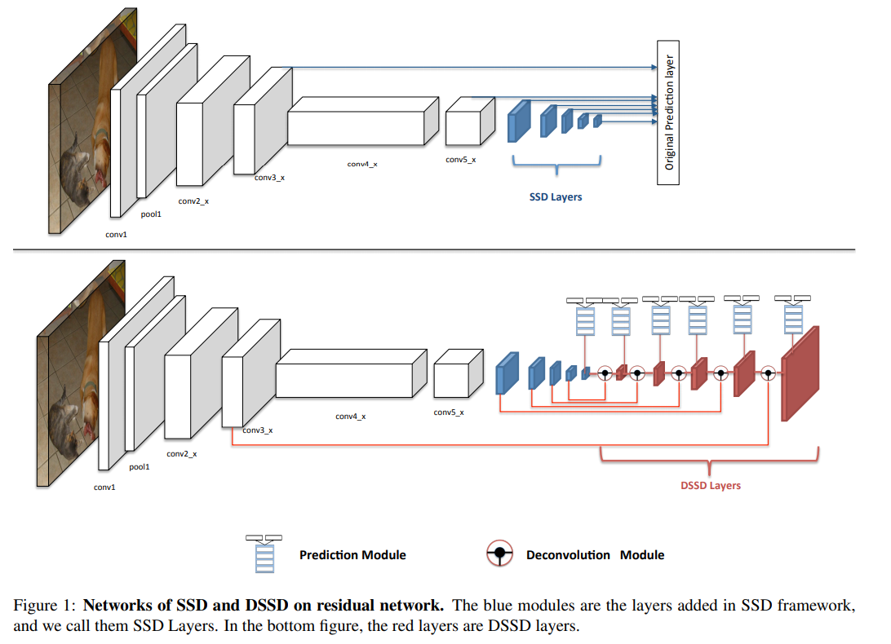

 본 논문에서는 기존 SSD에서 backbone network로 사용했던 VGG를 성능 향상 목적을 위해 Residual-101로 바꾸었다. DSSD는 이름과 같이 기존 SSD의 모델의 후반부에 Deconvolution을 추가하였다.

 Figure. 1을 보면 기존의 SSD와의 차이점을 알 수 있다. 기존 SSD는 각 feature map에서 바로 prediction layer를 거쳐 prediction이 되었지만 DSSD는 각 feature map마다 Prediction Module을 거친다. 또한 Deconvolution Moudle을 사용하여 기존에 있는 feature map의 특징을 재사용하는 방법을 사용한다.

### Prediction Module

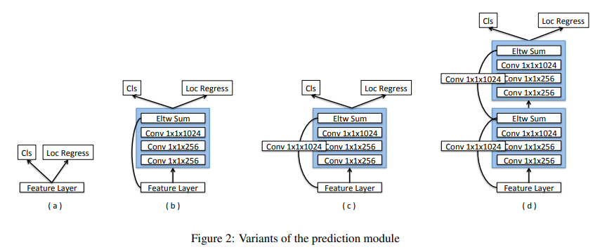

-  Figure. 2는 본 논문에서 사용된 prediction module에 대한 구조이다. a)는 기존 SSD에서 사용하는 방식으로 feature map에서 바로 classification과 local regression을 하는 방식을 의미한다. 
- 본 논문에서는 다양한 조합을 실험해 본 결과 c) 의 구조가 가장 성능이 좋고 c)의 결과에 element wise-product를 한게 가장 좋은 결과를 내 c) 구조를 채택한다고 한다.

> Element-wise-product(Hadamard product)
>
> ex)
>
> 

### Prediction Module 비교 table

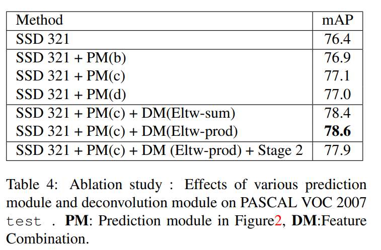

### Deconvolutional SSD

 본 논문에서는 SSD feature map의 해상도를 연속적으로 높이기 위해 Deconvolutional layer를 추가했다. 또한 이러한 기능을 좀 더 효율적으로 사용하기 위해 Hourglass 구조를 사용하여 encode와 decoder와 같은 비대칭 구조로 모델을 설계하였다.

또한 본 논문에서는 Deconvolutional layer를 얉게 만들었다고 하는데 그 이유는 다음과 같다.

- 본 논문에서는 SSD 구조를 개선하는 만큼 속도를 중요시 하기 때문에 
- 학습된 pre-trained model이 없기 때문에 전이 학습의 이점을 누릴 수 없어서

### Deconvolution Layer

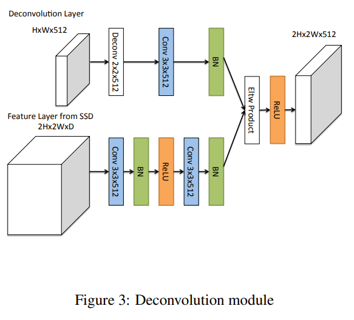

> 잘모르겠는것 :
>
> 여기서 high-level context in detection이라고 했는데 high-level context라는건 뭘까?

 Deconvolution layer은 "Learning to Refine Object Segments" 논문에서 영감을 받았다고 하는데 논문의 어느 기능에서 구현되었는지는 자세하게 명시되어있지 않다. 

논문에서 위와 같이 유사한 기능을 찾은 결과 나는 밑의 그림의 기능을 보고 영감을 얻지 않았을까 추정한다.

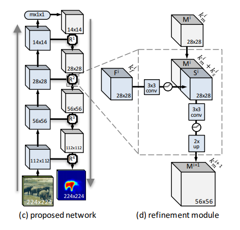

위의 그림을 보면 encoder와 decoder으로 나눠진 Hourglass와 같은 모델 구조라는 것을 알 수있다. 그리고 그림에서 보이는 R은 DSSD에서의 Deconvolution moudle과 같이 전 Conv layer의 정보를 가져와 다시 원래의 크기로 변환하는 기능을 한다는 것을 알 수 있다.

> 논문 출저: https://arxiv.org/pdf/1603.08695.pdf

또한 논문에서는 "Learning to Refine Object Segments" refinement module에서 feature의 크기를 키워줄 때 bilinear upsampling을 사용하였다고 한다. 

> 여기서 bilinear는 이중 선형 보간법을 의미
>
> 즉 아는 두점 A와 B 사이에 있는 모르는 값x를 유추하는 방법
>
> 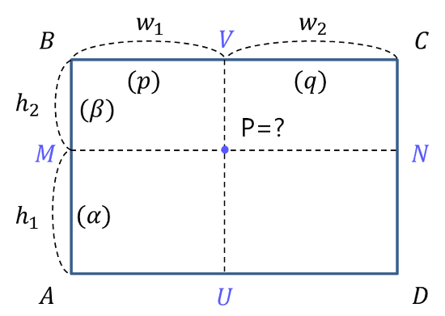
>
> 위의 그림을 예로 들면 P 점을 추정하는 방법 이미지 확대 분야에서 사용된다.
>
> 그림출처 및 지식: https://darkpgmr.tistory.com/117

하지만 DSSD에서는 bilinear upsampling을 사용하지 않고 그대신 Deconvolutional layer를 사용함으로써 feature의 크기를 키운다.

### Training

 본 논문에서 training에 사용한 방법은 SSD와 거의 비슷하다.

기본적으로 학습 방법은 밑과 같은 방법을 사용한다.

- IOU thresold 0.5 이상 True로 결정
- 학습시 True와 False의 비율 1:3으로 설정해 학습에 사용
- Random expansion augmentation 사용

  bounding box의 비율은 기존 SSD에서 사용된 비율 중 가장 효과가 좋다고 생각된 2 ~ 3 비율을 사용한다.

DSSD에서 사용된 방법 좀 특이한 방법은 Anchor box의 비율을 정하기 위해 K-means를 사용해 clustering을 적용했다는 점이다.

이것은 Yolo v2에서 사용된 방법으로 오브젝트의 경계박스를 클러스터링한 후 앵커박스의 종횡비 크기를 결정하는 법이다.

밑의 그림을 예로 설명하겠다.

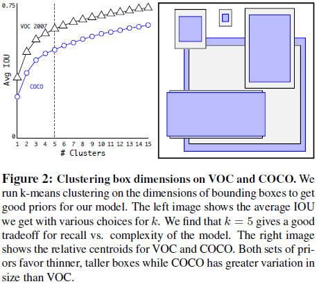

Figure. 2 그림은 Yolo v2 에서 사용된 그림이다. 그림을 보면 클러스터링한 면적과 실제 앵커박스와의 크기를 비교하는 모습을 볼 수 있다. 논문에서 사용된 식은 클러스터링의 크기와 앵커박스의 크기를 IOU값으로 계산하여 평가하는 방법을 사용했다.

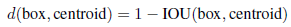

본 논문에서도 위와 같이 실험을 진행하였고 밑의 표와 같이 bounding box와 클러스터링의 오차가 약 20% 차이가 날때까지 실험을 진행했다.

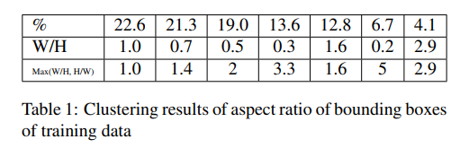

결과적으로 논문에서는 대부분의 bounding box가 1~3 사이 비율 이내에 들어간다고 판단하여 (1.6, 2.0, 3.0) 이 세가지 비율을 사용한다.

### Base network

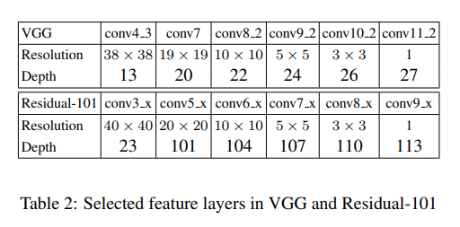

Base network는 VGG에서 Residual-101로 바꾼것을 볼 수 있다. 특징으로는 기존 모델보다 더 깊은 특징을 가지고 있다는 점이다.

### Reduce Inference Time

 본 논문에서 특이한 추론에서 소요되는 시간을 아끼기 위해 Test time일 때는 기존에 사용하는 batch normalization을 제거 한다.  그리고 대신 간소화시킨 식인 2) 와 3)을 사용한다.

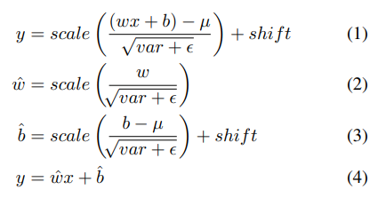

본 논문에서는 위와 같은 식을 Test time에 사용함으로써 메모리를 줄일 수 있었고 처리되는 시간을 1.2~1.5 배 정도 줄일 수 있었다고 한다.

### Model performance

​	기존 SSD 성능 table

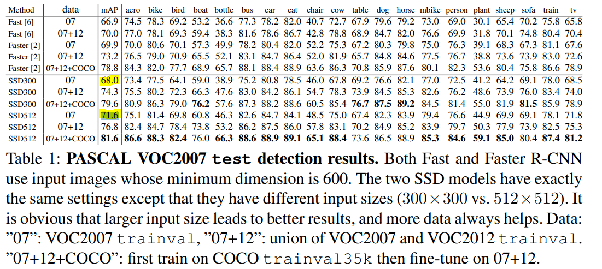

위의 테이블은 SSD 논문에 있는 성능 지표를 가져온 것 이다.

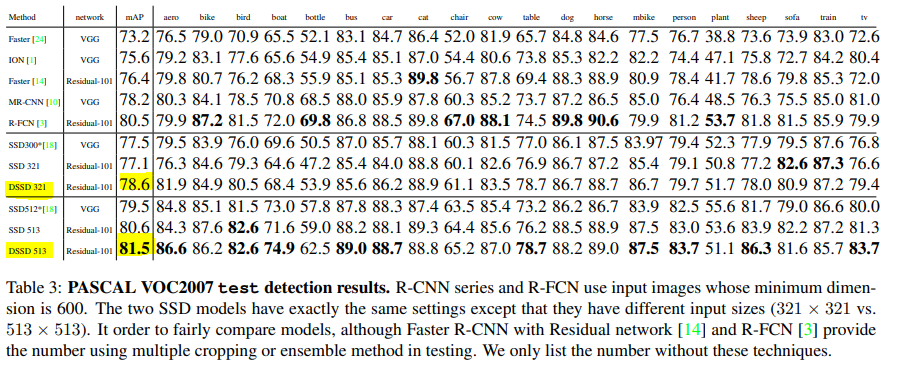

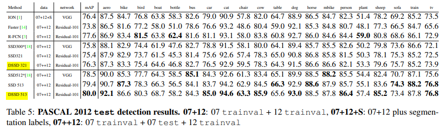

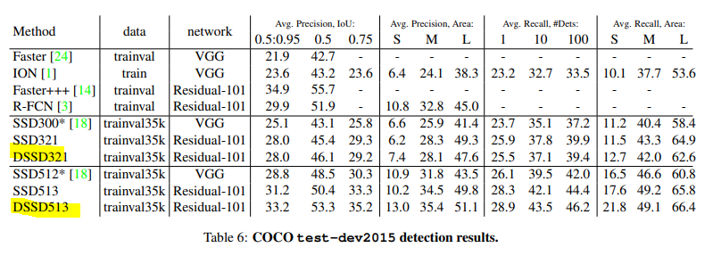

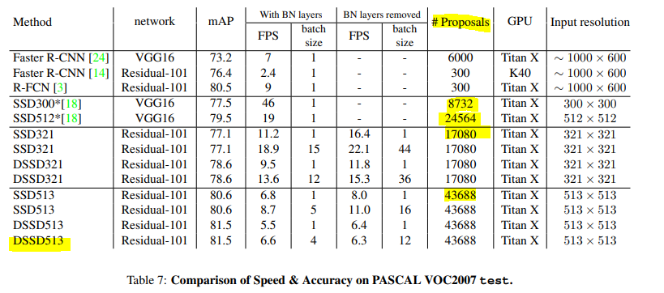

성능 테이블을 보다보면 기존 SSD 모델 보다 FPS가 떨어진다는 특징을 알 수 있다.

본 논문에서는 DSSD가 왜 느린지 변명? 같은 주장을 한다. 그 주장은 밑의 내용과 같다.

- 기존 VGG모델에서 Residual-101로 backbone network를 바꾸어서 느리다.
- prediction module과 deconvolution module같은 모듈을 SSD보다 많이 넣어서 느리다.
- 기존 SSD 모델보다 Proposals가 더 많기 때문.

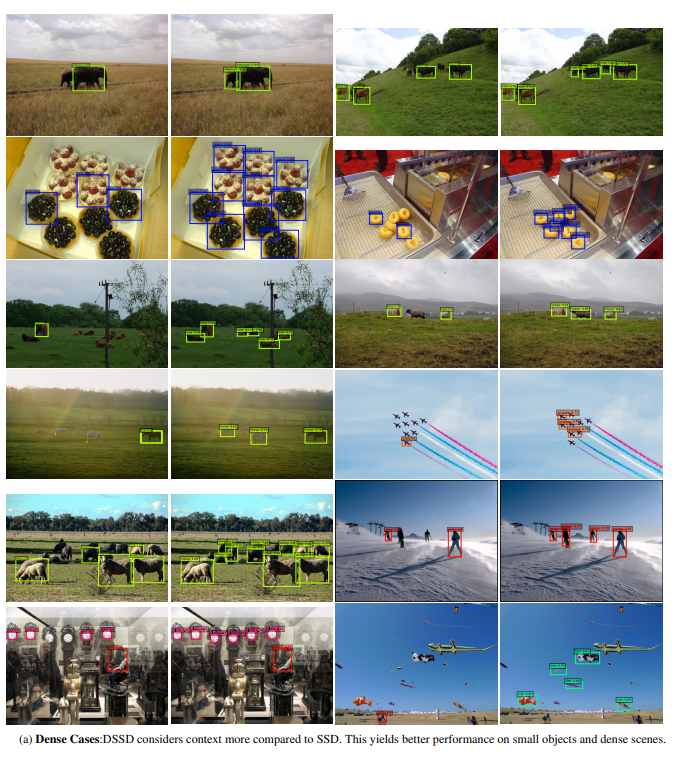

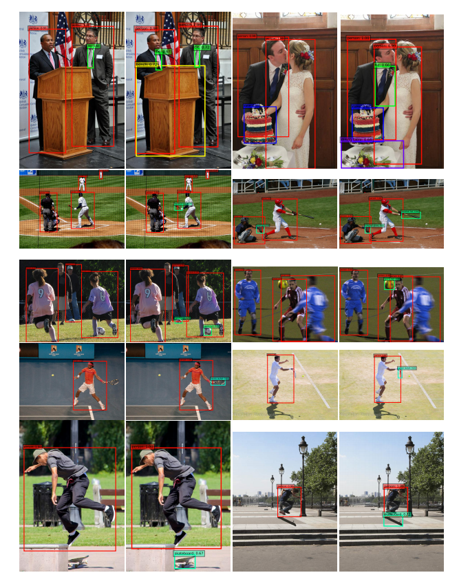

성능지표를 보면 기존 SSD모델보다 크게 성능이 는것 같지는 않지만 실제로 object detection을 하면 SSD에 비해 작은 물체를 더 잘 찾는 것을 볼 수 있다.

왼쪽: SSD 오른쪽: DSSD

### Conclusion

- 본 논문에서는 기존 SSD이 작은 물체를 잘 찾을 수 있도록 Deconvolutional layer를 추가
- 기존 SSD에 비해 FPS가 많이 낮아졌지만 약간의 성능 향상이 있었고 작은 물체를 잘 찾는 모델을 만들 수 있었음