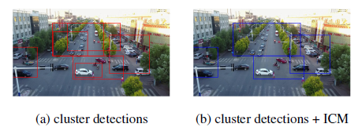

### Clustered Object Detection in Aerial Images

> _ICCV' 2019_
>
> Fang Yang, Heng Fan, Peng Chu, Erik Blasch  <https://scholar.google.com/citations?user=Po7s1TsAAAAJ&hl=en>, Haibin Ling
>
> > Temple University, USA
> >
> > Air Force Research Lab, USA
> >
> > Stony Brook University, USA

Abstract

* 항공 이미지에서 물체를 감지하는 것에 대하여 2가지의 어려움을 가지고 있다.
  1. 대상 물체가 매우 작다
  2. target에 대하여 일반적으로 드물고(sparsely) 불균일하게 분포되어 있다.
* 본 논문에서는 항공이미지에서의 target들에 대하여 종종 clustering 된다는 사실을 발견하여 이를 활용한 Clustered Detection을 제안한다.
* ClusDet(Clustered Detection)은 크게 3요소인 CPNet, ScaleNEt, DetecNet로 구성되어 있으며 이를 통해 end-to-end 프레임워크에서 객체의 클러스터링과 detection을 통합한다.
* 본 논문에서 제안하는 ClustDet의 장점 3가지
  1. 최종 detection을 위한 chip(bbox)의 수를 크게 줄여 높은 실행시간의 효율성을 달성한다.
  2. 단일객체 기반의 스케일 추정보다 크러스터 기반의 스케일 추정이 보다 정확하고 작은 객체에 대한 detection에 효과적으로 개선될수 있었다.
  3. DetecNet은 클러스터링 된 영역에 대한 detection을 위해 특별히 지정된것으로 정확도를 높이기 위해 이전 feature의 정보(prior context information)를 암시적으로 모델링한다.
* 실험에 활용한 데이터셋은 VisDrone, UADT, DOTA 3가지를 적용하였으며, 다음 데이터 셋에대하여 SOTA를 달성하였다.

ClusDet Network

* CPNet(Cluster Proposal Sub-network)
  * 클러스터 region을 추출하는 핵심으로 high-level feature map에 대하여 클러스터의 위치와 규모를 예측한다.
  * CPNet은 fully convolutional network block으로 공식화한다.
  * backbone을 통해 나온 feature map에서 high-level의 feature map을 입력으로 취하며 클러스터 후보영역을 제안한다.
  * RPN과 같이 object 의 proposal에 비해 클러스터의 크기가 훨씬 크기 때문에 큰 receptive field를 필요로 하여 feature 추출 backbone의 상단에 부착한다.
  * 5x5 conv layer + 2개의 1x1 conv layer(regression / classification)

* ICM(Iterative Cluster Merging)

  

  * CPNet만 사용하여 생성된 초기 클러스터는 조밀하고 지저분하다.(겹치는 부분이 많이 존재)

  * 이러한 클러스터 영역은 중첩이 높고 크기가 크기 때문에 정밀 감지에 직접 활용하기 어렵기 때문에 실제 계산 부담이 매우 높다.

    

  * $B$는 CPNet에 의해서 detection된 $N_B$  클러스터 set에 대한 bounding box

  * $R$은 클러스터 classification score

  * $\tau_{op}$는 미리 지정된 overlap threshold

  * $N_{max}$는 merging후의 클러스터의 maximum number

  * NMM(non-max merge)를 통해 가장 높은점수를 가진 B_i를 찾은 다음 B_i와 overlap이 $\tau_{op}$보다 큰 클러스터를 선택하여 이를 B_i와 병합한다.

  * 미리 설정된 N_max에 도달할때까지 NMM을 여러번 수행하여 병합된 모든 클러스터를 제거

* ScaleNet

  

  * backbone feature map, cluster bounding box, global image에서의 initial detection results 를 입력으로 하고, 클러스터 chip의 개체에 대한 상대적인 scale offset을 출력한다.

  * $t^*_i = (p_i - s^*_i)/p_i$를 클러스터 i에 대한 상대적인 scale offset라고 정의

  * 이때의 $p_i, s^*_i$는 각각 클러스터 i에서 detection된 객체의 기준 scale과 GT Box의 평균 scale을 나타낸다.

  * $$
    L({t_i}) = \frac{1}{M}\sum^M_i l_{reg}(t_i, t^*_i)
    $$

  * 다음 (1)과 같이 ScaleNet에 대한  loss function 을 정의할 수 있다.

  * $t_i = (p_i - s^*_i)/p_i$는 추정된 상대적 scale offset

  * $s_i$는 추정된 scale, M은 클러스터 box의 수

  * $l_{reg}$는 smoothly L1 loss function을 사용

PP(Partition and Padding)

* 개체의 크기가 적절한 범위 내에 있는지 확인하는데 사용

* 클러스터 bounding box $B_i$와 추정된 객체 스케일 $S_i$, 검출기의 입력 크기 $S^{in}$

* $$
  S^{in}_i = S_i \times \frac{S_{in}}{s_i}
  $$

* 다음 (2)를 통해 객체 스케일을 추정할 수 있다.

* $S^{in}_i$가 특정 범위보다 크면 클러스터가 비례적으로 채워지고, 그렇지 않다면 두개의 동일한 chip으로 분할한다.

  * 특정범위는 [70, 280] pixel

  

  

DetecNet

* 아키텍처는 모든 SOTA detector가 될 수 있다.
* 본 논문에서는 FPN이 포함된 Faster R-CNN 을 채택
* detector의 backbone은 VGG, ResNet, ResNeXT 와 같은 standard backbone network일 수 있다.

Final detection

* 클러스터 chip의 local detection 과 전체 이미지의 global detection 결과를 표준 NMS 적용후 융합하여 처리한다.

> VisDrone dataset

 

> TopN : The maximum number of clusters
>
> TopN이 4 이후는 이미지의 수가 점차 증가하지만, AP가 너무 많이 변하지 않고, AP가 27에서 크게 변하지 않는다.
>
> 즉, TopN을 높은 값으로 설정하면 많은 클러스터 영역이 반복적으로 계산되어 연산량이 증가하는것에 비해 AP의 성능이 크게 변하지 않아 계산 비용에 영향을 미친다.