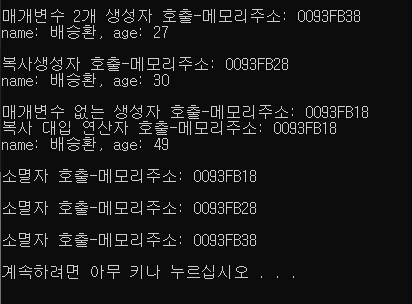
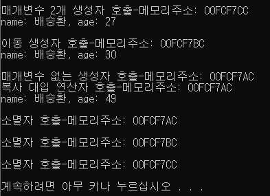
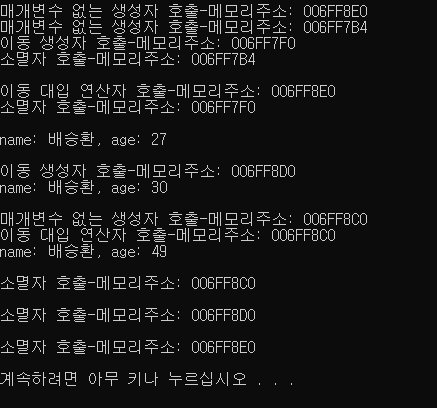
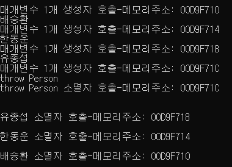

## CH07. 클래스 생성자와 소멸자

#### 이동 생성자와 이동 대입 연산자

> * rvalue : 주소값을 취할수 없는 값 / lvalue : 주소값을 취할 수 있는 값
>
>   ```c++
>   int a = 3;
>   ```
>
>   
>
> * rvalue 참조
>
>   * 상수나 임의 저장소를 참조하는 개념
>
>   * <Type>&& <name> 과 같이 &&를 붙여 사용
>
>     ```c++
>     int && value = 10;
>     ```
>
>   * 이동 생성자와 이동 대입 연산자의 인수로 사용
>
>   * Perfect Forwarding, 함수 오버로딩의 개수를 줄이는 데 사용


이동 생성자

* rvalue참조를 파라미터로 갖는 생성자
* 다른 개체 멤버 변수들의 소유권을 가져온다.
* 메모리를 재할당 하지 않는다.
* 복사 생성자보다 빠르며, 얕은 복사와 비슷하다.
* <class_name>::<class_name>(<class_name>&&)


이동 생성자 호출 조건

* 임시 객체를 전달할때

* std::move()를 사용하여 인자를 전달할때

  > std::move() 
  >
  > 인자로 받은 객체를 ravlue 참조로 변환하여 리턴
  >
  > * *<utility>헤더에 포함되어 있으며, constexpr 지정자로 표기되어 상수를 반환하는 함수 템플릿이다.*
  >
  > * *컴파일 시점에 함수의 인수를 조사하여 인수가 일반 타입이거나 또는 lvalue 참조, 그리고 rvalue 참조에 맞추어 모두 rvalue 참조로 변환하여 반환하는 기능을 제공한다.*


이동 생성자가 호출되면?

* 얕은 복사를 하고 원본의 소유권을 대상으로 이전(move)하는 방식으로 객체를 생성
* 이때, 원본 객체를 null로 초기화하여 접근할 수 없게 한다.


이동 대입 연산자

* 이동 생성자와 같은 개념
* 다른 개체 멤버 변수들의 소유권을 가져온다.
* 메모리 재할당을 하지 않으며, 얕은 복사가 이뤄진다.

> 대입 연산자
>
> * 자신과 같은 타입의 다른 객체를 대입 받을 때 사용하는 연산자
> * 연산자 오버로딩의 결과로써 실행
> * 따로 선언하지 않는 경우 default로 얕은 복사를 하는 대입 연산자를 컴파일러가 자동으로 만든다.
>   * 포인터를 가지고 있는 경우, 깊은 복사를 위해 복사생성자와 복사 대입연산자를 정의해주어야한다.


```c++
#include <iostream>
#include <cstring>
#include <vector>
using namespace std;

class Person {
	char* name;
	int age;
public:
	Person();
	Person(const char _name[], int _age);
	~Person();
	Person(const Person& p);                    //복사 생성자
	Person& operator = (const Person& p);       //복사 대입 연산자
	Person(Person&& p) noexcept;                //이동 생성자
	Person& operator=(Person&& p) noexcept;     //이동 대입 연산자
	void ShowData();

	void setName(const char _name[]) {
		name = new char[strlen(_name) + 1];
		strcpy_s(name, strlen(_name) + 1, _name);
	}
	void setAge(int age) {
		this->age = age;
	}

	string getName() {
		return name;
	}
	int getAge() {
		return age;
	}
};

Person::Person() {
	cout << "매개변수 없는 생성자 호출-메모리주소: " << this << endl;

	name = NULL;
	age = 0;
}

Person::Person(const char _name[], int _age) {
	cout << "매개변수 2개 생성자 호출-메모리주소: " << this << endl;
	name = new char[strlen(_name) + 1];
	strcpy_s(name, strlen(_name) + 1, _name);

	age = _age;
}

Person::~Person() {
	cout << "소멸자 호출-메모리주소: " << this << endl;
	delete[] name;
}

Person::Person(const Person& p) : age(p.age) {
	cout << "복사생성자 호출-메모리주소: " << this << endl;
	name = new char[strlen(p.name) + 1];
	strcpy_s(name, strlen(p.name) + 1, p.name);
}

Person& Person::operator=(const Person& p) {
	cout << "복사 대입 연산자 호출-메모리주소: " << this << endl;
	if (this != &p) {
		delete[] name;

		name = new char[strlen(p.name) + 1];
		strcpy_s(name, strlen(p.name) + 1, p.name);     //깊은 복사

		age = p.age;
	}
	return *this;
}

Person::Person(Person&& other) noexcept {
	cout << "이동 생성자 호출-메모리주소: " << this << endl;
	name = other.name;          //얕은 복사
	age = other.age;

	//임시 객체 소멸 시에 메모리를 해제하지 못하게 한다.
	other.name = nullptr;       //이전 객체에서 pointer는 삭제
	other.age = 0;
}

Person& Person::operator=(Person&& other) noexcept {
	cout << "이동 대입 연산자 호출-메모리주소: " << this << endl;
	if (this != &other) {
		delete[] name;

		name = other.name;          //얕은 복사
		age = other.age;

		//임시 객체 소멸 시에 메모리를 해제하지 못하게 한다.
		other.name = nullptr;       //이전 객체에서 pointer는 삭제
		other.age = 0;
	}

	return *this;
}

void Person::ShowData() {
	cout << "name: " << name << ", age: " << age << endl;
}

Person setData() {
	Person tmp;
	tmp.setName("배승환");
	tmp.setAge(27);
	return tmp;
}

int main() {
	cout << endl;       //출력 구분 목적
	
	Person p1;
	p1 = setData();				//얕은 복사
	//Person p1("배승환", 27);
	p1.ShowData();

	p1.setAge(30);

	cout << endl;

	Person p2(p1);				//복사 생성자 호출
	//Person p2 = std::move(p1);	//이동 생성자 호출
	p2.ShowData();

	cout << endl;

	Person p3;				
	//p3 = p2;					//복사 대입 연산자 호출
	//p3.operator=(p2);			//복사 대입 연산자 호출
	p3 = std::move(p2);			//이동 대입 연산자 호출
	p3.setAge(49);
	p3.ShowData();

	cout << endl;

}
```

1. ```c++
   int main(){
   ...
       Persion p1("배승환", 27);
   ...
       Person p2(p1);
   ...
       Person p3;
       p3 = p2;
   ...
   }
   ```

   

2. ```c++
   int main(){
   ...
       Persion p1("배승환", 27);
   ...
       Person p2 = std::move(p1);
   ...
       Person p3;
       p3.operator = (p2);
   ...
   }
   ```

   

3. ```c++
   int main(){
   ...
       Person p1;
       p1 = setData();
   ...
       Person p2 = std::move(p1);
   ...
       Person p3;
       p3 = std::move(p2);
   ...
   }
   ```

   


#### 복사/이동 생략의 원칙

* 복사 생성자와 이동 생성자의 호출을 생략할 수 있는 경우

  * 암시적 변환 생성자 처럼 객체 생성 시 오로지 하나의 객체만이 생성된다.

    * Complex x=1;	혹은 	Complex x = Complex(Complex(Complex(1)));
    * 이는 Complex x(1); 과 동일한 문장

  * 함수 내 지역변수를 생성하여 반환한다면, 복사 생성자의 호출을 생략된다.

    * NRVO(Named Return Value Optimization)

    * ```c++
      MyString create(const char *ptr = nullptr){
          MyString obj(ptr);		// 지역 변수를 생성
          return obj;				// 복사 생성자를 호출하지 않는다.
      }
      MyString x = create("Hello World");					// 일반 생성자 하나만 호출
      MyString *p = new MyString(create("Hello World"));	// 일반 생성자 하나만 호출
      ```

    * 원칙적으로는 함수 범위내 생성된 객체가 범위를 벗어난다면, 삭제되므로 복사 생성자를 호출하여 객체를 복사시켜 전달되어야 하지만, 그 과정이 생략된다.

  * 함수가 다음과 같이 객체를 생성하여 반환하는 경우에 이동 생성자의 호출이 생략된다.

    * RVO(Return Value Optimization)

    * ```C++
      MyString create(const *ptr = nullptr){
          return MyString{ptr};		//무명 변수를 생성
      }
      MyString x = create();
      ```

  * 함수 내부에서 객체를 생성하여 throw를 사용하여 예외를 던졌을 때, 복사 생성자의 호출이 생략된다.

    * ```C++
      void foo(const char *ptr=nullptr){
          throw MyString(ptr);
      }
      int main(){
          try {
              foo("throw MyString");
          }catch(MyString& c){}
      }
      ```


* ```c++
  #include <iostream>
  #include <cstring>
  #include <algorithm>
  
  using namespace std;
  
  class Person {
  	char* name;
  public:
  	Person();
  	Person(const char _name[]);
  	~Person();
  	Person(const Person& p);                    //복사 생성자
  	Person& operator = (const Person& p);       //복사 대입 연산자
  	Person(Person&& p) noexcept;                //이동 생성자
  	Person& operator=(Person&& p) noexcept;     //이동 대입 연산자
  	void ShowData();
  
  	void setName(const char _name[]) {
  		name = new char[strlen(_name) + 1];
  		strcpy_s(name, strlen(_name) + 1, _name);
  	}
  
  	string getName() {
  		return name;
  	}
  };
  
  Person::Person() {
  	cout << "매개변수 없는 생성자 호출-메모리주소: " << this << endl;
  
  	name = NULL;
  }
  
  Person::Person(const char _name[]) {
  	cout << "매개변수 1개 생성자 호출-메모리주소: " << this << endl;
  	name = new char[strlen(_name) + 1];
  	strcpy_s(name, strlen(_name) + 1, _name);
  	cout << name << endl;
  }
  
  Person::~Person() {
  	cout << name << " 소멸자 호출-메모리주소: " << this << endl;
  	cout << endl;
  	delete[] name;
  }
  
  Person::Person(const Person& p) {
  	cout << "복사생성자 호출-메모리주소: " << this << endl;
  	name = new char[strlen(p.name) + 1];
  	strcpy_s(name, strlen(p.name) + 1, p.name);
  }
  
  Person& Person::operator=(const Person& p) {
  	cout << "복사 대입 연산자 호출-메모리주소: " << this << endl;
  	if (this != &p) {
  		delete[] name;
  
  		name = new char[strlen(p.name) + 1];
  		strcpy_s(name, strlen(p.name) + 1, p.name);     //깊은 복사
  
  	}
  	return *this;
  }
  
  Person::Person(Person&& other) noexcept {
  	cout << "이동 생성자 호출-메모리주소: " << this << endl;
  	name = other.name;          //얕은 복사
  
  	//임시 객체 소멸 시에 메모리를 해제하지 못하게 한다.
  	other.name = nullptr;       //이전 객체에서 pointer는 삭제
  }
  
  Person& Person::operator=(Person&& other) noexcept {
  	cout << "이동 대입 연산자 호출-메모리주소: " << this << endl;
  	if (this != &other) {
  		delete[] name;
  
  		name = other.name;          //얕은 복사
  
  		//임시 객체 소멸 시에 메모리를 해제하지 못하게 한다.
  		other.name = nullptr;       //이전 객체에서 pointer는 삭제
  	}
  
  	return *this;
  }
  
  
  Person NRVO(const char *ptr = nullptr) {
  	Person obj(ptr);
  	return obj;
  }
  
  Person RVO(const char *ptr = nullptr) {
  	return Person{ ptr };
  }
  
  void foo(const char *ptr = nullptr) {
  	throw Person(ptr);				//복사 생성자 생략
  }
  
  int main() {
  	cout << endl;       //출력 구분 목적
  
  	Person Bae = "배승환";				//이동 생성자 생략
  	Person obj1(NRVO("한동운"));		//복사 생성자 생략
  	Person obj2(RVO("유종섭"));		//이동 생성자 생략
  	try {
  		foo("throw Person");
  	}
  	catch (Person& c) {}
  	cout << endl;
  }
  
  
  ```
  
  

