# Learning Deep Features for Discriminative Localization

> 저자:
>
>  Bolei Zhou: 
>
> http://bzhou.ie.cuhk.edu.hk/
>
> https://scholar.google.com.hk/citations?user=9D4aG8AAAAAJ&hl=en
>
> Aditya Khosla:
>
>  https://scholar.google.com/citations?user=75x4pdcAAAAJ&hl=en
>
> Àgata Lapedriza:
>
>  https://scholar.google.com.hk/citations?user=9D4aG8AAAAAJ&hl=en
>
> Aude Oliva
>
> :https://scholar.google.co.kr/citations?user=FNhl50sAAAAJ&hl=ko
>
> Antonio Torralba
>
> : https://scholar.google.co.kr/citations?user=8cxDHS4AAAAJ&hl=ko
>
> 연구실
>
> : https://www.csail.mit.edu/

 본 논문은 weakly supervised learning의 대표적인 논문으로 단순히 class label만을 가지고 학습을 진행하면서 object detection도 어느정도 가능하다고 주장하는 논문이다.  저자는 기존의 모델을 수정하고 GAP를 넣어 실험을 진행했다고 했는데 한번 살펴보자.

 본 논문을 읽으며 가장 인상깊었던 점은 CNN 학습을 통해 모델이 어떤 곳을 바라보고 있는가 즉 어떻게 학습이 되는가에 초점을 맞췄다는 점이다.

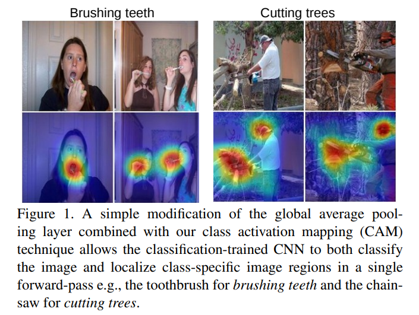

위 그림을 보면 이미지에 heap map으로  highlight된 모습을 볼 수 있다. 그렇다면 어떻게 이러한게 가능했을까? 과정은 생각보다 간단하다.

### Global Average Pooling

 본 논문에서 사용되는 방법을 알려면 우선 Global Average Pooling(GAP)를 알아야한다

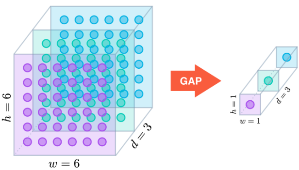

> 그림 출처: https://ganghee-lee.tistory.com/39

  GAP는 NIN(Network in Network) 논문에서 사용되었고 feature map의 평균을 구하여 x,y,d -> 1,1,d 형태로 만들어주는 Pooling 방법이다. Inception v1에서도 사용되었으며 특징으로는 파라미터 수를 획기적으로 줄이고 이를 통해 Overfiting을 방지해준다고 한다. 또한 GAP를 사용함으로써 feature map을 flatten 시켜 class의 값을 계산하는 FCL보다 공간정보 손실이 덜하다고 한다.

### Class Activation Mapping(CAM)

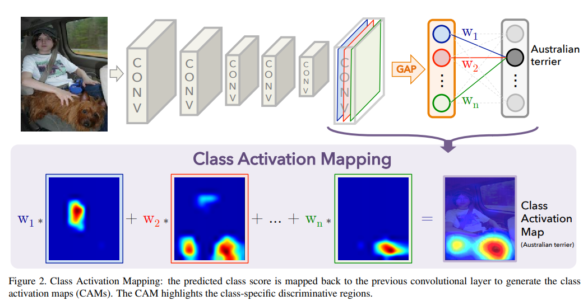

  본 논문에서는 base network를 Inception을 사용했다. 특징으로는 기존에 사용되던 fully connected layer의 구조를 제거하고 GAP(Global Average Pooling)을 사용했다는 점이다. 

 Figure 2를 보면 논문의 Main 요소라 볼 수 있는 Class Activation Mapping에 대한 설명을 보여준다. 그림에서는 GAP를 사용해 feature map을 vector화된 unit으로 만든 것을 볼 수 있다. 이를 통해 파라미터를 줄여 연산 효율을 극대화 하였고 가중치를 학습시켜 class를 예측한다. 또한 학습시킨 가중치를 feature map에 곱함으로써 중요한 feature map은 극대화하고 도움이 되지 않는 feature map은 영향을 최소화 시키는 작업을 거친 후 class 별로 결과를 더함으로써 class 별 Class Activation Mapping을 완성 시킨다.

수식으로 정확히 살펴보면 다음과 같다.
$$
f_k(x,y)\\
F^k = \sum_{(x,y)}f_k(x,y)\\
S_c = \sum w^c_{k}F_k\\
P_c = \frac{\exp(S_c)}{\sum_cexp(S_c)}
$$

> f_k는 activation map을 의미하고 k는 unit을 의미한다.
>
> F^k는 activation map에 GAP를 적용한 값을 의미한다.
>
> 수식을 보면 전체 더하기 수식을 썻지만 코드상으로 보면 전체 수식을 더한 후 평균을 내주는 작업을 해준다.
>
> 위 식은 마지막에 GAP를 적용한 후 class의 확률을 적용하는 식을 표현한다.

$$
M_c(x,y) = \sum w^c_{k}f_{k}(x,y).\\
$$

>  위의 식은 언뜻보면 위와 거의 같은 식처럼 보이지만  GAP를 적용하지 않은 activation map을 사용한다.
>
> 즉 학습된 가중치를 원래의 activation map에 곱함으로써 activation map의 중요도를 구하는 수식이다.
>
> 위와 같은 수식을 클래스 별로 적용 후 모두 더하면 CAM 결과를 얻을 수 있다.

### Global average pooling (GAP) vs global max pooling (GMP)

 과연 GAP가 본 논문에서 사용된 모델에서 사용된 가장 좋은  방법일까? 라는 생각이 들었는데 저자도 나와 같은 생각을 했는지 GAP만이 아닌 GMP를 사용해 실험을 진행하였다. 실험 결과는 밑의 표와 같다.

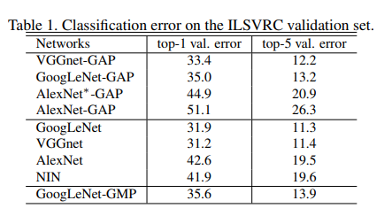

 표를 보면 우선 원래 orginal 모델과 FCL 구조를 제거한 후 GAP를 사용한 모델과 error가 그렇게 많이 차이 나지 않는 다는 것을 알 수 있다. 또한 GAP와 GMP를 비교해 GAP를 사용한 모델이 GMP를 사용한 모델보다 더 성능이 좋다는 것을 알 수 있다.

또한 GMP는 CAM실험 결과 maximum한 포인트는 잘 찾지만 포인트의 주변 영역을 찾는 성능은 좋지 않아 GAP를 사용했다고 말한다.

### CAM 실험 결과

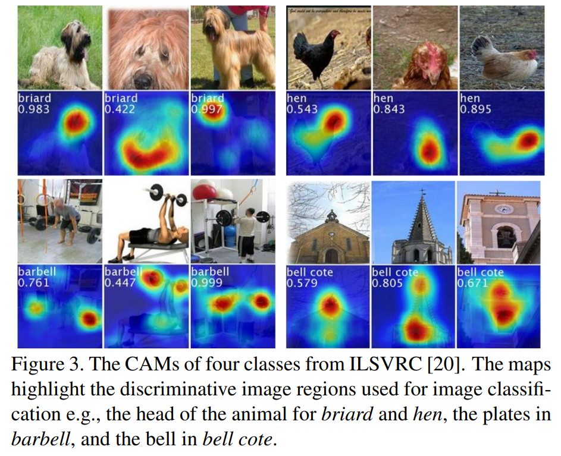

 Figure 3을 보면 각 객체 별 CAM 실험 결과를 볼 수 있다. 결과를 보면 모델이 객체의 어느 부분을 중요시 여기는지, 어느 특징을 보고 학습이 진행됬는지에 대한 정보를 얻을 수 있다.

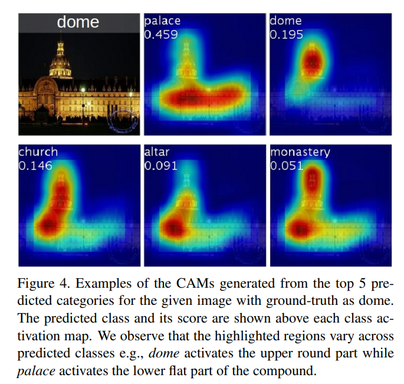

 또한  같은 객체를 class별 CAM이 어디를 집중하는지도 알 수 있다.

### Weakly-supervised Object Localization

 지금까지의 결과를 보면 단순히 classification과 설명 가능한 AI에 대해서 얘기하는 것 같지만 CAM의 결과를 보면 문득 떠오르는 것 이 있다. 그것이 무엇일까?

 본 논문의 저자들은 본 논문을 단순히 classification을 하고 CAM을 통해서 학습되는 영역을 찾는것에 끝나지 않고 Object Localization에 대해서도 실험을 진행하였다. 이 말을 읽고 결과를 보면 CAM에서 중요하다고 표시된 영역이 객체의 영역에 표시된 것 을 알 수있다. 즉 Object detection과 같은 기능을 수행하고 있다는 것을 알 수 있다.

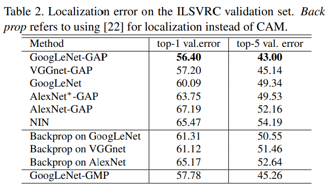

 위의 테이블은 저자들이 Object detection에 대하여 실험한 결과이다. Backporop는 GAP를 적용하지 않은 original model을 의미한다. 또한 AlexNet에 * 표시가 있는데 저자가 말하길 AlexNet의 성능이 너무 좋지 않아 FCL를 하나 추가한 후에 GAP를 적용한 모델이라고 한다. 위에 있는 모델들은 기본적으로 모두 Object detect에 관한 학습을 진행하지 않고 실험한 결과이다. 테이블을 보면 GooLeNet-GAP의 성능이 가장 좋다는 것을 알 수 있다.

또한 본 논문에서는 기존에 사용되는 object detection 방법과 비교하는 실험을 진행하였다. 논문에서는 성능을 평가하기 위해 두가지 방법을 사용했다고 한다. 하나는 매우 tight한 bounding box를 사용하고 다른 하나는 loose한 박스를 사용했다고 한다.(잘 이해가 되지 않음)

object detection 성능을 실험하기 위해 기존 network에 존재하는 fcl 영역을 모두 제거하고 GAP를 사용하는 방식을 사용했다. 논문에서는 fcl영역이 없기 때문에 softmax에서 가져왔던 방식과 유사하게 가중치를 얻기 위해 Linear SVM을 사용했다고 한다.

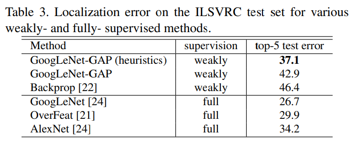

 결과는 다음과 같다. 예상되로 기존에 사용되는 full supervision이 훨씬 성능이 좋다는 것을 알 수 있다. 하지만 테이블을 보면 GoogLeNet-GAP(heuristics)가 Alexnet full supervision과 어느정도 근접한 성능이 나온다는 것을 볼 수 있다.

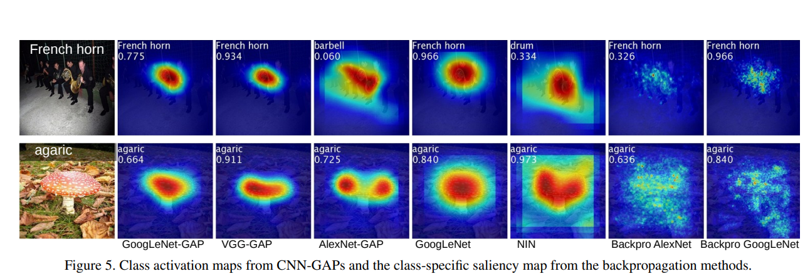

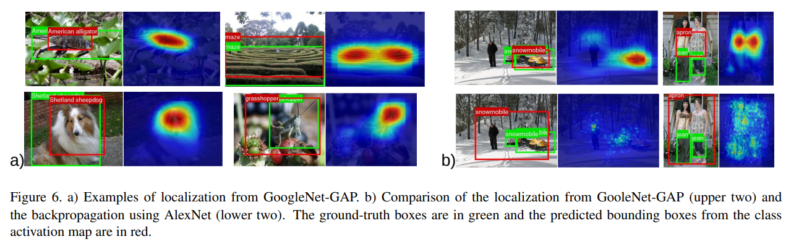

 Figure 6.은 GoogLeNet-GAP의 object dtection의 성능을 평가하기 위한 실험이다. 그림에서 보이는 초록색은 Ground Truth box이고 빨간색 박스는 모델이 예측한 박스이다. 본 모델에서 박스를 치는 방식은 CAM에서 최대값 20% 이상인 영역을 나눈 후 나눠진 영역을 모두 덮을 수 있는 bounding box를 만드는 방식을 사용하였다.

 그림의 결과에 대해 해석해 보자면 생각보다 위치 인식을 잘하는것을 볼 수 있다. b) 그림에서는 GAP를 사용한 모델과 using backpropagation을 사용한 모델의 성능을 비교하는데 GAP를 사용한 모델이 훨씬 객체의 위치를 잘 찾는 것을 볼 수 있다.

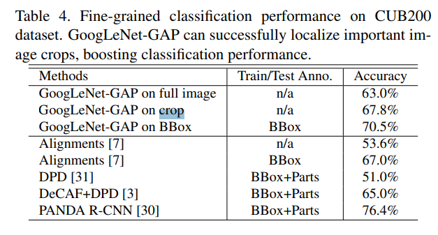

 논문에서는 localize 성능을 높이기 위해 다양한 방식을 사용하며 학습을 진행하였다. 특히 한점은 BBox를 사용하여 학습을 진행하였다는 건데 성능이 당연히 많이 올라간 것을 알 수 있다. 본 논문에서는 애초에 BBox 학습 없이 localize가 가능하다고 주장하는 논문이였는데 그냥 실험을 해본것일까? 잘 모르겠다.

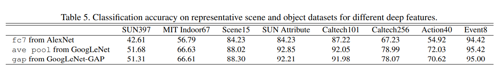

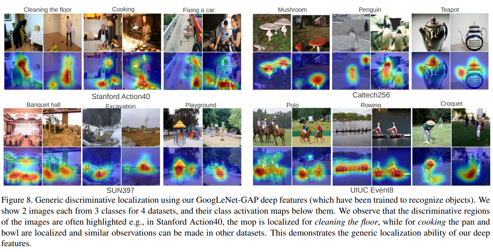

 논문에서는 단순한 classification data set만을 사용하지 않고 다양한 data set을 활용해 실험을 했다. table 5를 보면 GAP방식을 사용한 GoogLeNet-GAP가 fcl를 사용하는 AlexNet보다 더 좋은 성능을 내는 것을 알 수 있다.

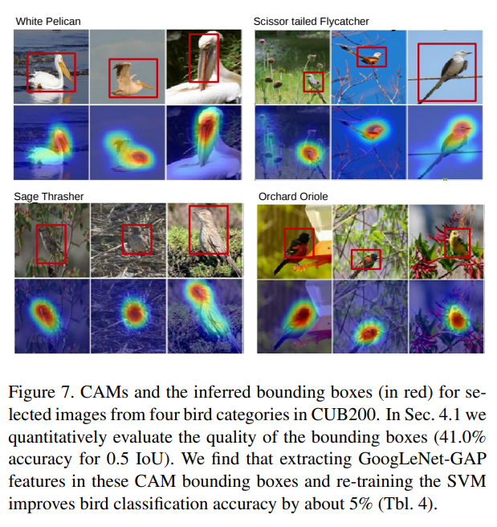

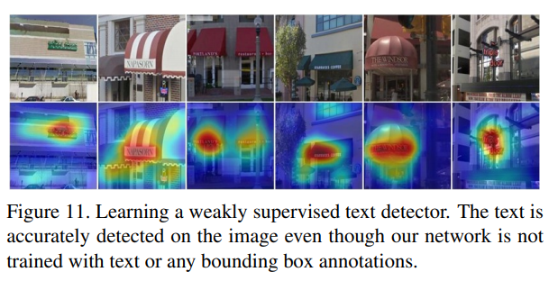

### Conclusion

- Class Activation Mapping (CAM)을 통해 CNN이 어떤 특징에 대해 학습이 되는지 알 수 있다.
- GAP를 사용하여 준수한 성능을 낼 수 있었고 CAM에서 객체에 대한 표현 성능이 더 좋다는 것을 알 수 있었다.
- CAM을 활용해 Object detection이 가능하다.(성능은 부족하지만)
- CNN 모델에 label에 대해서만 학습을 해도 object detection을 할 수 있다는 가능성을 열어준 논문