## Deep Double Descent : Where Bigger Models and More Data Hurts

>_2020. ICLR_
>
>* Harvard University
>
>  * Preetum Nakkiran, Gal Kaplun, Tamini Bansl, Tristan Tang, Boaz Barak [https://scholar.google.com/citations?hl=en&user=I0fbJ6cAAAAJ]
>
>* OpenAI
>
>  * Ilya Sutskever
>
>  <https://scholar.google.com/citations?user=x04W_mMAAAAJ&hl=en>

#### Abstract

 다양한 최신 Deep learning 에 있어서 모델 크기나 학습 epoch 수를 늘리면 성능이 먼저 악화된 다음 개선되는 "Double Descent"현상이 나타난다.

 본 논문에서는 새로운 모델 복잡성 측정을 정의하여 "Double Descent"현상을 통합하고 이 측정과 관련하여 일반화 된 "Double Descent"를 추측한다.

 또한 모델 복잡성에 대한 개념을 통해 모델의 크기, 학습 epoch수, 학습 sample 수에 따른 test error성능이 저하되는 특정 영역을 식별한다.

#### Introduction

 기존 전통 통계학습 이론에 따르면 더 높은 복잡성의 모델은 편향은 낮지만 분산은 더 높다. 따라서 복잡성의 특정 임계값을 통과하면 모델의 'overfit'으로 인하여 성능의 저하를 불러온다. 즉, 특정 임계값을 통과하면 "모델이 클수록 더 성능은 더 나빠진다."

 반면 현대 딥러닝의 실무자들 사이에서는 네트워크에 수백만개의 parameter가 있지만 작은 모델보다 많은 작업에 있어 훨씬 더 잘 수행하기 때문에 "큰 모델이 성능이 더 좋다." 라고 말한다.

 본 논문에서는 다양한 실험을 통해 모델의 성능과 관련하여 다양한 실험을 통하여 경험적 증거를 제시한다.

 이때, 모델 복잡성의 특정 임계값에 의하여 'overfit'이 발생되고, 이로 인해 모델 복잡성이 다시 증가하는 현상을 'double descent'현상이라 부른다.

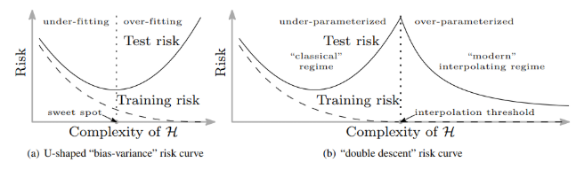

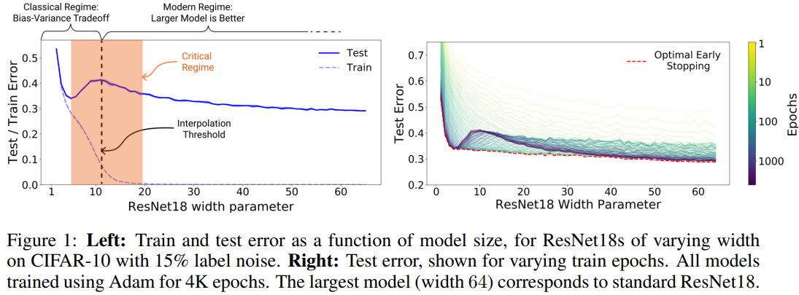

 'double descent' 현상이 발생되는 영역에 대하여 모델 성능의 저하되가 되는 3가지 시나리오를 정의한다.

#### Effective Model Complexity(EMC)

 EMC는 훈련 절차의 유효 모델 복잡도로 0에 가까운 train error를 달성할 수 있는 최대 샘플 수로 정의한다.

 EMC는 데이터의 분포 및 classifier의 구조 뿐만 아니라, training procedure와 training time에 많은 의존도를 가지고 있다.

 본 논문에서 말하고 있는 "double descent"현상은 EMC로 인하여 발생된다고 주장한다.

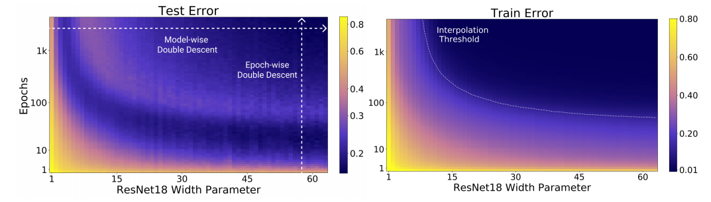

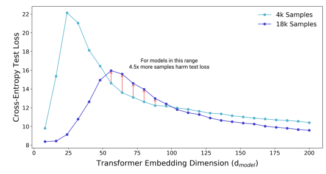

* Define(EMC)
  $$
  EMC_{D,\epsilon}(T) := max \left\{ n|\mathbb{E}_{S\sim D^n}[Errors_S(T(S))] \le \epsilon\right\}
  $$

  > T : training procedure
  >
  > S : {($x_1, y_1$), ... , ($x_n, y_n$)}
  >
  > T를 입력으로 S의 레이블이 지정된 학습 샘플의 데이터 매핑 분류기 T(S)
  >
  > D : Distribution
  >
  > T(D)의 EMC : T가 평균 $\approx 0$ 인 훈련 error를 달성하는 샘플 수 n의 최댓 값
  >
  > $Errors_S$ : 훈련 샘플 S에 대한 모델 M의 평균 오차

* Hypothesis

  1. Under-parameterized regime (Under-fit 되는 구간)

     > $EMC_{D, \epsilon}(T)$ 가 충분히 작으면, test error는 감소한다.

  2. Over-parameterized regime(Over-fit 되는 구간)

     > $EMC_{D, \epsilon}(T)$ 가 충분히 크면, test error는 감소한다.

  3. Critically parameterized regime(Under-fit과 Over-fit의 교차 지점)

     > $EMC_{D, \epsilon}(T) \approx n$ 인 경우, test error는 감소하거나 증가한다.

  

  * 경험적으로 $\epsilon : 0.1$로 사용했으며, 매우작음과 매우 큼의 정도에 대한 공식적인 사양을 아직 가지고 있지는 않다.
  * 본 논문에서의 실험은 $EMC_{D, \epsilon}(T) = n$일 때 interpolation 임계값 주변에 임계 간격이 있음을 시사한다.
  * Hypothesis 가 최적화 알고리즘, 모델 크기 및 테스트 성능 간의 상호작용을 설명하고, 이에 대한 경쟁을 조정하는데 도움이 될 것이다 주장한다.

#### Model-wise Double Descent

 고정된 많은 수의 최적화 단계에 대해 모델의 크기가 증가함에 따른 test error 결과 비교

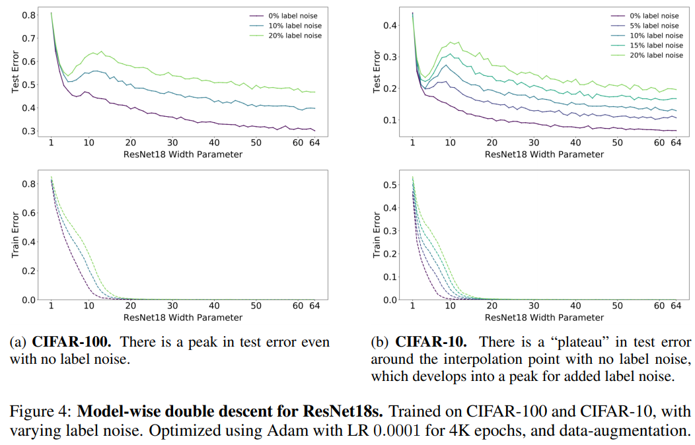

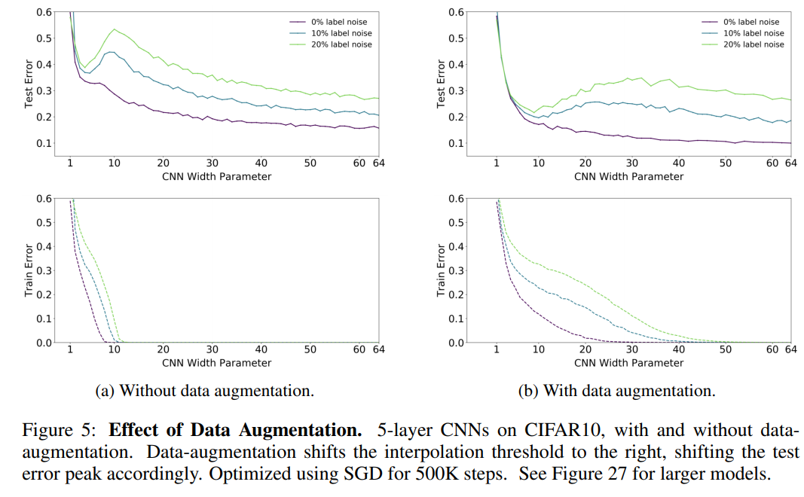

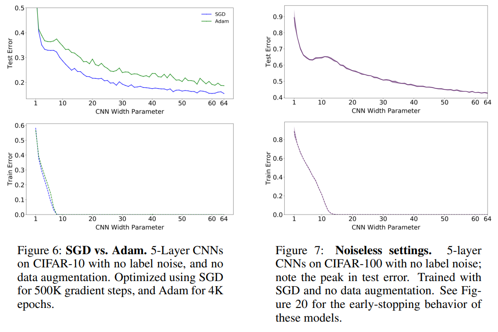

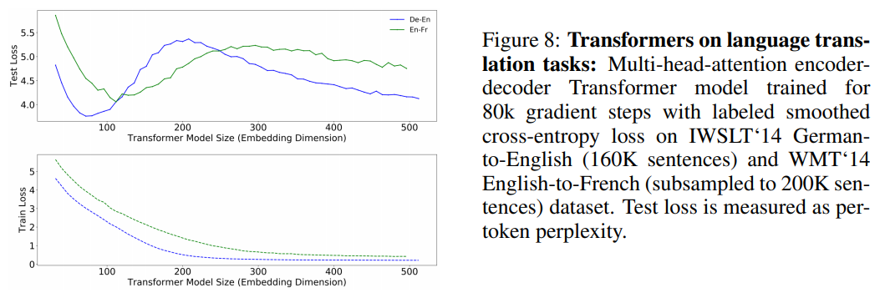

#### Epoch-wise Double Descent

 고정된 대규모 구조의 네트워크에서의 test error 결과 비교

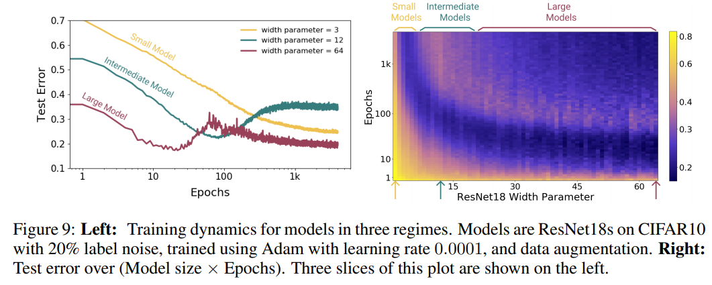

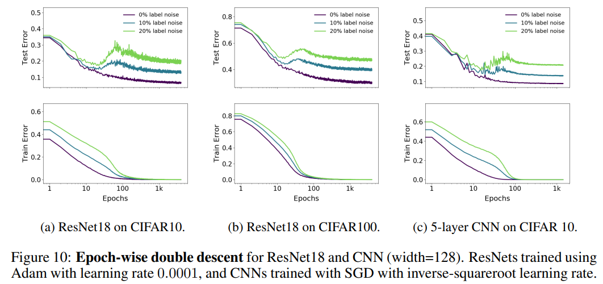

#### Sample-wise Non-monotonicity

 다양한 샘플 수에 따른 고정된 model 및 train procedure에 대한 test error 결과 비교

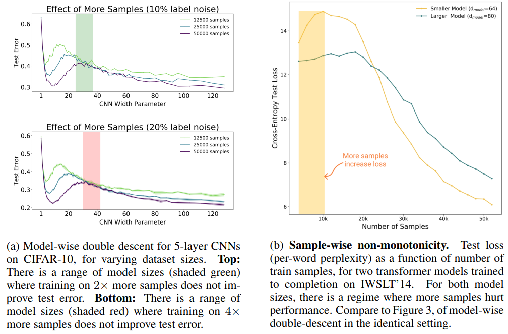

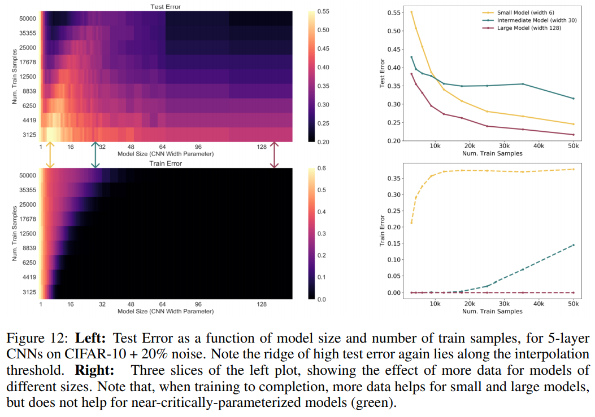

#### Conclusion

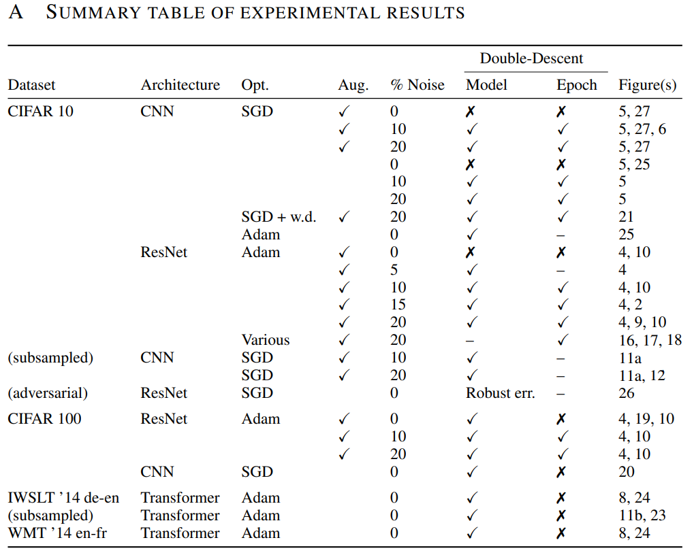

 label noise가 없는 경우, 대부분에 경우에서 double descent 가 일어나지는 않지만, 모든 경우에 해당하는것은 아니다.

 double descent는 noise가 존재한다는 가정하에 model/epoch-wise double descent가 발생하며, 이외에 weight decay나 optimizer, learning rate 와도 상관없이 발생됨을 추가 실험을 통해 알 수 있었다.

 또한, double descent 는 데이터 수가 증가함에 따라 성능향상이 발생 되며, Transformer의 경우 모델이 작은 경우가 더 좋은 성능이 나타나는 반면, CNN의 경우 모델이 작은 경우에 성능이 저하됨을 확인하였다.

 일반적으로 딥러닝을 활용한 학습을 진행할 때, 데이터의 수가 많고 모델이 큰 경우에 좋은 학습 성능을 보이지만, 때에 따라 실험결과를 epoch, parameter 수, 모델의 크기, 데이터의 수 등을 고려한 학습을 진행하는 것

