# ShuffleNet: An Extremely Efficient Convolutional Neural Network for Mobile Devices

> ShuffleNet: An Extremely Efficient Convolutional Neural Network for Mobile Devices[CVPR 2018]
>
> 저자:
>
> https://scholar.google.com/citations?user=yuB-cfoAAAAJ&hl=en
>
> 

본 논문은 우리가 알고있는 MobileNet과 같이 모바일 환경에서 사용될 수 있는 모델을  만들기위한 논문이다.

저자는 논문에서 Xception과 ResNext와 같은 SOTA모델은 1x1의 computational cost가 매우 커 작은 network에서 사용되기 힘들다고 말한다. 이와 같은 점을 극복하기 위해  ShuffleNet은 Pointwise group convolution과 channel shuffle 기법등을 사용하였다. 이 기법들을 어떻게 사용했는지는 밑에서 알아보자.

### Pointwise Group convolution

우선 Pointwise Group convolution을 설명하기 전에 Group convolution에 대해 알아보자.

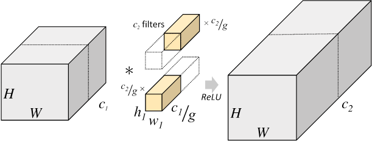

> 이미지 출처: https://www.slideshare.net/ssuser6135a1/ss-106656779

Group convolution은 초기 AlexNet에서 GPU 연산 성능이 부족하여 Convolution을 group 수만큼 나누어 병렬 연산을 수행하는 방법이다. 

Group는 g라는 단위를 사용하는데 g는 단위의 수를 의미한다. 위 방식을 사용하면 computational cost를 줄일 수 있다고 한다.

> ex)
>
> input: 32 , output=64, outputsize: k
>
> 일반 Conv: K * K * 32 * 64 = 2048(k제외)
>
> Group conv: K * K * 8 * 16 * 4 = 512 (g = 4)

group convolution을 사용함으로써 computational cost를 줄이고 이를 통해 절약된 자원을 feature map의 수를 늘려 모델의 성능을 높이는것이 본 논문이 중요한 점이다. 또한 본 논문에서도 MobileNet 등의 모델에서 사용하는 depthwise separable convolution을 사용한다.

> 참고

Group convolution은 computational cost를 줄여 매우 좋아보인다. 하지만 group convolution은 단점을 가지고 있다.

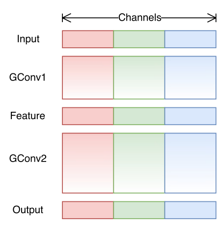

위 그림은 논문에서 나온 Group convolution을 표현한 그림이다. 그림을 보면 무엇을 알 수 있을까?

그림에서는 색깔로 input data의 정보를 표시하는데 유심히 보면 각 Group의 input부터 output까지 모두 같은 색인것을 볼 수 있다. 

이 말은 즉 Group Convolution을 사용하면 Group간의 교류가 되지 않아 group들 안에 있는 정보만을 사용하게 되고 이는 모델의 성능을 약화시킨다는 말이된다.

본 논문에서는 이러한 문제를 해결하기 위해 Channel Shuffle operation을 사용한다.

####  Channel Shuffle operation

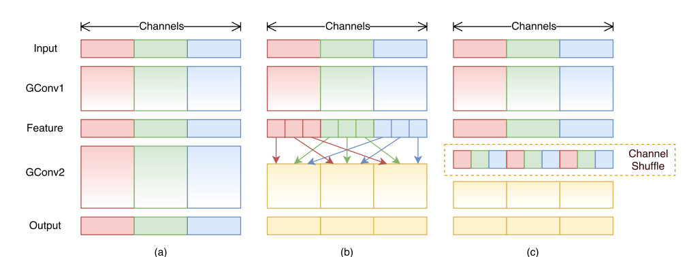

Channel Shuffle operation는 Group convolution을 사용함으로써 group간에 정보 교환이 되지않는 현상을 방지하기 위해 사용된다. 그림에서 (c)를 보면 Feature  영역의 Group을 sub Group으로 나눠서 서로 섞어주는 모습을 볼 수 있다. 이를 통해 본 논문에서는 representation을 강화할 수 있다고 한다.

### ShuffleNet Unit

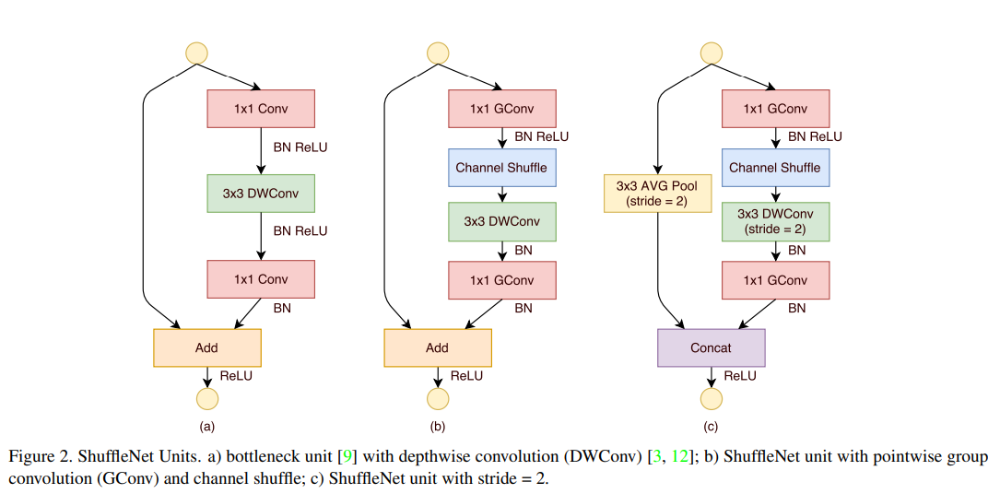

 위의 그림에서 a)는 Group convolution과 Shuffle이 없는 ResNet의 구조이다. 1x1 Conv 후 3x3 DWConv을 거쳐 다시 1x1을 수행한다. b)는 shuffleNet units으로 Group convolution 후에 Channel Shuffle이 들어가는 것을 볼 수 있다. c)는 stride 를 2로 설정할 때 사용되는 모듈이고 3x3 AVG pooling과 concat을 해주는 것을 볼 수 있다.

 본 그림을 보면 과연 이 구조가 기존의 구조보다 더 효율적인가? 라는 생각을 할 수 있다. 그래서 예로 논문에 있는 연산 결과의 표를 첨부한다.

|     ResNet      |   ShuffleNet   |
| :-------------: | :------------: |
| hw*(2cm + 9m^2) | hw(2cm/g + 9m) |

> c: channel , h: height, w: width, m: bottleneck channel, g: group

표의 연산결과를 보면 shuffleNet이 computational cost가 더 적게 든다는 것을 알 수 있다.

### Model Architecture

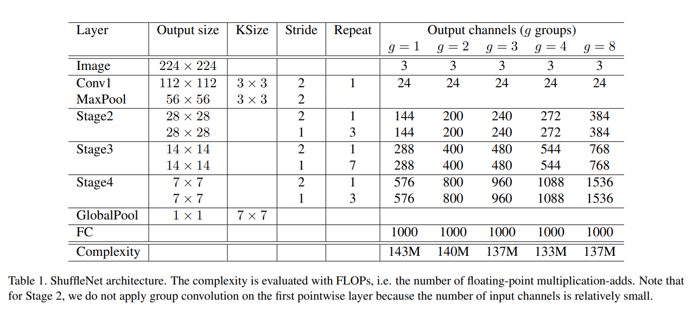

위의 테이블은 ShuffleNet의 Model Architecture이다. 특이한 점은 g(group)의 개수가 늘면 output의 channel의 개수가 느는 것을 볼 수 있는데, 이것은 g의 숫자가 늘면서 computational cost가 줄어들기 때문에 cost가 줄어든 만큼 더 channel의 개수를 늘려 representation을 강화시키기 위함이다.

> ex)
>
> input: 32 , output=64
>
> g = 8
>
> 32 /8 * 64 / 8 * 8 = 256
>
> g = 4
>
> 32/4 * 64/4 * 4 = 512
>
> g가 높을 수록 연산 효율이 높아짐!

## Ablation Study

### Pointwise Group Convolutions

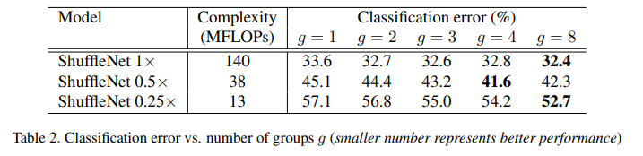

 위의 테이블은 g의 수에 따라 classification error가 어떻게 변하는 가를 실험한 실험이다. g가 높을 수록 error가 줄어드는 것을 알 수 있다.  하지만 전체적으로보면 g 값이 무조건 높다고 좋은 것이 아닌 적당한 값을 찾는것이 중요하다는 것을 알 수 있다.

>  여기서 0.5 , 0.25는 채널 수에 0.5 0.25를 곱한 것

### Channel Shuffle vs. No Shuffle

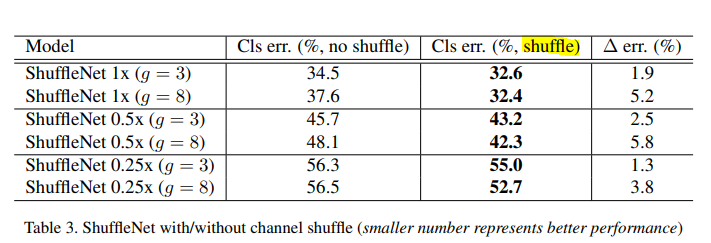

 테이블 3은 ablation study로 channel shuffle을 사용할 때와 사용하지 않을 때를 비교한 실험이다. 테이블을 보면 channel shuffle을 사용하지 않으면 g 값이 높은 g = 8이 g = 3인 모델보다 성능이 좋지 않은 것을 볼 수 있다. channel shuffle을 해주지 않음으로써 각 group간에 정보 교환이 되지 않아 representational이 약해졌다고 볼 수 있다. 하지만 channel shuffle을 사용했을 떄는 g의 값이 높을 수록 더 좋은 성능을 내는 것을 확인할 수 있다. 

### Comparison with Other Structure Units

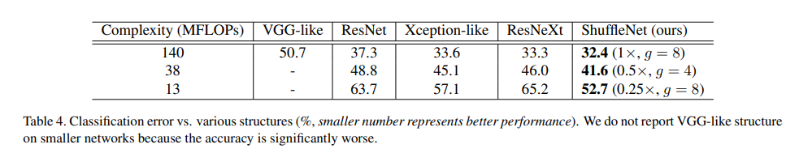

 본 논문에서는 shuffleNet의 구조를 다른 무거운 network와 비교하는 실험을 진행하였다. 저자는 정확한 실험을 위해 shuffle unit을 제거한 후 각 모델의 module을 결합하여 실험을 진행했다고 한다. 

 테이블을 보면 동일한 FlOPS 대비 가장 성능이 좋은 것을 볼 수 있는데 이는 computational cost를 효율적으로 사용함으로써 모델의 성능 향상을 가져왔다고 볼 수 있다.

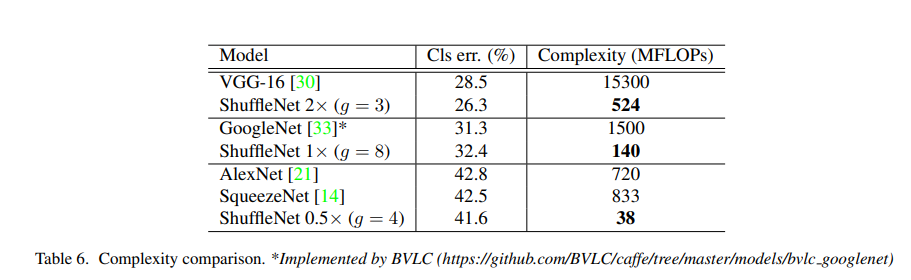

기존의 모델과 상대적으로 큰 모델의 성능을 비교한 테이블로 성능은 비슷하지만 FLOPs는 매우 낮아 매우 효율적인 모델이라는 것을 알 수 있다.

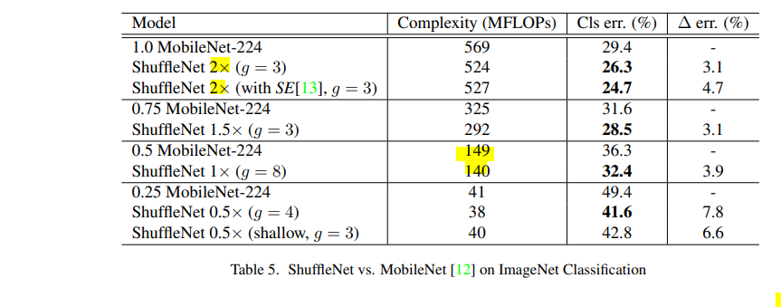

 모바일 네트워크의 대표격인 MobileNet과 Complexity를 비슷하게 맞춘 후 성능을 비교한 테이블이다. 주목할 점은 shuffleNet이 같은 complexity를 가질 때 MobbileNet보다 성능이 좋다는 점이다. 논문에서는 shuffleNet은 layer가 50개인것에 반해 MobileNet은 28개를 가지고 있다고 하며 더 정확한 측정을 위해 ShuffleNet의 layer를 제거해 26 layer를 가지게 한 후 MobileNet과 비교하였다.(shuffleNet 0.5x shallow) 결과는 위와 같이 shuffleNet이 더 좋은 성능을 내는 것을 볼 수 있다.

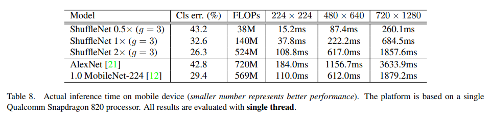

우의 테이블은 모델 별 actual inference time을 비교한 결과이다. 결과를 보면 ShuffleNet이 다른 모델보다 매우 빠른 속도를 가지는 것을 볼 수 있고 AlexNet보다 FLOPS 수치는 낮으면서 error는 더 낮은 것을 볼 수 있다.

### Conclusion

- Group convolution을 사용하여 연산량을 줄여 효율적인 모델을 만들 수 있었다.
- Group convolution을 하며 발생되는 문제점을 Channel shuffle을 이용하여 극복하였다.
- 위의 두가지를 사용하여 기존 mobile 모델들 보다 더 효율적인 연산을 할 수 있는 모델을 만들었다.