## End-to-End Object Detection with Transformers

> _ECCV'20_
>
> Facebook AI Researcher
>
> > Nicolas Carion
> >
> > Francisco Massa
> >
> > Gabriel Synnaeve
> >
> > Nicolas Usunier
> >
> > Alexander Kirillov [https://scholar.google.com/citations?user=bHn29ScAAAAJ&hl=en]
> >
> > Sergey Zagoruyko

### Abstract

 본 논문에서는 Object Detection을 direct set prediction problem 으로 보는 새로운 방안을 제안한다.

 접근 방식은 detection pipeline 을 능률화하여 NMS 나 anchor 생성과 같은 수작업 설계를 요구하는 요소를 효율적으로 제거한다.

 DEtection TRansformer(DETR)는 bipartite matching(이분 매칭)을 통해 고유한 예측을 도출하는 set-based global loss 와 transformer의 encoder-decoder 구조가 주요 프레임워크의 요소이다.

 본 논문에서 제안하는 모델인 DETR은 개념적으로 간단하고 library를 필요로 하지 않으며, COCO object detection dataset에서 잘 수행되고 최적화된 Faster RCNN과 동등한 정확도와 런타임 성능을 나타낸다.

### Introduction

 기존의 Object detection 모델들은 anchor박슬르 생성하여 RoI를 제안하고, NMS를 정의하여 중복을 제거하는 사용자의 정의에 의한 레이어 구성이 요구되어 왔었다. 하지만 본 논문에서는 이러한 간접적인 방식을 우회할 수 있는 direct set prediction problem으로 제안한다.

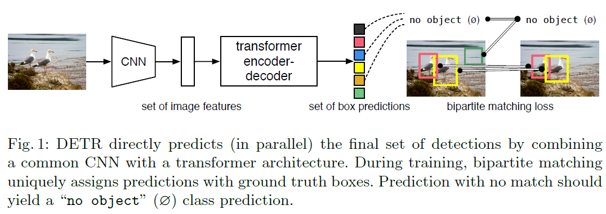

 DETR은 Transformer의 self-attention 메커니즘을 통해 중복된 예측을 제거와 같은 특정 제약 조건을 해결하는 구조를 사용한다. 따라서 anchor 박스 또는 NMS와 같은 사전 정의를 인코딩 할 수 있도록 구조화하여 pipeline을 단순화 한다.

 DETR은 큰 객체들에 대해서는 우수한 성능을 도출하지만, 작은 객체에 대해서는 낮은 성능이 나타났으며, 디코딩 loss 학습을 위해서 긴학습 시간이 소요된다.

### The DETR model

 DETR에서는 1) prediction 과 GT 간의 매칭을 요구하는 loss와 2)single pass 로 예측하고 그 관계를 모델링하는 구조를 필요로 한다.

#### - Object detection set prediction loss

 DETR은 decoder를 통해 고정된 사이즈의 N개의 object를 예측한다. 이때 N은 이미지의 일반적인 개체 수보다 상당히 크게 설정한다. N개의 객체와 GT간의 optimal bipartite matching을 생성해 개체 별 (bounding box) loss를 최적화 한다.

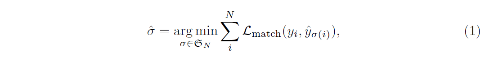

> y : GT set of objects
>
> $\hat{y} = \{\hat{y_i}\}^N_{i=1}$ : set of N predictions
>
> $\sigma(i)$ : 예측한 N개의 object set의 permutation(순열) 중 GT object set과의 $L_{match}$가 가장 작은 permutation(순열)
>
> N이 이미지 객체 수보다 크다고 가정하면 y는 $\varnothing$(no object)로 채워진 크기 N의 집합으로 간주
>
> $L_{match}(y_i, \hat{y}_{\sigma(i)})$ : GT($y_i$)와 prediction 간의 pair-wise matching cost
>
> 최적 할당은 Hungarian algorithm을 사용하여 효율적으로 계산

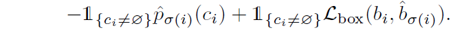

> $y_i = (c_i, b_i)$
>
> c : class label
>
> b($b_i \in [0,1]^4$) : 0과1사이의 이미지 사이즈와 상대적인 box 중심좌표와 height, width 
>
> matching cost :
>
> anchor box의 역할을 하며 주요 차이점은 duplicate(중복)이 없는 direct set prediction을 위해 one-to-one matching이 이뤄줘야 한다.

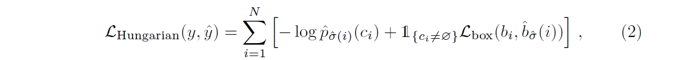

> 최적의 matching cost $\hat{\sigma}$를 찾았다면, Hungarian loss계산 수행
>
> 클래스 불균형을 위해 $c_i = \varnothing$ 인 경우 로그확률 항에 10배만큼 가중치를 낮춘다.

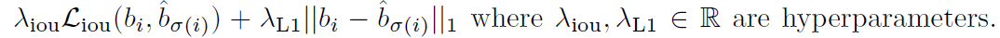

> $L_{box}(b_i, \hat{b_{\sigma(i)}})$ :
>
> bounding box의 점수를 매기는 function
>
> L1 loss 와 generalized IoU loss의 선형조합으로 구성

#### - DETR architecture

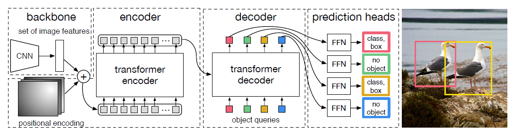

 DETR은 feature 추출을 하는 CNN backbone, Transformer의 encoder-decoder, 간단한 FFN(Feed Foward Network)로 구성된다.

##### Transformer Encoder

* feature map f($f \in R^{C\times H\times W}$)에 1x1 convolution 적용하여 채널 차원을 d로 줄인다.
* $z_0 \in R^{d\times H\times W}$를 생성한다.
* encoder는 sequence를 입력으로 하기 때문에 $z_0$를 $d\times HW$로 바꿔준다.
* Transformer는 permutation에 대하여 invariant 하기 때문에 각 attention layer의 input으로  positional encoding을 추가한다.

##### Transformer Decoder

* encoder-decoder 메커니즘을 사용하여 d크기의 N개의 임베딩을 변환한다.
* 한번에 한 요소씩 출력 시퀀스를 예측하는 autoregressive model을 사용하는 기존 모델과 달리, 본 논문에서는 모델이 각 디코더 계층에서 N개의 객체를 병렬로 디코딩한다.
* permutation invariant를 위해 N개의 입력 임베딩이 달라야 하기 때문에, positional encoding이 각 레이어의 입력에 추가한다.
* N개의 object query는 디코더에 의해 output embedding이 생성된다.

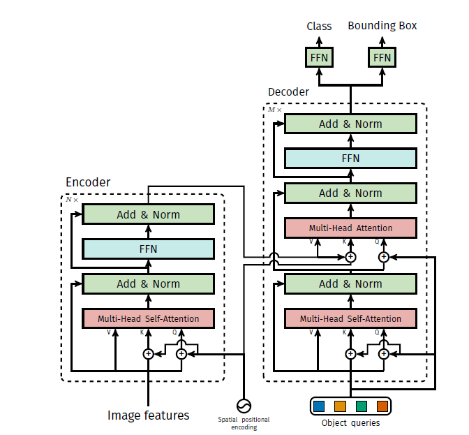

> 각 channel(d)은 각각 이미지의 다른 특징 정보를 가지고 있고, 이미지를 하나의 context, feature map의 한 channel을 하나의 단어로 생각해야한다.
>
> 이 channel들은 self-attention을 통해 전체 channel과 어떤 연관을 갖고 있는지에 대한 정보를 포함하여 encoding이 된다.
>
> decoder는 query(처음에는 0으로 설정), output positional encoding(object queries), encoder memory를 수신하고, multi head self-attention과 decoder-encoder attention을 통해 최종 class label과 bounding box의 예측한다.

### Experiments

* DETR, DETR-R101 : ResNet-50, ResNet-101
* DETR-DC5, DETR-DC5-R101 : feature resolution을 증가시키기 위해 dilated를 적용

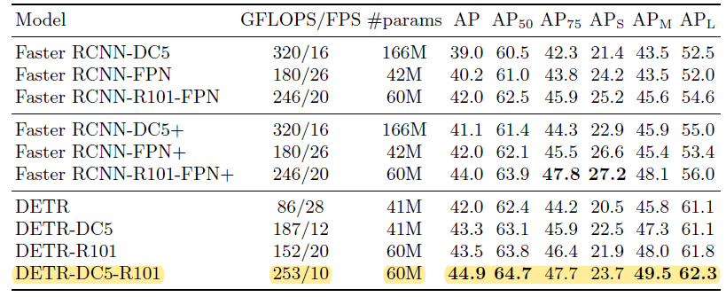

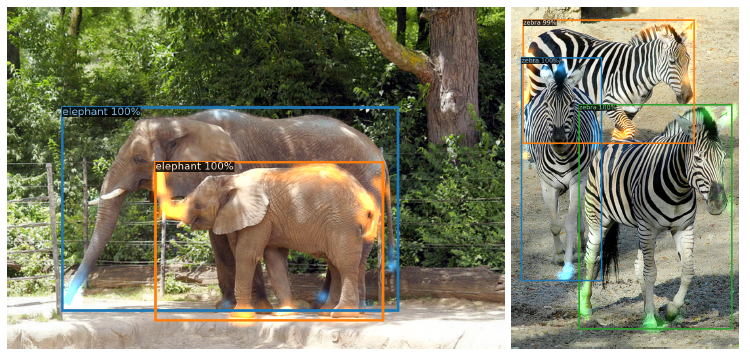

#### - DETR for panoptic segmentation

>  Faster R-CNN을 Mask R-CNN으로 확정한것과 유사하게 DETR 디코더 출력 위에 마스크 헤드를 추가하여 segmentation에 대한 확장 가능성이 있음을 보여준다.
>
> 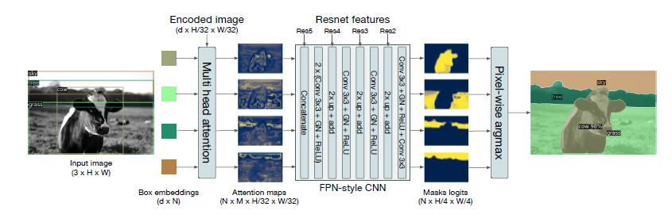
>
> 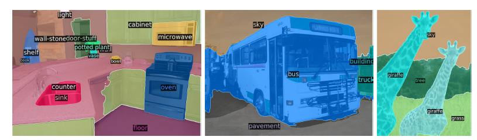
>
> 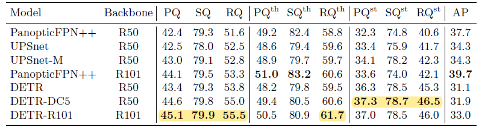

### Conclusion

본 논문에서는 direct set prediction을 위한 transformer 및 matching loss 를 기반으로 Object detection을 설계한 DETR(Detection Transformer)을 제안한다.

DETR은 COCO dataset에서 최적화된 Faster-RCNN과 비슷한 성능을 나타냄을 확인 하였고, segmentation 분야(panoptic segmentation)에도 확장이 가능함을 보여주었다.

또한, Faster R-CNN보다 큰 object에 대해서 훨씬 나은 성능을 달성하는 반면 작은 object에 대해서는 부족한 성능을 보이기도 하였다.

이에 대하여 새로운 접근법에 대하여 특히 작은 물체에 대한 training, optimization 및 성능과 관련되어 향후 개선작업이 필요하다.