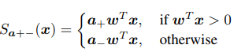
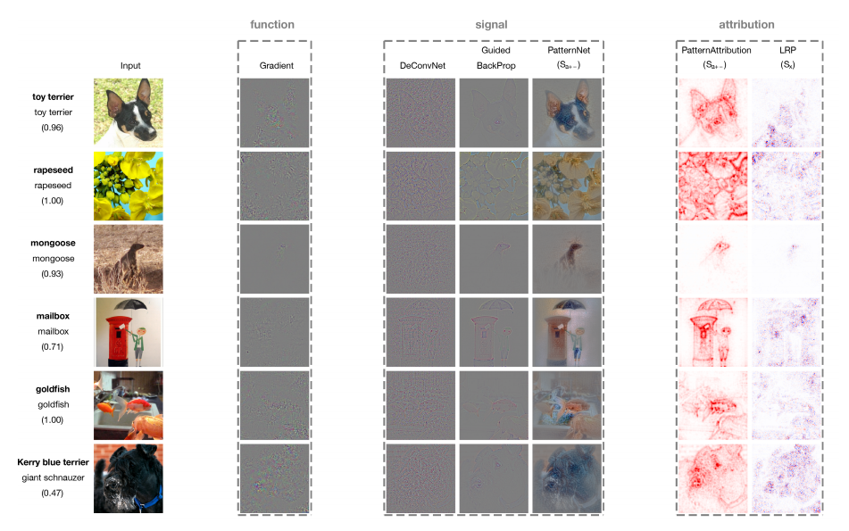

# Learning how to explain neural networks: PatternNet and PatternAttribution

> Pieter-Jan Kindermans - Google Brain
>
> https://scholar.google.be/citations?user=FpI8dFwAAAAJ&hl=en
>
> 

본 논문은 딥러닝을 설명하기 위한 XAI 모델 중 하나이다.

본 논문에서는 Data의 중요한 의미를 담고있는 Signal과 불 필요한 정보를 가지고 있는 Distractor로 구성되는데 모델을 시각화를 하기 위해서는 Signal을 중점으로 두어야한다고 한다. 왜냐하면 Weight는 distractor의 영향을 많이 받기 때문에 모델을 시각화할 때 Wieght에만 의존하면 좋은 결과를 낼 수 없기 때문이다.

최종적으로 모델을 시각화 하기 위해 weight, input, output의 값을 활용해 linear, non-linear 두가지 방식으로 Signal을 구할 수 있고 이를 이용해 모델을 시각화한다.

 본 논문에서는 어떻게 모델을 시각화 했는지 밑에서 알아보자.

### Signal & Distractor

먼저 논문을 알기전에 Signal과 Distractor에 대해서 설명하겠다.

- Relevant Signal: Data 표현이 가장 중용한 부분
- Distractor: 데이터에서 불필요한 내용, 노이즈

 본 논문에서는 Signal과 Distractor에 대해서 Linear model을 활용하여 설명한다.

 보통 데이터는 Signal과 DIstractor가 섞여 있다. 표현하자면 X = s + d이다.  

 우리가 학습을 하는 이유는 최적의 y값을 얻기 위함으로 학습에 사용되는 식은 WT*X이다(딥러닝을 사용하는 이유는 Distractor를 제거하기 위함).  최적의 y값을 얻기 위해서는 noise인 Distractor를 제거해야하는데 이때 이 Distractor를 제거해주는 역활을 하는것이 가중치 w이다. 그렇다면 가중치 w는 어떻게 Distractor를 제거할 수 있을까? 정답은 위의 그림에 나와있는데 그래프에 W 화살표의 방향이 ad와 직각인 것을 볼 수 있다. 이것은 선형대수학적으로 Distractor의 데이터와 orthogonal한 모습이라고 볼 수 있다. 

 즉, 가중치 w가 Distractor와 orthogonal하면서 Distractor를 0으로 만들어 제거할 수있다는 것을 알 수 있다. 이러한 기능을 하기에 가중치는 filter라고도 불린다.

#### saliency maps을 이용한 분석 방법

 본 논문에서는 비교 분석을 위해 saliency maps(Class Activation mapping이라고 생각하면 됨)을 사용하여 분석한 과거의 논문에 대해서 말한다.

- DeConvNet
- Guided BackProp
- LRP(Layer-wise Relevance Propagation)

> 간단한 설명
>
> #### Guided BackProp
>
> Class(확률이 가장 높은)에 대해서 마지막 conv layer의 gradients가 0보다 크고 relu ouput이 양수인 gradient만 feature map에 곱해 시각화 하는 방식
>
> 
>
> 
>
> 

위의 모델들의 특징으로는 중요한 정보가 압축된 output을 Backpropagation을 하면 input에 어떤 중요한 정보들이 함축되어 있는지 알 수 있다는 것이다.

함축되어 있는 정보를 토대로 saliency map을 만들어 모델을 시각화 한다.

>  sailency map

 위에서 사용하는 과거의 방법들은 매우 효과적인 방법 같지만 위 방법은 이론적으로 완벽하게 input data의 중요 부분을 추출하지는 못한다.

왜 이론적으로 완벽하게 중요 부분을 추출하지 못할까? 이유는 다음과 같다.

위의 시간화 방식은 보통 weight를 활용하여 표현하게 되는데 이 weight들은 Data의 불 필요한 요소들인 Distractor의 영향을 많이 받는다. 

즉 Data에서 중요한 signal에 집중을 해야하는데 Distractor의 영향을 많이 받는 weight vector을 사용함으로써 시각화를 하니 input data의 중요한 부분을 정확히 추출하지 못한다는 점이다.

이해를 위해 과거의 모델들을 간략히 소개한다.

- #### DeconvNet

- Convolutional 연산을 수행 후 Unnpool, Rectify, Reconstruction을 수행

- #### Unpooling

  - pooling을 할 때마다 해당 layer의 최대값 위치를 저장하고 DeConvolution과정에서 다시 되돌리는 과정
  - 

  - ### Rectified

    - Relu를 처리해주는 과정

  - ### Reconstruction

    - Deconv연산을 수행해 원래의 이미지를 수행

  - 

  - DeconvNet을 통해 featuremap을 시각화 할 수있음

  - 위의 사진은 영역별로 회색이미지로 가렸을때의 클래스 확률에대한 수치를 히트맵으로 표현한것이다.

  - > b) total activation 변화
    >
    > c) probability score 변화
    >
    > d) class 종류 변화

- #### Guided BackProp

  - Class(확률이 가장 높은)에 대해서 마지막 conv layer의 gradients가 0보다 크고 relu ouput이 양수인 gradient만 feature map에 곱해 시각화 하는 방식

위의 두 모델들의 특징은 바로 weight를 기준으로 특징 영역을 찾는다는 점이다.

Weight는 Data의 중요한 Signal을 따라가지 못하므로 이런 방법은 Data의 중요한 부분을 정확하게 잡아낼 수 없다.

이러한 점을 보완하기 위해 본 논문에서는 두가지 모델을 제안했다.

### Linear model

- Linear model은

- $$
  w^Tx = y(1)\\
  w^Ta_s = y(2) \\
  w^Ta_de = 0(3)
  $$

  1) 결과를 만족해야하기 때문에 2)와 3)을 모두 만족해야한다.

- 그러기 위해서는 3)의 조건을 가지기 위해 Distractor가 제거되야하기 떄문에 weight는 discractor에 orthogonal한 형태를 띄게된다.

- 하지만 이렇게 되면 Distractor에 대해서만 영향을 받게되고 Signal에 대해서는 거의 영향이 없기 때문에 weight만으로는 정확한 표현을 알 수 없게된다.

### additive Isotropic Gaussian noise

- ##### Gaussian noise를 사용한 이유

  - noise와 distractor의 상관관계가 없기 떄문에 weight에 의해서 noise가 완전히 제거되지 않음
  - Gaussian noise를 추가함으로써 L2 regularization 효과를 나타내 weight를 shrink(줄어들다)하게 만듬
  - 즉 W^Ta_s = 1을 만족하는 a_s의 방향과 같은 방향을 향하는 weight를 만들 수 있다.

### Overview of explanation approaches and their behavior

 즉 본 논문에서는 Signal이 데이터에서 가장 중요한 부분이고 Signal을 이용해야 정확한 영역을 찾을 수 있나고 말하고 있다.

 아래는 모델을 설명하기 위한 과거에 사용되었던 모델을 크게 3가지로 나누고 있다. 

- #### Functions - gradients, saliency map

  - 해당 모델의 gradient를 사용하는 방식으로 weight를 사용하는 방식

- ### Signal

  - output에서 나온 gradient를 input space까지 backprop화 시킨 후 visualization하는 방법
  - viusalization을 한 최종 결과가 Signal이라는 보장을 할 수 없음
  - PatternNet으로 보완

- ### Attribution

  - 특정 Signal이 output에 기여하는 정도를 나타내는 지표
  - Linear model에서는 signal과 weight의 element-wise곱으로 나타냄
  - PatternAttribution으로 보완

### QUALITY CRITERION FOR SIGNAL ESTIMATORS

> #####  Correlation Coefficient
>
> ![{\displaystyle \rho _{X,Y}=\operatorname {corr} (X,Y)={\operatorname {cov} (X,Y) \over \sigma _{X}\sigma _{Y}}={\operatorname {E} [(X-\mu _{X})(Y-\mu _{Y})] \over \sigma _{X}\sigma _{Y}}}](https://wikimedia.org/api/rest_v1/media/math/render/svg/93185aed3047ef42fa0f1b6e389a4e89a5654afa)

> $$
> S(x)=s^{hat}\\
> d^{hat}=1-S(x)
> $$

위의 식의 특징은 다음과 같다.

- 좋은 Signal estimator는 correlation이 0이 됨으로써 P(s)가 가장 큰값을 가지 하는모델이다.
- correlation은 scale에 영향을 받지 않기 때문에 v^td^과 y의 분산은 같다고 가정한다.
- 본 논문에서는 S(x)를 고정하고 최적의 weight인 V를 찾는 학습을 진행한다고 한다.
- 학습은 d와 y에 대해 Least-square regression을 사용

본 논문에서는 위의 식을 사용한다. 그렇다면 기존의 Signal estimator방식은 어떨까?

- #### The identity estimator

  - $$
    S_x(x) = x
    $$

  - Data에 Distractor가 없다고 가정하고 Data 전체를 Signal 가정

  - $$
    r = w \bigodot s+w\bigodot d
    $$

  - 

  - Atturibtion시에 noise가 많이 보임

- ### filter based estimator

  - $$
    S_w(x) = \frac{w}{w^Tw}w^Tx
    $$

  - Signal이 weight의 direction에 속한다는 가정

  - wegiht는 normalize해야 함

  - Attribution

  - $$
    r = \frac{w\bigodot w}{w^tw}y
    $$

  - Signal을 제대로 표현하지 못함

- ### PatternNet & PatternAttribution

  - 본 논문에서 제안하는 Signal을 추출하는 방법
  - 위의 식 P(s)을 최적화하는 학습 방식
  - y와 d의 correlation이 0이 나오게 하는 최적의 vector(weight)를 찾는 방법

- ### 	Linear model에 사용하는 PatternNet 방식	

$$
S_a(x) = aw^Tx = ay
$$

- a를 곱하여 Signal을 추출하는 방식
- 공식은 다음과 같음 Cov([y,d] = 0 
- 
- 
- 즉 최적의 a를 찾아 Signal을 찾기 위한 학습 방법
- 단 이 방법은 비선형 모델에서는 noise를 완전히 제거할 수 없음

- ### The two-component estimator

  - non-linear singnal estimator로 y값의 부호에 따라서 계산을 달리하는 estimator
  - 
  - distractor에도 활성화된 뉴런이 존재하기 때문에 y의 음수인 부분도 계산이 필요하다고 판단되어 +/- 두 영역을 나눠 계산했다고 한다.
  - 식은 +영역과 -영역으 두가지로 나눠지는데 여기서 파이 기호는 각 부호일때의 가중치를 의미한다.
  - 
  - 여기서도 위와 같이 COV[x,y]와 COV[s,y]를 같게하는 a의 값을 찾는 방법을 사용한다.
  - 단 여기서는 가정을 하는데 가정은 밑과 같다.
  - 
  - 
  - 위의 식을 사용하여 Signal을 Estimator하게 된다.
  - 왜 이런 식이 나오는지 한번 유도?를 해보았다.
  - 
  - 

### Result

위의 그래프를 보면 다른 방법보다 본 논문에서 사용된 linear estimator와 non-linear estimator의 correlation수치가 매우 높은 것을 볼 수 있다. 하지만 relu를 사용하는 fc layer에서는 non-linear estimator가 linear estimator보다 더 좋은 성능을 내는 것을 볼 수 있다.

위의 그림을 보면 확실히 본 논문에서 사용된 모델이 특징을 더 잘 찾는 모습을 보여주는 것을 볼 수 있다.

위의 그림은 과거의 방법들과 patternNet의 방법을 그림으로 설명하고 있다. 그림을 보면 과거의 방법들은 SIgnal을 찾기 위해 weight만을 활용하고 있지만

PatternNet은 위에서 보았던 a를 사용하여 signal을 찾는 모습을 볼 수 있고 위의 모델 중 signal을 가장 잘 찾는 모습을 보여준다.

### Conlusion

