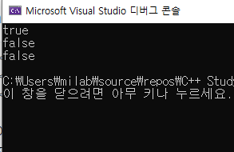
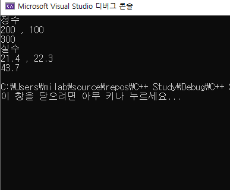
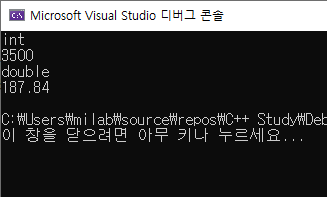
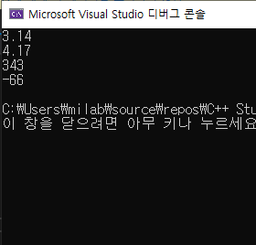

## 8.4 타입 특성 클래스 템플릿

```c++
#include <iostream>

template<class T>
T min(T a, T b) {
    return (a < b) ? a : b;
}

int main() {
    int tmp01 = 10;
    int tmp02 = 20;
    int *a = &tmp01, *b = &tmp02;
    std::cout << "1. 최소값 : " << min(*a, *b) << std::endl;
    std::cout << "2. 최소값 : " << min<int *>(a, b) << std::endl;
}

```

결과:


 위와 같은 상황에서는 탬플릿 인수로 int or float 타입을 사용하면 정상적으로 작동한다. 하지만 만약 int* 와 같은 포인터를 사용한다면 실행하는 과정에서 에러가 생기게 된다.

이러한 일을 방지하기 위해 클래스 템플릿을사용하여 코드를 실행했을 때 발생할 수 있는 오류를 사전에 방지할 수 있다.


#### 스위치 역활을 하는 enable_if

대표적으로 사용되는 enable_if 구조체는 밑에와 같다.

```c++
template <typename T>
struct enable_if<true, T>{typedef T type;}

enable_if는 <X,y>안에 X가 True일때 y의 타입을 사용되어 함수 템플릿이 활성화 되지만
X가 false인 상황에서는 함수 템플릿에 대해 비활성화가 된다.
```


예를 통해 알아보자. 

> - is_lvalue_reference
>   - T타입이 lvalue 참조면 True 출력
>   - T타입이 lvalue 참조가 아니면 False 출력


- ##### enable_if 예시

```c++
#define  _CRT_SECURE_NO_WARNINGS
#include <iostream>
#include <type_traits>

template<class T>
typename std::enable_if<!std::is_lvalue_reference<T>(), T&>::type
min(T& a, T& b) {				//min( T a, T b)를 사용해도 결과는 같음
    std::cout << "변  수 ";
    //a = a + 25;
    return (a < b) ? a : b;
}

template<class T>
typename std::enable_if<std::is_lvalue_reference<T>(), T>::type
min(T a, T b) {
    std::cout << "참  조 ";
    a = a + 25;
    return (a < b) ? a : b;
}

template<class T>
T min(T* a, T* b) {
    std::cout << "포인터 ";
    return (*a < *b) ? *a : *b;
}


int main() {
    int tmp01 = 10;
    int tmp02 = 20;
    int& tmp03 = tmp01;
    int& tmp04 = tmp02;
    int* a = &tmp01, * b = &tmp02;
    std::cout << "1. 최소값 : " << min<int>(*a, *b) << std::endl;
    std::cout << "2. 최소값 : " << min<int&>(tmp03, tmp04) << std::endl;
    std::cout << "3. 최소값 : " << min(a, b) << std::endl;
    std::cout << "4. 최소값 : " << min<int&>(a, b) << std::endl;	//오류발생
    std::cout << "4. 최소값 : " << min(tmp01, tmp02) << std::endl;
    std::cout << tmp01 << std::endl;
    std::cout << tmp02 << std::endl;


}
```

> 

 결과를 보면 min< > 안에 들어간 type에 따라 사용되는 함수가 다른것을 알 수 있다. 위와 같이 enbale_if를 사용하면 활성화할 함수를 선택해 실행하도록 설정할 수 있다는 장점이 있다. 또한 조심해야할 점은 enable_if의 조건이 서로 같은 템플릿이 여러개가 발생되면 오류가 발생할 수 있어 이에 주의해야한다.


또 다른 예로 책에서는 enable_if 구조체 템플릿과 많이 사용하는 is_same 구조체 템플릿을 소개한다.


- #### 두 인자의 타입을 검사하는 is_same

```c++
#include <iostream>
#include <type_traits>
#include <typeinfo>

int main() {
	std::cout << std::boolalpha;
	std::cout << std::is_same<int, int32_t>::value << std::endl;
	std::cout << std::is_same<int, float>::value << std::endl;
	std::cout << std::is_same<int, char>::value << std::endl;

}
```

> 

is_same 기능은 < x,y> 영역에 들어가 있는 x와 y의 타입이 같으면 True를 출력하고 타입이 서로 다르면 False를 출력한다.


- ##### enable_if와 is_same 사용 예시

```c++
#include <iostream>
#include <type_traits>
#include <typeinfo>

template<typename T1, typename T2>
typename std::enable_if<std::is_same<T1, T2>::value, bool>::type 
check_type(const T1& t1, const T2& t2) { 
    std::cout << t1 << "과 " << t2
              << "는 같은 타입이다."  << std::endl;
    return true;
} 

template<typename T1, typename T2>
typename std::enable_if<!std::is_same<T1, T2>::value, bool>::type 
check_type(const T1& t1, const T2& t2) { 
    std::cout << t1 << "과 " << t2
              << "는 서로 다른 타입이다."  << std::endl;
    return false;
} 

int main() {    
    check_type(10, 40);
    check_type(10, 40.56);
    check_type(10, "Test 타입");
}   
```

> 

결과를 비교하면 10과 40은 서로 같은 타입으로 std::is_same<T1, T2>::value가 True를 출력하고 enable_if의 True 조건을 만족하였으므로 첫번째 함수가 활성화되어 10과 40는 같은 타입이다. 라는 결과를 도출한다. 

 이와 반대로 10과 40.56는 서로 다른 타입이므로 False를 출력하는데 두번째 함수에는 std::enable_if<!std::is_same<T1, T2>::value, bool>::type 과 같이 작성되어 있으므로 서로 다른 상황에서는 두번째 함수가 활성화되어 출력된다.


그 밖에 더 많은 종류의 타입 속성 클래스 템플릿이 존재한다.

- ##### enable_if와 is_inegral, is_floating_point

```c++
#include <type_traits>
#include <iostream>
#include <string>

template< typename T>
typename std::enable_if<std::is_integral<T>::value, T>::type
test(T num1, T num2) {
	std::cout << "정수" <<std::endl;
	std::cout << num1 << " , " << num2 << std::endl;
	return num1 + num2;
}

template< typename T>
T test(T num1, T num2, typename std::enable_if<std::is_floating_point<T>::value, T>::type = 0) {
	std::cout << "실수" <<std::endl;
	std::cout << num1 << " , " << num2 << std::endl;
	return num1 + num2;
}

int main() {
	std::cout << test<int>(200, 100) << std::endl;
	std::cout << test<double>(21.4, 22.3) << std::endl;
}


```

> 

is_inegral는 <> 안에 들어온 타입이 정수인지 아닌지 확인하는 클래스 탬플릿이며 정수가 들어오면 True를 출력한다. is_floating_point는 인수의 타입이 실수인지 확인하여 실수이면 True를 출력하는 클래스 템플릿이다.


>  나머지 많은 기능들이 있지만 너무 많아 책 p.401쪽 참조


## 8.5 포워드 참조

이 파트에서 중요하다고 생각되는 Universal reference에 대해서 설명한다.


- #### Universal reference

  - 상황에 따라 rvalue가 될수도 있고 lvalue가 될수도 있는 reference
  - 유연성을 가지는 reference
  - forward 참조(forward reference) or 유니버설 참조(Universal reference)라고 불림
  - 변수 인자가 type 추론이 필요하고 T&&과 같이 표현되면 그 참조는 universal 참조

 유니버설 참조 타입은 scott meyers(Effective C++책 저자)가 붙인 이름으로 rvalue의 참조의 성격을 나타낸다. 유니버설 참조의 특징으로는 필요에 따라 일반데터 타입 또는 lvalue, rvalue 참조가 된다는 점이다.

rvalue 참조를 선언하면 컴파일러는 lavalue or rvalue 참조로 인수 타입을 선택해 함수를 선택하게 된다. 따라서 rvalue 참조 타입의 인수를 사용하면 별도의 데이터 타입(T&, const ZT&, T&&)과 같이 별도로 선언해 줄 필요가 없다.

간단하게 예를 들어보자면 다음과 같다.


```c++
int&& value = some_value;
auto&& value2 = value
```

위의 예제를 보면 처음 value 변수는 변수의 주소를 알 수 있고 변수의 값을 받을 수 있어 lvalue이다. 마지막에 있는 value2는 && 때문에 rvalue 참조라고 생각할 수 있지만 auto가 추론이 필요하고 auto에 &&로 표현되었으며 value가 lvalue이기 때문에 value2는 lvalue 참조가 된다.


```c++
template <typename T>
void f(std::vector<T>&& param); // rvalue ref
```

그렇가면 위의 코드는 어떨까 여기서 param은 ravlue일까 lvalue일까?

정답은 바로 rvalue이다.  왜냐하면 universal reference의 조건은 변수 인자의 추론이 필요할 때인데 위의 코드는 std::vector로 추론이 필요하지 않기 때문에 rvalue라고 볼 수 있다.

위의 예제 같이 상황에 따라 rvalue 참조라고 생각이되는 것이 lvalue 참조로 결정될 수 있는 참조를 Universal reference라고 부른다.


다음의 예제를 보면서 이해를 해보자.

```c++
#include <iostream>
#include <type_traits>
#include <utility>
#include <typeinfo>
#include <string>

int i = 0;

template<typename T>
void ParamCheck (T&& s) {			//universal reference
    if (std::is_reference<T&&>::value) {
        if (std::is_lvalue_reference<T&&>::value)
           std::cout << ++i << ". " << s << " 인수는 'T&' 타입이다.\n";
        else 
           std::cout << ++i << ". " << s << " 인수는 'T&&' 타입이다.\n";
    } else std::cout << ++i << ". " << s << " 인수는 'T' 타입이다.\n";
}

int main(int argc, char **argv) {
    ParamCheck("리터럴"); 
    ParamCheck(std::string{"무명변수"}); 

    std::string s3{"일반변수"};
    ParamCheck(s3); 

    const std::string& s4{"const 상수"};
    ParamCheck(s4); 

    std::string ss = std::string("std::move(") + s3 + std::string(")");
    std::string& s5{ss};
    ParamCheck(std::move(s5)); 
   
    std::string&& s6 = std::string("대입연산자와 무명변수"); 
    ParamCheck(s6); 
    std::cout << std::endl;
    return 0;
}

```

> 

위의 코드에는 void ParamCheck (T&& s) 과 같이 코드가 작성되어 Universal reference를 선언되었다. 

결과를 보면 ParamCheck( )에 들어가게 되는 인자가 lvalue reference or rvalue reference 무엇이냐에 따라 결과가 다르게 출력되는 것을 볼 수 있다.

> 더 알고싶다면 : http://egloos.zum.com/sweeper/v/3149089


## 8.6클래스 템플릿의 상속

클래스 템플릿의 상속은 우리가 알고 있는 class 상속의 개념과 유사하다.

여기서의 개념은 예제로 설명하는게 좋다고 생각되어 예제를 통해 진행하겠다.


- #### 부모 class template사용하고 자식 class는 template을 사용하지 않을 때

```c++
#include<iostream>
#include <typeinfo>

template <typename T>
class Parent {
	T asset;
public:
	Parent(T a) { asset = a; }

	void showparent() {
		std::cout << typeid(asset).name() << std::endl;
		std::cout << asset << std::endl; 
	}
};

class Child : public Parent<int> {
	int asset;
public:
	Child(int a, int b) : Parent<int>(a) { asset = b; }
	void showchild() { 
		std::cout << typeid(asset).name() << std::endl;
		std::cout << asset << std::endl; 
	}
};

int main()
{
	Child C(10.5, 50.5);
	Parent<double> P(10.5);
    
	C.showparent();
	P.showparent();
	C.showchild();
    
	return 0;
    
}
```

> 

위의 코드는 template을 사용하는 class를 상속하는 template을 사용하지 않는 class에 대한 코드이다.

코드를 보면 C++의 class와 사용법이 거의 유사한 모습을 볼 수 있고, 상속할 때 template의 타입을 지정하여 상속해주는 모습을 볼 수 있다.  상속을 할때 인자의 타입을 <int>로 지정했고 그래서 child class의 출력결과와 타입이 모두 int로 나오는 것을 볼 수 있다.


- #### 부모 자식 둘다 template을 사용할 때 상속

```c++
#include<iostream>
#include <typeinfo>

template <typename T>
class Parent {
	T asset;
public:
	Parent(T a) { asset = a; }
	void showAsset() {
		std::cout << typeid(asset).name() << std::endl;
		std::cout << asset << std::endl; 
	}
	void getMoney(T a) { asset += a; }
};
template <typename U>
class Child : public Parent<U> {
	U money;
public:
	Child(U a, U b) : Parent<U>(a) { money = b; }
	void exchange() {
		this->getMoney(money);
		money = 0;
	}
};

int main()
{
	Child<int> first(2000, 1500);
	Child<double> second(155.34, 32.5);

	first.exchange();
	first.showAsset();

	second.exchange();
	second.showAsset();

	return 0;
}
```

> 

부모 자식 둘다 template을 사용할 때 상속은 위의 결과와 같다. 

class를 상속할 때 class Child : public Parent<U>와 같이 작성하여 자식 class가 사용하는 template 인자 타입을 부모에게도 전달할 수 있다.


## 8.7 클래스 템플릿의 내부 클래스

클래스 내부 클래스는 쉽게 말하여 클래스 내부에 클래스를 또 한번 선언하는 것을 말한다. 이러한 구조를 왜 사용할까?

- 코드의 가독성을 높일 수 있다.
- 클래스의 필드와 함수를 공유할 수 있다.
- 캡슐화가 쉽다.

위와 같은 이유로 중첩 클래스를 사용한다고 한다. 하지만 이를 남용하다보면 오히려 유지보수가 힘들어질 수도 있다고하니 조심하자.


- #### 외부 클래스에만 템플릿을 사용한 경우

#### class

```c++


template<typename T>

class outerClass{

public:

outerClass();

outerClass(T newValue);

void setOuterValue(T newValue);

T getOuterValue();

 

class innerClass{

public:

innerClass();

innerClass(int newValue);

void setInnerValue(int newValue);

int getInnerValue();

 

private:

int innerValue;

};

 

private:

T outerValue;

};

```

#### main

```c++

int main() {


														//중요한점 위의 class는 outerclass에만 template을 사용
    outerClass<double> O(3.14);							//outerclass 선언 

    std::cout << O.getOuterValue() << std::endl;

    O.setOuterValue(4.17);

    std::cout << O.getOuterValue() << std::endl;


    outerClass<double>::innerClass I(12);				//innerclass 선언
    													//여기서 특징은 innerclass의 경우엔 template를 사용하지 않음에도
    												//outclass를 선언할 때 outerclass<double>과 같이 타입을 사용한 후 에 선언해야한다.

    std::cout << I.getInnerValue() << std::endl;

    I.setInnerValue(-66);

    std::cout << I.getInnerValue() << std::endl;


    return 0;

}

```

> 


 위의 코드에서 특이한점은 outerclass안에 있는 innerclass를 선언할 때 outerclass<자료형>::을 꼭 붙여줘야한다는 점이다.

다음은 outerclass와 inner class가 모두 template를 사용할 때는 어떻게 사용해야하는지 알아보자.


- #### Outerclass와 innerclass가 같은 template를 사용할 때

##### class

```c++
template<typename T>

class outerClass{

public:

outerClass();

outerClass(T newValue);

void setOuterValue(T newValue);

T getOuterValue();

 

class innerClass{

public:

innerClass();

innerClass(T newValue);

void setInnerValue(T newValue);

T getInnerValue();

 

private:

T innerValue;

};

 

private:

T outerValue;

};
```

#### main

```c++

int main() {


    outerClass<double> O(3.14);

    cout << O.getOuterValue() << endl;

    O.setOuterValue(4.17);

    cout << O.getOuterValue() << endl;


    outerClass<double>::innerClass I(3.14);

    cout << I.getInnerValue() << endl;

    I.setInnerValue(4.17);

    cout << I.getInnerValue() << endl;


    return 0;

}
```

 위의 코드에서는 맨 위에서 보여주었던 innerclass는 template를 사용하지 않을 때와 사용법이 같다. 애초에 같은 template 인자 T를 사용하고 있으니 딱히 달라질 점은 없는게 당연하다고 할 수도 있다.

 마지막으로는 outerclass와 ineerclass가 서로 다른 template을 사용할 때의 사용법에 대해서 예제를 보며 설명하겠다. 위 3가지의 경우를 알면 중첩 class를 사용할 때 template을 사용하는데 문제가 없다고 생각이된다.


- #### outerclass와 innerclass가 서로 다른 template을 사용하는 경우

#### class

```c++
template<typename T>

class outerClass{

public:

outerClass();

outerClass(T newValue);

void setOuterValue(T newValue);

T getOuterValue();

 

template<typename U>

class innerClass{

public:

innerClass();

innerClass(U newValue);

void setInnerValue(U newValue);

U getInnerValue();

 

private:

U innerValue;

};

 

private:

T outerValue;

};
```

 위의 class 코드를 보면 outerclass와 innerclass 모두 template을 사용하는데 서로 다른 template을 사용하는 것을 볼 수 있다. 이와 같은 경우는 어떻게 사용해야할까?

사용법은 크게 어렵지 않다 밑의 예제를 통해 알아보자.

```c++

int main(){


outerClass<double> O(3.14);

cout << O.getOuterValue() << endl;

O.setOuterValue(4.17);

cout << O.getOuterValue() << endl;

 

outerClass<double>::innerClass<int> I(12);

cout << I.getInnerValue() << endl;

I.setInnerValue(-66);

cout << I.getInnerValue() << endl;

 

return 0;

}
```

> 


코드를 보면 outerclass<double> 와 같이 작성하는 방법을 사용한다.

 outerclass안에있는 innerclass를 선언할 때 outerClass<double>::innerClass<int> I(12); 이렇게 타입을 두번 작성해주면 사용이 가능하다.