# EfficientDet: Scalable and Efficient Object Detection

> **[EfficientDet]** EfficientDet: Scalable and Efficient Object Detection | **[CVPR' 20]** 
>
> 저자: Mingxing Tan, Ruoming Pang, Quoc V. Le
>
> Ruoming Pang: 
>
> - Google Brain team 소속 
> - Deep learning 연구자
>
> https://scholar.google.com/citations?user=1fsmwB8AAAAJ&hl=en

#####  EfficientDet는 효율성을 중요시한 Detector로 다음과 같은 method를 사용했다. 

- ##### bi-directional feature pyramid network(BiFPN)

- ##### fast multi-scale feature fusion

- ##### Compound scaling method

본 논문에서 기존 논문들에서는 feature extraction을 할때 PANet같은 경우는 Top-down 방식과 Bottom-up 방식을 한번만 사용하고, FPN와 같은구조를 사용할 때 input feature가 서로 다른 해상도를 가지고 있어 output feature에 기여하는 정도를 다르게 가져야한다고 주장한다. 

이러한 점을 개선하기 위해 본 논문에서는 Top-down과 Bottom-up 방식을 여러번 사용하고 서로  다른 해상도를 가지고 있는 input feature에 대해 다른 가중치를 주는 **weighted bi-directional FPN(BiFPN)**구조를 제안한다. 

또한, 서로 다른 해상도에 맞는 가중치를 구하기 위해 fast normalized fusion이라는 방법을 사용해 softmax-based방식을 사용했을 때의 GPU slowdown문제를 개선했다. 

마지막으로 **Compound scaling method**라는 **EfficientNet**에서 사용된 scaling방식을 사용해 모델의 효율성과 정확도를 개선시켰다.

## Bi-directional feature pyramid entwork(BiFPN)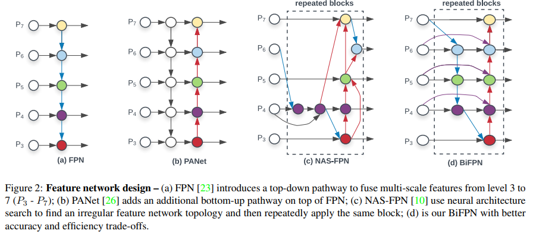

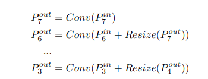

> FPN aggregates multi-scale feature in a top-down manner:
>
> level 7 resolution: 5 x 5
>
> :
>
> level 3 resolution: 80 x 80

 FIgure. 2에서 보이는 b)와 c)는 FPN을 개선한 network로 b)는 PANet FPN에 Bottom-up을 추가한 network이며 c)는 Architecture search를 이용해 만든 FPN구조이다.  각 모델의 단점으로 c)는 모델을 설계하기 위해 수천개의 GPU time이 필요하고, 구조가 복잡해 모델을 해석하거나 수정하기가 어렵다는 점이있다.  그리고 b) PANet은 a)와 c)에 비해 가장 정확도가 좋지만 다른 모델에 비해 parameter수가 더 많고 연산이 많아 효율적이지 못하다.

 위와 같이 효율성이 낮다는 문제를 해결하기 위해 본 논문에서는 d) **BiFPN**을 제안한다.  BiFPN모델의 특징은 다음과 같다.

- ##### 하나의 input을 가지는 edge 제거

  - one input edge를 가지는 edge는 특징에 대한 기여도가 낮을거라 판단
  - feature fusion이 일어나지 않는 edge를 제거
  - 예로 level 7의 첫번째와 level3의 첫번째가 fusion이 일어나지 않는 것을 볼 수 있음

- ##### skip connection 같은 extra edge 추가

  - 논문에서는 많은 비용 없이 같은 레벨의 특징을 더 가질 수 있을꺼라고 판단
  - original input을 이어 더해주는 방법을 사용

- ##### Repeated block

  - PANet에서는 top-down과 bottom-up을 한번만 사용
  - 반면 BiFPN에서는 위과정을 반복하는 방법을 사용
  - 더 높은 레벨의 피쳐와 fusion할 수 있음

## weighted Feature Fusion

 기존 FPN에서 input feature들을 합칠 때는 같은 해상도를 가지게 하기위해 해상도를 resize한 후 합치는 방식을 사용해왔다. 하지만 본 논문에서는 각 input feature들에 따라 output feature에 기여하는 정도가 다르기 때문에 FPN에서 feature fusion을 해서는 안된다고 주장했고, 이점을 개선하기 위해 input feature에 가중치를 주고 학습으로 가중치를 학습하는 방식을 제안했다.

가중치는 3가지로 줄 수있다고 주장한다.

- ##### scalar(per-feature)

- ##### vector(per-channel)

- ##### multi-demensional tensor(per-pixel)

 본 논문에서는 위 3가지 중 scalar로 가중치를 주는게 정확도와 연산량면에서 좋다고 말한다. 

밑의 식은 위에서 말한 가중치를주는 3가지 방법에 대해 설명한다.

- #### Unbounded Feature Fusion

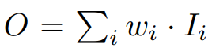

Unbounded Feature Fusion은 제한이 없는 가중치를 줄 수 있는 구조이기 때문에 학습에 불안정성을 줄 수 있다. 그렇기 떄문에 가중치에 대한 normalization이 필요하다고 한다.

- #### SoftMax-based Feature Fusion

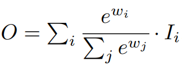

SoftMax-based Feature Fusion는 0~1로 normalization을 할 수 있었다. 하지만 실험해본 결과 GPU hardware에 상당한 slowdown을 일으킨다고 한다.

- #### Fast normalized Feature Fusion

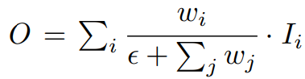

Fast normalized Feature Fusion은 activation function을 ReLU로 사용하여 모든 가중치가 non-zero임을 보장하고 분모가 0이 되는것을 방지 하기 위해 입실론(0.0001)크기를 넣어주었다. 또한 softmax와 같이 0~1로 normalized가 되면서 Softmax보다 더 빠른 연산속도를 가진다.

본 논문에서는 위의 두가지 Fusion을 개선한 Fast normalized Feature Fusion을 제안한다.

 BiFPN는 위에서 보여준 bidirectional corss scale connection과 fast normalized fusion을 사용한다. 밑에 식은 level 5의 feature를 fusion하는 과정을 보여준다.

#### ex)

#### 										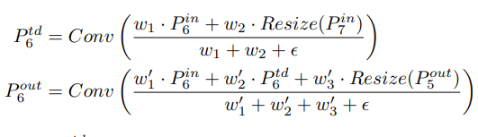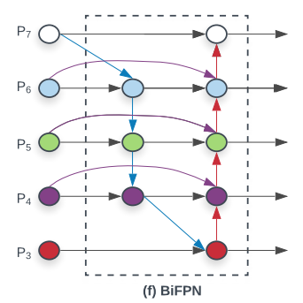

## EfficientDet

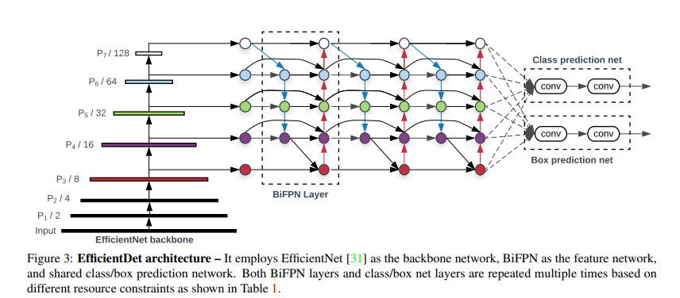

 EfficientDet의 backbone은 EfficientNet을 사용한다.  Figure. 3을 보면 BiFPN을 level 4~ 7에 적용해 반복적으로 사용하는 모습을 볼 수 있다.

 논문에서는 Top-down, bottom-up bidirectional feature fusion을 반복으로 사용한다고 한다.

## Compound Scaling method

 Backbone network는 EfficientNet(B0~B6) ImageNet-pretrained network를 사용했다. EfficientNet은 Depth, Width, Resolution 3가지를 scaling 했지만 EfficientDet에서는 class/box network 도 Compound scaling에 포함했다. Compound scaling 방식은 밑의 식과 같다.

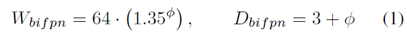

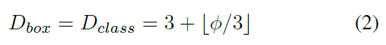

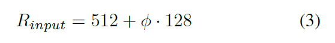

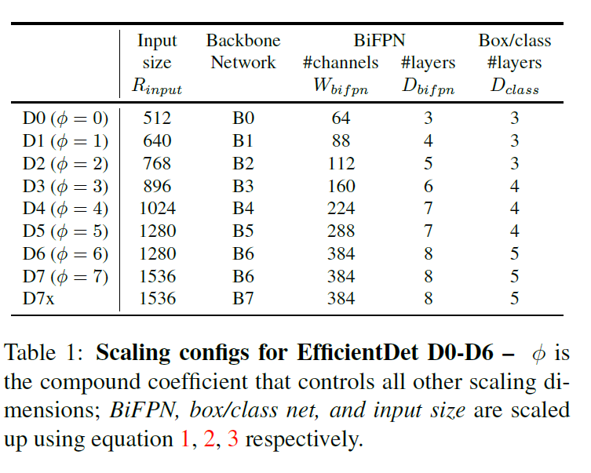

 위의 3가지 식과 Table. 1을 보면 EfficientNet에서 compound Scaling을 하듯이 5가지를 모두 동시에 scaling을 적용한것을 알 수 있다. 그리고 Table. 1에 보이는 D7x는 D7과 같은 조건을 EfficientNet B7에 적용한것을 의미한다.

 EfficeintNet에서는 Grid search를 이용해 최적의 compound scaling의 비율을 찾았지만 여기서는 고려할것이 너무 많아 Heuristic하게 위 식을 정했다고 한다.

## Experiment

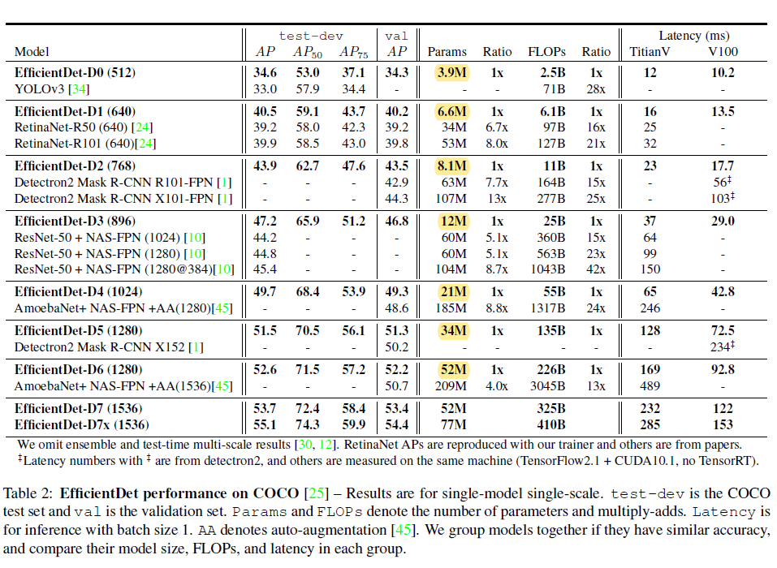

 

 Table. 2를 보면 EfficientNet와 같이 비슷한 성능을 내는 모델과 비교해 Parameter가 훨씬 적은것을 볼 수 있고 2019년 11월 기준 State-of-the-art(SOTA)를 달성했다.

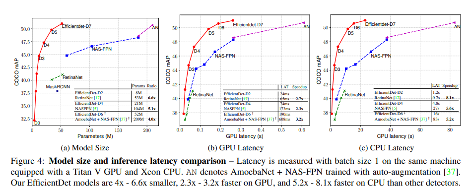

Figure.4 를 보면 EfficientDet가 얼마나 효율적인 Detector인지 알 수 있다. Parameter 뿐만아닌 GPU latency , CPU latency 또한 다른 모델의 mAP 성능에 비해 훨씬 낮은것을 알 수 있다.

### EfficientDet for Semantic Sementation

 본 논문 저자는 semantic Sementation에 흥미를 가져 EfficientDet의 input feature의 level을 {P2,P3 ~ P7}로 수정한 BiFPN을 적용하였고 EfficeintNet-B4를 사용해 Semantic Sementation의 성능을 테스트 했다.

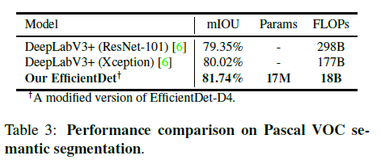

논문에서는 DeepLab V3+ 보다 EfficientDet가 1.7%로 성능이 더 좋았고, 9.8x 낮은 FLOPs를 보였다고 한다. 그러면서 EfficientDet가 semantic segmentation에 promising 하다고 주장한다. (어쩌면 EfficentNet을 기반으로 한 Image segmentation분야로 또 논문이 나올 수 도 있다고 생각)

## Ablation Study

### BiFPN

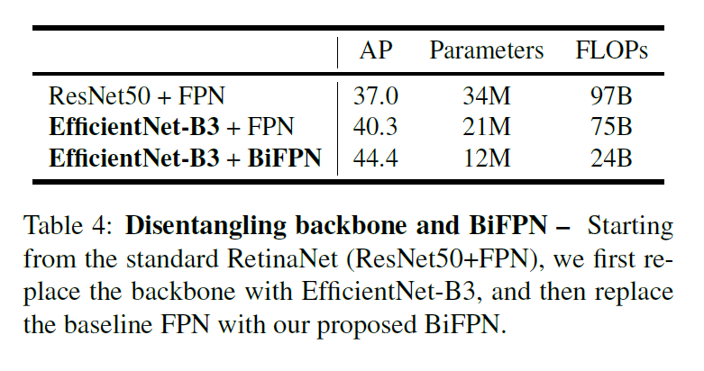

논문 Ablation Study에서는 본 논문에서 사용된 method들이 정말로 효과가 있는지 비교해 보는 실험을 진행했다. Table. 4를 보면 BiFPN을 적용한 모델이 AP와 Parameter FLOPs면에서 더 월등히 좋다는 것을 알 수 있다.

### Softmax vs Fast Normalized Fusion

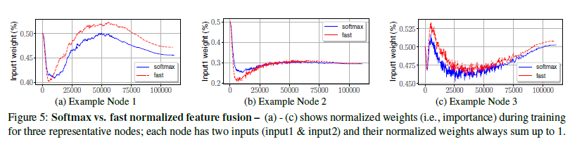

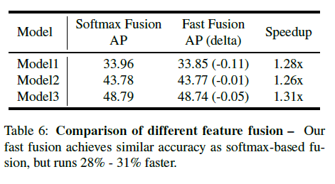

 Table.6 를 보면 SOftmax Fusion을 사용한 모델이 Fast Fusion보다 AP가 조금 더 높지만 Fast Fusion이 Speed는 더 빠른것을 볼 수 있다. 

또한 Figure. 5를 보면 Fast Fusion을 사용해도 Softmax Fusion을 사용한 결과와 유사한 결과가 나온것을 알 수 있다.

### Compound Scaling

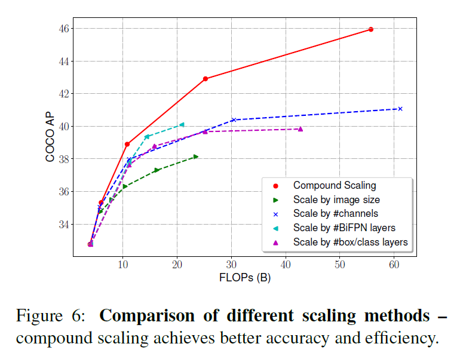

역시나 Compound Scaling을 적용한 모델이 가장 좋은 성능을 내는것을 알 수 있다.

## Conclusion

- BiFPN을 사용해 input feature의 해상도에 따라 다른 가중치를 적용하는 방법을 사용해 정확도를 향상
- Compound Scaling을 사용해 Parameter를 낮추고 높은 정확도를 확보
- Fast normalized fusion 방법을 사용해 unbounded한 문제와 GPU slowdown 문제를 개선
- 위와 같은 방법들을 사용하여 2019년 11월 기준 State-of-the-art(SOTA) 달성
- Semantic segmentation model에서 좋은 성능을 가짐
- 매우 높은 효율을 가지고 높은 정확도를 가진 모델을 설계